## Parte 1

#### 1. What is the CIA? Explain its key security concepts

**CIA** is a foundational model for information security defined by NIST. The **NIST** (National Institute of Standards and Technology) defines the term computer security as follows:

"Measures and controls that ensure **confidentiality**, **integrity**, and **availability** of information system assets including hardware, software, firmware, and information being processed, stored, and communicated"

So, according to NIST the three core security objectives that all security controls and practices aim to protect are:

1. **Confidentiality**, preserving authorized restrictions on information access and disclosure, including means for protecting personal privacy and proprietary information.  
   - **Data confidentiality** assures that private or confidential information is not made available or disclosed to unauthorized individuals. 
   - **Privacy** assures that individuals control how their information is stored, accessed and shared.
2. **Integrity**, guarding against improper information modification or destruction, including ensuring information nonrepudiation and authenticity. 
  - **Data integrity** assures that information and programs are changed only in a specified and authorized manner.
  - **System integrity** assures that a system performs its intended function in an unimpaired manner
3. **Availability,** ensuring timely and reliable access to and use of information.

Other important properties essential for network and security requirements are:

- **Authenticity,** the property of being genuine and being able to be verified and trusted. Regards the validity of a transmission, a message, or message originator. This means verifying that users are who they say they are and that each input arriving at the system came from a trusted source.
- **Accountability,** ability to uniquely trace the actions of an entity. This supports nonrepudiation, deterrence, fault isolation, intrusion detection and prevention, and after-action recovery and legal action.
guarding against improper information modification or destruction, including ensuring information nonrepudiation and authenticity.

---

#### 2. Define threats, attacks and assets; define the concepts of attack surface and defense in depth and provide relevant examples

- **Threat,** Any circumstance or event with the potential to adversely impact organizational operations (including mission, functions, image, or reputation), organizational assets, individuals, other organizations, or the Nation through an information system via unauthorized access, destruction, disclosure, modification of information, and/or denial of service. A threat represents a potential security harm to an asset.
The four kinds of threat consequences are:

  * **Unhathorized disclosure**, It is a threat to confidentiality and occurs when an unauthorized entity gains access to data.
  * **Deception**, is a threat to either system integrity or data integrity.
  * **Disruption**, it is a threat to availability or system integrity and occurs when the correct system functionality is interrupted or prevented.
  * **Usurpation**, it is a threat to system integrity and occurs when an unathorized entity gains control of system services or functions.

  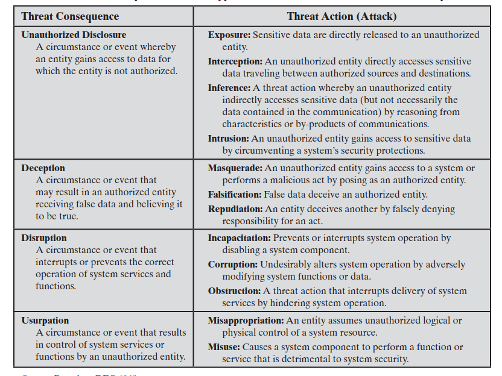
- **Attack,** Any kind of malicious activity that attempts to collect, disrupt, deny, degrade, or destroy information system resources or the information itself. An attack is a threat that is carried out (threat action) and, if successful, leads to an undesirable violation of security, or threat consequence.

Attacks may be:

  * **Passive** - attempt to learn or make use of information from the system that does not affect system resources
  * **Active** - attempt to alter system resources or affect their operation
  * **Insider** - initiated by an entity inside the security perimeter
  * **Outsider** - initiated from outside the perimeter
* **Asset,** a major application, general support system, high impact program, physical plant, mission critical system, personnel, equipment, or a logically related group of systems. The assets of a computer system can be categorized as **hardware**, **software**, **data**, and **communication lines and networks:**

  * **Hardware:** A major threat to computer system hardware is the threat to availability. Hardware is the most vulnerable to attack and the least susceptible to automated controls. Threats include accidental and deliberate damage to equipment as well as theft. The proliferation of personal computers and workstations and the widespread use of LANs increase the potential for losses in this area. Theft of USB drives can lead to loss of confidentiality. Physical and administrative security measures are needed to deal with these threats.
  * **Software** includes the operating system, utilities, and application programs. A key threat to software is an attack on availability. Software, especially application software, is often easy to delete. Software can also be altered or damaged to render it useless. Careful software configuration management, which includes making backups of the most recent version of software, can maintain high availability. A more difficult problem to deal with is software modification that results in a program that still functions but that behaves differently than before, which is a threat to integrity/authenticity. Computer viruses and related attacks fall into this category. A final problem is protection against software piracy. Although certain countermeasures are available, by and large the problem of unauthorized copying of software has not been solved.
  * **Data**: **data security** involves files and other forms of data controlled by individuals, groups, and business organizations. Security concerns with respect to data are broad, encompassing availability, secrecy, and integrity. In the case of **availability**, the concern is with the destruction of data files, which can occur either accidentally or maliciously.
  The obvious concern with **secrecy** is the unauthorized reading of data files or databases, and this area has been the subject of perhaps more research and effort than any other area of computer security. A less obvious threat to secrecy involves the analysis of data and manifests itself in the use of so-called statistical databases, which provide summary or aggregate information. Presumably, the existence of aggregate information does not threaten the privacy of the individuals involved. However, as the use of statistical databases grows, there is an increasing potential for disclosure of personal information. In essence, characteristics of constituent individuals may be identified through careful analysis. For example, if one table records the aggregate of the incomes of respondents A, B, C, and D and another records the aggregate of the incomes of A, B, C, D, and E, the difference between the two aggregates would be the income of E. This problem is exacerbated by the increasing desire to combine data sets. In many cases, matching several sets of data for consistency at different levels of aggregation requires access to individual units. Thus, the individual units, which are the subject of privacy concerns, are available at various stages in the processing of data sets. Finally, **data integrity** is a major concern in most installations. Modifications to data files can have consequences ranging from minor to disastrous
  * **Communication lines and networks** Network security attacks can be classified as passive attacks and active attacks.
    * **Passive Attacks**: Attempts to learn or make use of information from the system but does not affect system resources. Eavesdropping on, or monitoring of, transmissions. Goal of attacker is to obtain information that is being transmitted. Two types of passive attacks are: Release of message contents and traffic analysis.
    * **Active Attacks**: Attempts to alter system resources or affect their operation. Involve some modification of the data stream or the creation of a false stream. Four categories: **Replay**, **Masquerade**, **Modification of messages**, **Denial of service**.

      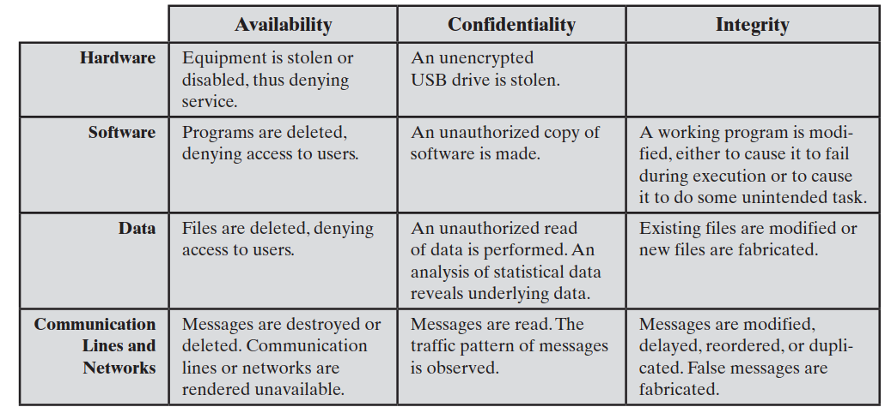

**Attack Surface,** An attack surface consists of the reachable and exploitable vulnerabilities in a system. Examples of attack surfaces are the following:

* Open ports on outward facing Web and other servers, and code listening on those ports
* Services available on the inside of a firewall
* Code that processes incoming data, e-mail, XML, office documents, and industry-specific custom data exchange formats
* Interfaces, SQL, and web forms
* An employee with access to sensitive information vulnerable to a social engineering attack

Attack surfaces can be categorized in the following way:

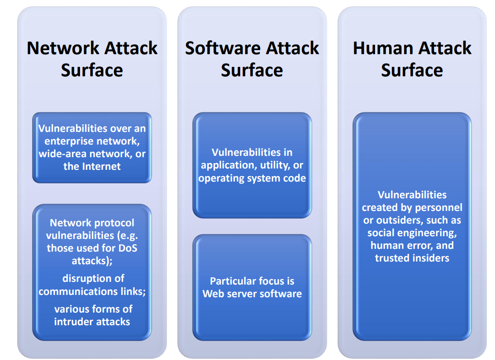

* **Network attack surface**: This category refers to vulnerabilities over an enterprise network, wide-area network, or the Internet. Included in this category are network protocol vulnerabilities, such as those used for a denial-of-service attack, disruption of communications links, and various forms of intruder attacks.
* **Software attack surface**: This refers to vulnerabilities in application, utility, or operating system code. A particular focus in this category is Web server software.
* **Human attack surface**: This category refers to vulnerabilities created by personnel or outsiders, such as social engineering, human error, and trusted insiders.

To assess the scale and severity of threats to a system:

* Identifies the points of vulnerability
* Identifies the most appropriate security mechanisms and their deployment

Benefits of Attack Surface Analysis:

* Makes developers and security analysts aware of where security mechanisms are required.
* Designers may be able to find ways to make the surface smaller, thus making the task of the adversary more difficult.
* It also provides guidance on setting priorities for testing, strengthening security measures, or modifying the service or application.

**Defense in Depth** is a cybersecurity strategy that relies on using **multiple layers of defense** to protect systems, data, and networks. Layering refers to the use of multiple, overlapping protection approaches addressing the people, technology, and operational aspects of information systems. The idea is that if one layer is breached, others are still in place to stop or slow down the attacker.

In practice: instead of relying on a single barrier (e.g., a firewall), multiple controls are distributed across the environment (firewalls, IDS/IPS, strong authentication, encryption, network segmentation, backups, logging, etc.).

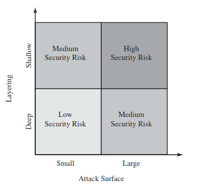

In short, Defense in Depth aims to move toward the lower-risk quadrants by reducing the attack surface and increasing the number of defensive layers.

#### 3. Present and explain the properties of one-way hash functions

Properties of a one-way hash function `H`:

1. It can be applied to data blocks of any size
2. It produces a fixed length output
3. It is easy to compute (making both software or hardware implementations practical)
4. It is **one way**: it is computationally infeasible to find `x` such that `H(x) = h`
5. It is **weak collision resistant**: given `x` it is computationally infeasible to find `y` such that `H(x) = H(y)`
7. It is **collision resistant**: it is computationally infeasible to find a pair `x`, `y` such that `H(x) = H(y)`

   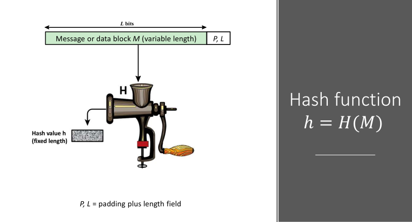

---

#### 4. Explain the meaning of "multifactor authentication" and provide relevant examples

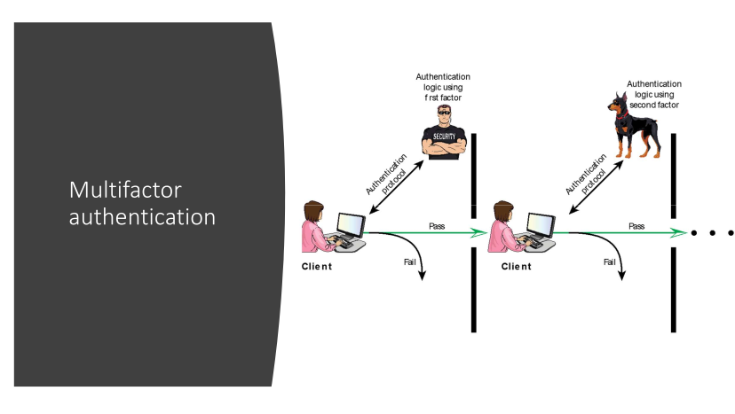
Multifactor authentication refers to the useof more than one of the authentication means in the preceding list.
The strength of authentication systems is largely determined by the number of factors incorporated by the system. Implementations that use two factors are considered to be stronger than those that use only one factor; systems that incorporate three factors are stronger than systems that only incorporate two of the factors, and so on.

Types of factors:

- Something the user knows: password, PIN, security questions
- Something the user has: keys, smart cards, tokens
- Something the user is (static biometrics): fingerprint, retina, face recognition
- Something the user does (dynamic biometrics): voice recognition, handwriting, typing rhythm

**Example**:
When logging into an online banking account, a user may first enter their password (something they know) and then confirm their identity with a one-time code sent via SMS or generated by an authentication app (something they have). This combination of two different factors makes the authentication process significantly more secure than relying on just a password.

---

#### 5. Discuss the methodologies of password cracking, explain the concepts of dictionary attack and of rainbow table attack and explain the role of the salt in the Unix password file.

Password crackers exploit predictable human behaviour (weak, common or short passwords) and the deterministic nature of hash functions to recover plaintext passwords from stored hashes. Common strategies include brute-force (trying all combinations), dictionary attacks (trying likely passwords) and hybrid attacks (dictionary + character mangling). Modern crackers often combine these with rules, mangling, and GPU acceleration.

- **Dictionary Attacks**: A dictionary attack iterates over a list of candidate passwords (a "dictionary") and, for each candidate, computes the hash and compares it to the target stored hash. If salts are used and known, the attacker combines each candidate with the salt before hashing. Dictionary attacks are effective because many users choose common words, phrases or predictable variants.
- **Rainbow Table Attack**: A rainbow table is a precomputed data structure that maps many possible plaintext passwords to their hash values using a time-memory trade-off (it stores reduced chains rather than every single password -> hash pair). An attacker can look up a target hash in the table to recover the original password much faster than computing hashes on the fly. However, rainbow tables assume the same hash function and no per-password randomization (salt). When salts are used, separate rainbow tables are needed for each salt value, which quickly becomes infeasible.
- **Role of salt in the Unix password file**: A salt is a random value generated for each password and stored alongside the password hash (in traditional Unix systems, salts are stored in `/etc/shadow`). When a password is set, the system computes `hash(salt || password)` and stores both the salt and the resulting hash. Salts serve three main purposes:

1. **Ensure uniqueness**: identical passwords chosen by different users produce different stored hashes because their salts differ.
2. **Thwart precomputation**: salts make general, reusable precoumputed tables (rainbow tables) impractical. An attacker would need a separate table for each possible salt.
3. **Force per-password work**: an attacker must compute guesses separately for each salt (per account), greatly increasing the time and resources required to crack many accounts.

- **Defenses and best practices**:

1. Complex password policy, forcing users to pick stronger passwords. However password-cracking techniques have also improved:
   - The processing capacity available for password cracking has increased dramatically.
   - The use of sophisticated algorithms to generate potential passwords.
   - Studying examples and structures of actual passwords in use.

---
#### 6. Discuss the policies to strength the password management and how they can be enforced (proactive password checking, complex password policy, etc.) 

Modern approaches to strength the password include the complex password policy that consists in forcing users to pick stronger passwords.

**Password selection strategies**
- **User education**: users can be told the importance of using hard to guess passwords and can be provided with guidelines for selecting strong passwords.
- **Computer generated passwords**: users have trouble remembering them.
- **Reactive password checking**: system periodically runs its own password cracker to find guessable passwords.
- **Complex password policy**: User is allowed to select his own password, but the system checks if the password is allowable. If not, rejects it. Goal is to eliminate guessable passwords while allowing the user to select password easy to remember.

**Proactive password checking**
- **Rule enforcement**: specific rules that passwords must adhere to.
- **Password checker**: compiler a large dictionary of "bad" passwords not to use.
- But how to make a fast password check?
  - Bloom filter, used to implement password checkers
  - Exploits k hash functions to build tables of hash values
  - Check desired password against this table
  - It's probabilistic, efficient way to check if a password is in the dictionary of forbidden

---

#### 6. Discuss the different methods for biometric authentication

**Biometric authentication** attempts to authenticate an individual based on unique physical characteristics. It is based on pattern recognition. It is technically complex and expensive when compared to passwords and tokens.
Physical characteristics used include:

- **Facial characteristics**: Facial characteristics are the most common means of human-to-human identification; thus it is natural to consider them for ­identification by computer. The most common approach is to define characteristics based on relative location and shape of key facial features, such as eyes, ­eyebrows, nose, lips, and chin shape. An alternative approach is to use an ­infrared camera to produce a face thermogram that correlates with the underlying vascular system in the human face.
- **Fingerprints**: Fingerprints have been used as a means of identification for centuries, and the process has been systematized and automated particularly for law enforcement purposes. A fingerprint is the pattern of ridges and furrows on the surface of the fingertip. Fingerprints are believed to be unique across the entire human population. In practice, automated fingerprint recognition and matching system extract a number of features from the fingerprint for storage as a numerical surrogate for the full fingerprint pattern.
- **Hand geometry**: Hand geometry systems identify features of the hand, including shape, and lengths and widths of fingers.
- **Retinal pattern**: The pattern formed by veins beneath the retinal surface is unique and therefore suitable for identification. A retinal biometric system obtains a digital image of the retinal pattern by projecting a low-intensity beam of visual or infrared light into the eye.
- **Iris**: Another unique physical characteristic is the detailed structure of the iris.
- **Signature**: Each individual has a unique style of handwriting and this is reflected especially in the signature, which is typically a frequently written sequence. However, multiple signature samples from a single individual will not be identical. This complicates the task of developing a computer representation of the signature that can be matched to future samples.
- **Voice**: Whereas the signature style of an individual reflects not only the unique physical attributes of the writer but also the writing habit that has developed, voice patterns are more closely tied to the physical and anatomical characteristics of the speaker. Nevertheless, there is still a variation from sample to sample over time from the same speaker, complicating the biometric recognition task.

  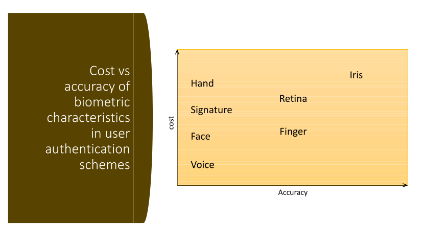

It is composed by 3 main phases:

1. **Enrollment**

- The user provides an identifier (such as name or PIN) through the user interface and submits a biometric sample (e.g., fingerprint) to the **biometric sensor**.
- The system processes the sample using a **feature extractor**, generating a digital representation of the biometric characteristic.
- This **template** is stored in the **biometric database**, linked to the user's ID.

2. **Verification**

   - The user provides both an identifier (name/PIN) and a biometric sample.
   - The **biometric sensor** captures the new sample, and the **feature extractor** generates a fresh feature set.
   - The **feature matcher** compares this new feature set against the single template stored for that user in the database.
   - The system outputs a result of **true/false**, confirming whether the claimed identity matches.

3. **Identification**
   - The user provides only a biometric sample, without any additional identifier.
   - The biometric sensor and feature extractor generate a new feature set.
   - The feature matcher compares the extracted features against all stored templates in the database.
   - The system outputs either the identified user's identity (if a match is found) or "user unidentified" (if no match is found).

---

#### 7. Discuss the token-based authentication

Token-based authentication uses objects that a user possesses for the purpose of user authentication are called tokens
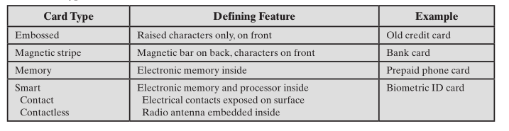

- **Memory cards**: Memory cards can store but not process data. The most common such card is the bank card with a magnetic stripe on the back. A magnetic stripe can store only a simple security code, which can be read (and unfortunately reprogrammed) by an inexpensive card reader. There are also memory cards that include an internal electronic memory. Memory cards can be used alone for physical access, such as a hotel room. For authentication, a user provides both the memory card and some form of password or personal identification number (PIN). A typical application is an automatic teller machine (ATM). The memory card, when combined with a PIN or password, provides significantly greater security than a password alone. An adversary must gain physical possession of the card (or be able to duplicate it) plus must gain knowledge of the PIN.
Among the potential drawbacks NIST SP 800-12 (An Introduction to ComputerSecurity: The NIST Handbook, October 1995) notes the following:

  - **Requires special reader**: This increases the cost of using the token and created the requirement to maintain the security of the reader's hardware and software.
  - **Token loss**: A lost token temporarily prevents its owner from gaining s­ystem access. Thus, there is an administrative cost in replacing the lost token. In addition, if the token is found, stolen, or forged, then an adversary need only determine the PIN to gain unauthorized access.
  - **User dissatisfaction**: Although users may have no difficulty in accepting the use of a memory card for ATM access, its use for computer access may be deemed inconvenient.

- **Smart Cards**: A wide variety of devices qualify as smart tokens. These can be categorized along four dimensions that are not mutually exclusive:

  - **Physical characteristics**: Smart tokens include an embedded microprocessor. A smart token that looks like a bank card is called a smart card. Other smart tokes can look like calculators, keys, or other small portable objects.
  - **User interface**: Manual interfaces include a keypad and display for human/token interaction.
  - **Electronic interface**: A smart card or other token requires an electronic interface to communicate with a compatible reader/writer. A card may have one or both of the following types of interface:
    - **Contact**: A contact smart card must be inserted into a smart card reader with a direct connection to a conductive contact plate on the surface of the card (typically gold plated). Transmission of commands, data, and card status takes place over these physical contact points.
    - **Contactless**: A contactless card requires only close proximity to a reader. Both the reader and the card have an antenna, and the two communicate using radio frequencies. Most contactless cards also derive power for the internal chip from this electromagnetic signal. The range is typically one-half to three inches for non-battery-powered cards, ideal for applications such as building entry and payment that require a very fast card interface.
  - **Authentication protocol**: The purpose of a smart token is to provide a means for user authentication. We can classify the authentication protocols used with smart tokens into three categories:
    - **Static**: with a static protocol, the user authenticates himself or herself to the token then the token authenticates the user to the computer. The latter half of this protocol is similar to the operation of a memory token.
    - **Dynamic password generator**: In this case, the token generates a unique password periodically (e.g., every minute). This password is then entered into the computer system for authentication, either manually by the user or electronically via the token. The token and the computer system must be initialized and kept synchronized so the computer knows the password that is current for this token.
    - **Challenge-response**: In this case, the computer system generates a challenge, such as a random string of numbers. The smart token generates a response based on the challenge. For example, public-key cryptography could be used and the token could encrypt the challenge string with the token's private key.

For user authentication, the most important category of smart token is the smart card, which has the appearance of a credit card, has an electronic interface, and may use any of the type of protocols just described. The remainder of this section discusses smart cards.
A smart card contains within it an entire microprocessor, including processor, memory, and I/O ports. Some versions incorporate a special co-processing circuit for cryptographic operation to speed the task of encoding and decoding messages or generating digital signatures to validate the information transferred. In some cards, the I/O ports are directly accessible by a compatible reader by means of exposed electrical contacts. Other cards rely instead on an embedded antenna for wireless communication with the reader.
A typical smart card includes three types of memory. Read-only memory (ROM) stores data that does not change during the card's life, such as the card number and the cardholder's name. Electrically erasable programmable ROM (EEPROM) holds application data and programs, such as the protocols that the card can execute. It also holds data that may vary with time. For example, in a telephone card, the EEPROM holds the remaining talk time. Random access memory (RAM) holds temporary data generated when applications are executed.

Applications/Features:

- **Electronic identity cards**: An application of increasing importance is the use of a smart card as a national identity card for citizens. A national electronic identity (eID) card can serve the same purposes as other national ID cards, and similar cards such as a driver's license, for access to government and commercial services. In addition, an eID card can provide stronger proof of identity and be used in a wider variety of applications. In effect, an eID card is a smart card that has been verified by the national government as valid and authentic. One of the most recent and most advanced eID deployments is the German eID card "neuer Personalausweis". The card has human-readable data printed on its surface, including the following:

  - **Personal data**: Such as name, date of birth, and address; this is the type of printed information found on passports and drivers' licenses.
  - **Document number**: An alphanumerical nine-character unique identifier of each card.
  - **Card access number (CAN)**: A six-digit decimal random number printed on the face of the card. This is used as a password, as explained subsequently.
  - **Machine readable zone (MRZ)**: Three lines of human- and machine-readable text on the back of the card. This may also be used as a password.
- **Eid functions**:The card has the following three separate electronic functions, each with its own protected dataset
  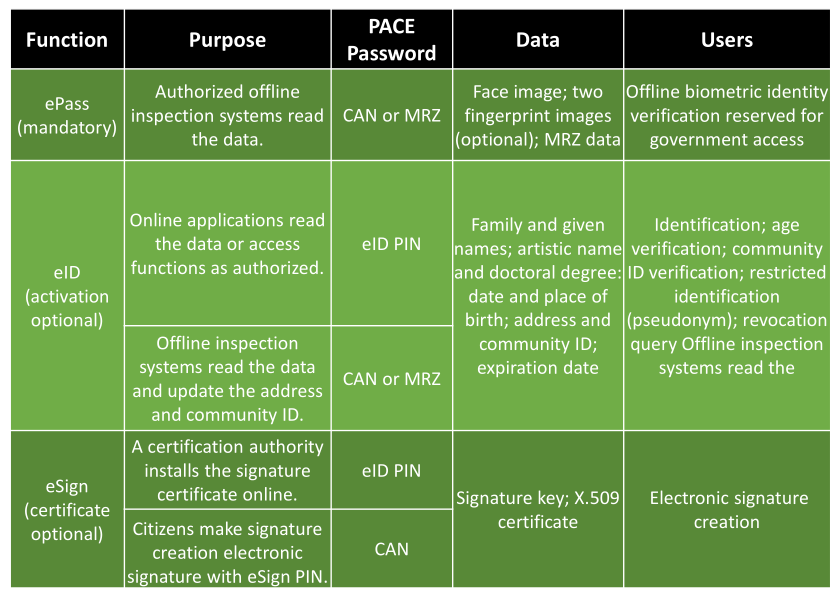

  - **ePass**: This function is reserved for government use and stores a digital representation of the cardholder's identity. This function is similar to, and may be used for, an electronic passport. Other government services may also use ePass. The ePass function must be implemented on the card.
  - **eID**: This function is for general-purpose use in a variety of government and commercial applications. The eID function stores an identity record that authorized service can access with cardholder permission. Citizens choose whether they want this function activated.
  - **eSign**: This optional function stores a private key and a certificate verifying the key; it is used for generating a digital signature. A private sector trust center issues the certificate.
- Password authenticated connection establishment (PACE)
- **Password Authenticated Connection Establishment (PACE)**: Password Authenticated Connection Establishment (PACE) ensures that the contactless RF chip in the eID card cannot be read without explicit access control. For online applications, access to the card is established by the user entering the 6-digit PIN, which should only be known to the holder of the card. For offline applications, either the MRZ printed on the back of the card or the six-digit card access number (CAN) printed on the front is used.

---

#### 8. Explain the challenge-response protocol for remote user authentication

Authentication over a network, the internet, or a communication link is more complex. Remote user authentication exposes the authentication process to additional security threats such as eavesdropping, capturing a password, replaying an authentication sequence that has been observed.
So generally it relies on some form of a **challenge-response protocol** to counter threats.

**Password Protocol**

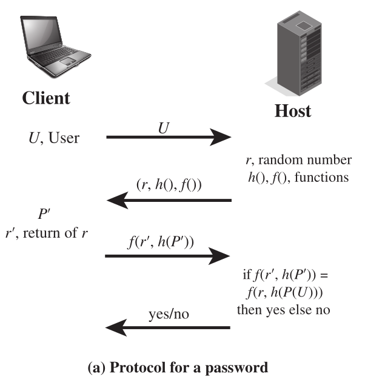

a user first transmits his or her identity to the remote host. The host generates a random number `r`, often called a nonce, and returns this nonce to the user. In addition, the host specifies two functions, `h()` and `f()`, to be used in the response. This transmission from host to user is the challenge.
The user's response is the quantity `f(r', h(P'))`, where `r' = r` and `P'` is the user's password. The function h is a hash function, so the response consists of the hash function of the user's password combined with the random number using the function f.
The host stores the hash function of each registered user's password, depicted as `h(P(U))` for user U. When the response arrives, the host compares the incoming `f(r', h(P'))` to the calculated `f(r, h(P(U)))`. If the quantities match, the user is authenticated.

This scheme defends against several forms of attack. The host stores not the password but a hash code of the password. This secures the password from intruders into the host system. In addition, not even the hash of the password is transmitted directly, but rather a function in which the password hash is one of the arguments.
Thus, for a suitable function `f`, the password hash cannot be captured during transmission.

Finally, the use of a random number as one of the arguments of `f` defends against a replay attack, in which an adversary captures the user's transmission and attempts to log on to a system by retransmitting the user's messages.

**Protocol for a token**

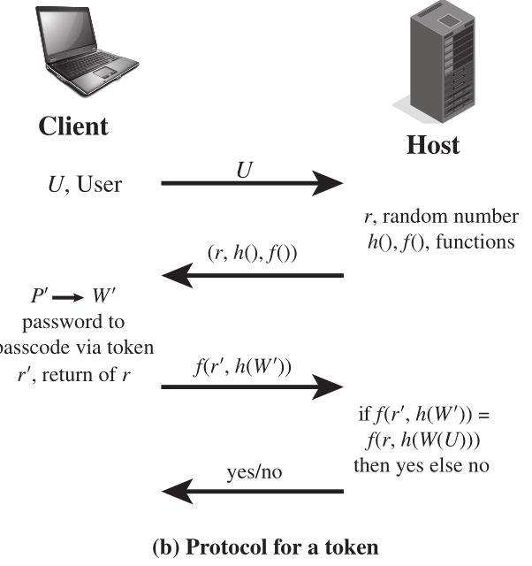

As before, a user first transmits his or her identity to the remote host. The host returns a random number and the identifiers of functions `f()` and `h()` to be used in the response. At the user end, the token provides a passcode `W'`. The token either stores a static passcode or generates a one-time random passcode. For a one-time random passcode, the token must be synchronized in some fashion with the host. In either case, the user activates the passcode by entering a password P'. This password is shared only between the user and the token and does not involve the remote host. The token responds to the host with the quantity `f(r', h(W'))`. For a static passcode, the host stores the hashed value `h(W(U))`; for a dynamic passcode, the host generates a one-time passcode (synchronized to that generated by the token) and takes its hash.
Authentication then proceeds in the same fashion as for the password protocol.

**Static biometric protocol**

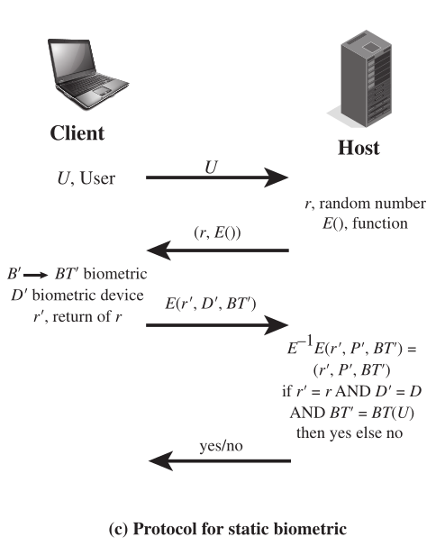

As before, the user transmits an ID to the host, which responds with a random number r and, in this case, the identifier for an encryption `E()`. On the user side is a client system that controls a biometric device. The system generates a biometric template `BT'` from the user's biometric `B'` and returns the ciphertext `E(r', D', BT')`, where D' identifies this particular biometric device. The host decrypts the incoming message to recover the three transmitted parameters and compares these to locally stored values.
For a match, the host must find `r' = r`. Also, the matching score between `BT'` and the stored template must exceed a predefined threshold. Finally, the host provides a simple authentication of the biometric capture device by comparing the incoming device ID to a list of registered devices at the host database.

**Dynamic Biometric Protocol**

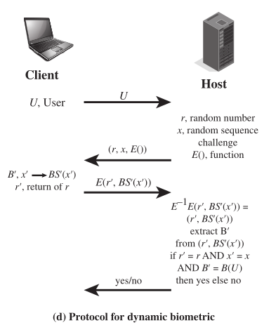

The principal difference from the case of a stable biometric is that the host provides a random sequence as well as a random number as a challenge. The sequence challenge is a sequence of numbers, characters, or words. The human user at the client end must then vocalize (speaker verification), type (keyboard dynamics verification), or write (handwriting verification) the sequence to generate a biometric signal `BS'(x')`. The client side encrypts the biometric signal and the random number. At the host side, the incoming message is decrypted. The incoming random number `r'` must be an exact match to the random number that was originally used as a challenge (`r`). In addition, the host generates a comparison based on the incoming biometric signal `BS'(x')`, the stored template `BT(U)` for this user and the original signal `x`. If the comparison value exceeds a predefined threshold, the user is authenticated.

---

#### 9. Define Discretionary access control, Role-based accesso control, Attribute-based access control and give relevant examples

- **Discretionary access control** (DAC): Controls access based on the identity of the requestor and on access rules (authorizations) stating what requestors are (or are not) allowed to do.
  - Example: In a Windows or Unix system, the owner of a file can decide who else can read, write, or execute it using file permissions (e.g., chmod 755 file.txt). The decision is at the discretion of the file owner.
- **Role-based access control** (RBAC):  Controls access based on the roles that users have within the system and on rules stating what accesses are allowed to users in given roles.
  - Example: In a hospital information system, a doctor role may have access to edit patient records, while a nurse role can only view them. If a user’s role changes, their permissions change automatically according to the new role.
- **Mandatory access control** (MAC): Controls access based on comparing security labels with security clearances.
  - Example: In a military system, documents are labeled “Confidential,” “Secret,” or “Top Secret.” A user with a “Secret” clearance cannot access “Top Secret” files, regardless of ownership or personal discretion.
- **Attribute-based access control** (ABAC): Controls access based on attributes of the user, the resource to be accessed, and current environmental conditions.
  - Example: In a cloud environment, a user can access a financial report only if their department attribute = “Finance”, the resource attribute = “Financial Data”, and the environmental condition = “Access from corporate network during business hours.”

#### 10. Explain the differences between access control matrix, lists of capabilities and access control lists

- **Access control matrix**:
  Access control matrix are often used by Discretionary Access Control.
  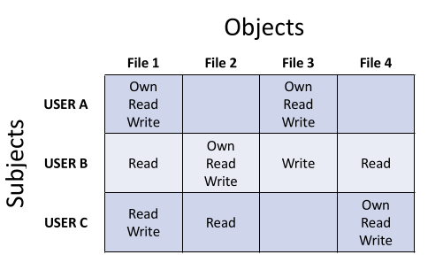

  - One dimension of the matrix consists of identified subjects that may attempt data access to the resources. Typically, this list will consist of individual users or user groups, although access could be controlled for terminals, network equipment, hosts, applications instead of or in addition to users.
  - The other dimension lists the objects that may be accessed. At the greatest level of detail, objects may be individual data fields. More aggregate groupings, such as records, files, or even the entire database, may also be objects in the matrix. Each entry in the matrix indicates the access rights of a particular subject for a particular object.

- **Access control lists**

  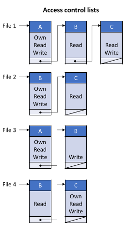

An access matrix is usually sparse and is implemented by decomposition in one of two ways. The matrix may be decomposed by columns, yielding access control lists (ACLs).
For each object, an ACL lists users and their permitted access rights. The ACL may contain a default, or public, entry. This allows users that are not explicitly listed as having special rights to have a default set of rights. The default set of rights should always follow the rule of least privilege or read-only access, whichever is applicable. Elements of the list may include individual users as well as groups of users.
When it is desired to determine which subjects have which access rights to a particular resource, ACLs are convenient, because each ACL provides the information for a given resource. However, this data structure is not convenient for determining the access rights available to a specific user.

- **List of Capabilities**

  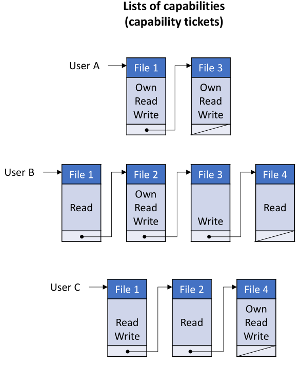

Decomposition by rows yields capability tickets. A capability ticket

- specifies authorized objects and operations for a particular user. Each user has a number of tickets and may be authorized to loan or give them to others.
- Because tickets may be dispersed around the system, they present a greater security problem than access control lists.
  - The integrity of the ticket must be protected, and guaranteed (usually by the operating system). In particular, the ticket must be unforgeable.
  - One way to accomplish this is to have the operating system hold all tickets on behalf of users. These tickets would have to be held in a region of memory inaccessible to users.
  - Another alternative is to include an unforgeable token in the capability. This could be a large random password, or a cryptographic message authentication code. This value is verified by the relevant resource whenever access is requested. This form of capability ticket is appropriate for use in a distributed environment, when the security of its contents cannot be guaranteed.
  - The convenient and inconvenient aspects of capability tickets are the opposite of those for ACLs. It is easy to determine the set of access rights that a given user has, but more difficult to determine the list of users with specific access rights for a specific resource.

---

#### 11. Explain the basic model of Unix for access control

All types of UNIX files are administered by the operating system by means of `inodes`. An `inode (index node)` is a control structure that contains the key information needed by the operating system for a particular file. Several file names may be associated with a single inode, but an active inode is associated with exactly one file, and each file is controlled by exactly one inode. The attributes of the file as well as its permissions and other control information are stored in the inode. On the disk, there is an inode table, or inode list, that contains the inodes of all the files in the file system. When a file is opened, its inode is brought into main memory and stored in a memory-resident inode table. Directories are structured in a hierarchical tree. Each directory can contain files and/or other directories. A directory that is inside another directory is referred to as a subdirectory. A directory is simply a file that contains a list of file names plus pointers to associated inodes. Thus, associated with each directory is its own inode.

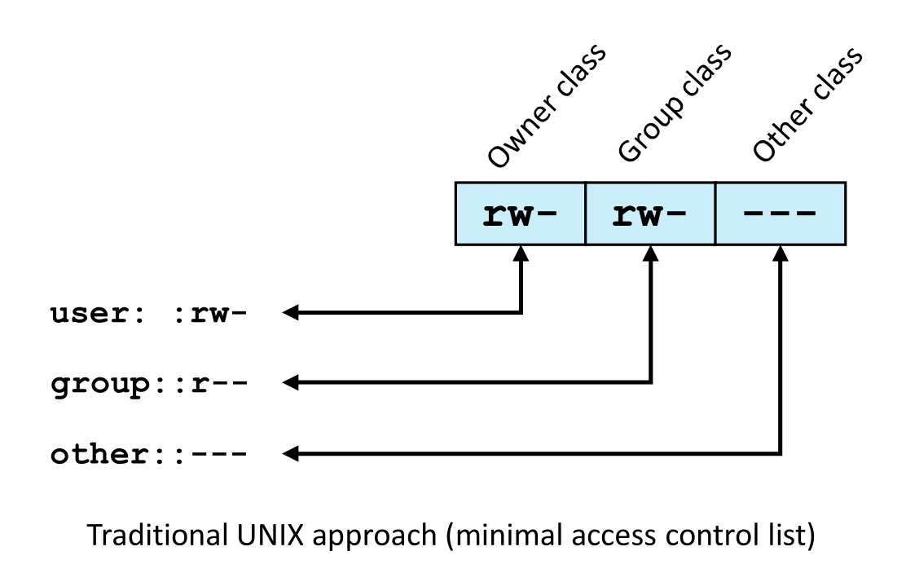

---

#### 12. Discuss advantages and disadvantages of RBAC and ABAC

**Role Based Access Control**

- **Advantages**:
  - **Simplicity and Manageability**: easy to implement and understand, especially in organizations with clear job functions. Administration is simplified: assigning a user to a role automatically gives them the correct permissions.
  - **Scalability**: works well for medium to large organizations; roles can be reused and standardized.
  - **Compliance-Friendly**: Simplifies auditing and enforcing the principle of least privilege since permissions are grouped by role.
  - **Reduced Administrative overhead**: No need to assign permissions indvidually, just manage roles.
- **Disadvantages**:
  - **Lack of granularity**: Access decisions are based on roles, not contextual factors (e.g., time, location, device).
  - **Role Explosion**: As organizations grow, the number of roles cane become unmanageable.
  - **Static access control**: Doesn't adapt well to dynamic environments where access decisions depend on context or attributes.
  - **Maintainance overhead in complex systems**: adding or modifying roles requires reassigning users and permissions, which can become complex over time.
    **Attribute-Based Access Control (ABAC)**
- **Advantages**:
  - **High granularity and flexibility**: Policies can include multiple conditions and context-aware rules (e.g., location, device type, time).
  - **Dynamic access control**: Decisions can change based on real-time attributes, supporting zero-trust security models.
  - **Reduced role explosion**: Eliminates the need for countless roles, access is defined by policies instead.
  - **Fine-Tuned Security**: Enables least-privilege access precisely based on contextual factors.
- **Disadvantages**:
  - **Complexity of implementation**: Requires defining, managing, and maintaining many attributes and policies. May need a policy decision engine and integration with multiple systems.
  - **Performance overhead**: Evaluating many attributes in real-time can impact system performance.
  - **Difficult to audit and manage**: Harder to predict or explain access decisions due to dynamic policies.
  - **Requires strong data governance**: Effectiveness depends on the accuracy and consistency of attribute data across systems.

    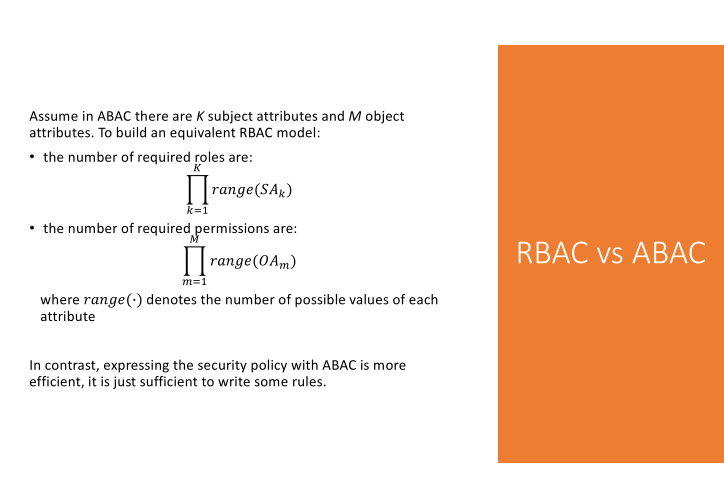

The core point is that when you have an ABAC policy defined by attributes, an equivalent RBAC model often requires significantly larger number of roles and permissions.

The main takeaway is that as the number of attributes (K and M) and the number of values they can take (range) increases, the number of required roles and permissions in an equivalent RBAC system grows exponentially.

- **ABAC** handles this complexity by defining **rules** on attributes.
- **RBAC** would require an explosion of static **roles** and **permissions** to achieve the same level of granularity.

In short, ABAC is **more scalable and manageable** for complex policies where access depends on many different attributes and their values.

---

### 13. Discuss methods to implement complex passwords policy and proactive password checking

A promising approach to improved password security is a **complex password policy**, or **proactive password checker**.
In this scheme, a user is allowed to select their own password. However, at the time of selection, the system checks whether the password is allowable and rejects it if not.

Such checkers are based on the philosophy that, with sufficient guidance from the system, users can select memorable passwords from a fairly large password space that are not likely to be guessed in a dictionary attack.

The challenge with a proactive password checker is to **strike a balance between user acceptability and password strength**.
If the system rejects too many passwords, users will complain that it is too hard to select one. On the other hand, if the system uses a simple algorithm to define what is acceptable, it might provide hints to attackers refining their guessing techniques.

In the remainder of this section, we examine possible approaches to proactive password checking.

---

#### **Rule Enforcement**

The first approach is a simple system for **rule enforcement**.For example, *NIST SP 800-63-2* suggests the following alternative rules:

- **basic16**: Password must have at least **sixteen characters**.
- **comprehensive8**: Password must have at least **eight characters**, including:
  - an uppercase and lowercase letter,
  - a symbol, and
  - a digit.
    It may not contain a dictionary word.

Although NIST considers **basic16** and **comprehensive8** equivalent, [KELL12] found that **basic16** is superior against large-scale guessing attacks.
Combined with prior findings that **basic16** is also easier for users [KOMA11], this suggests **basic16** is the better policy choice.

While this approach is better than merely educating users, it may still not be sufficient to thwart password crackers.
This scheme alerts attackers to which passwords *not* to try, but password cracking may still be feasible.

The process of rule enforcement can be automated using a **proactive password checker**, such as **pam_passwdqc** ([openwall.com/passwdqc](https://www.openwall.com/passwdqc/)), which enforces configurable rules on passwords.

---

#### **Password Checker**

Another possible procedure is to compile a **large dictionary of “bad” passwords**.
When a user selects a password, the system checks that it is **not** on the disapproved list.

However, there are two major problems with this approach:

1. **Space:** The dictionary must be large to be effective.
2. **Time:** Searching a large dictionary can be time-consuming.

Additionally, to check for permutations or variations of dictionary words, either those must also be stored (making the dictionary huge), or each search must involve significant processing.

---

#### **Bloom Filter**

A more efficient method for proactive password checking, proposed by [SPAF92a, SPAF92b], is based on rejecting words on a list using a **Bloom filter** [BLOO70].
This technique has been implemented on several systems, including Linux.

A **Bloom filter** of order \( k \) consists of a set of \( k \) independent hash functions:

\[
H_1(x), H_2(x), \dots, H_k(x)
\]

where each function maps a password into a hash value in the range \( 0 \) to \( N - 1 \).
That is:

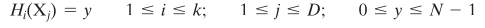

Where:

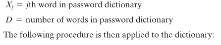

**Steps:**

1. A hash table of \( N \) bits is defined, all bits initially set to 0.
2. For each password, its \( k \) hash values are calculated, and the corresponding bits in the hash table are set to 1.
   Thus, if \( H_i(X_j) = 67 \) for some \( (i, j) \), the sixty-seventh bit of the hash table is set to 1; if the bit already equals 1, it remains 1.

When a new password is presented, its \( k \) hash values are computed.
If **all corresponding bits** in the table are 1, the password is rejected.

All passwords in the dictionary will be rejected, but there will also be some **false positives** - passwords not in the dictionary that produce a match in the hash table.

---

**Example**

Suppose two hash functions are used and the dictionary contains *undertaker* and *hulkhogan*, but not *xG%#jj98*.

$$
\begin{aligned}
H_1(\text{undertaker}) &= 25 \\
H_2(\text{undertaker}) &= 998 \\
H_1(\text{hulkhogan}) &= 83 \\
H_2(\text{hulkhogan}) &= 665 \\
H_1(\text{xG\%\#jj98}) &= 665 \\
H_2(\text{xG\%\#jj98}) &= 998
\end{aligned}
$$

The password *xG%\%\#jj98* will be **rejected**, even though it is not in the dictionary.

If too many false positives occur, users will find it difficult to select passwords.
Hence, the goal is to design the hash scheme to **minimize false positives**.

---

It can be shown that the probability \( P \) of a false positive can be approximated by:

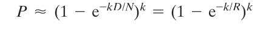

or equivalently,

where:

- \( k \) = number of hash functions
- \( N \) = number of bits in the hash table
- \( D \) = number of words in the dictionary
- $R = \frac{N}{D}$ = ratio of hash table size (bits) to dictionary size (words)

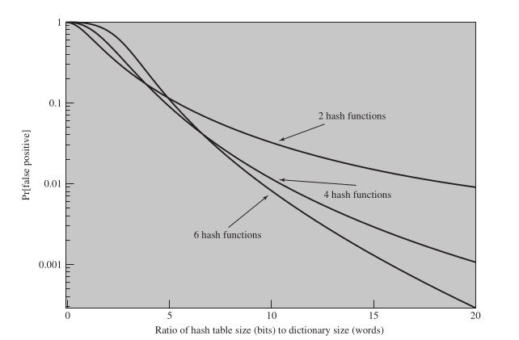

For a password not in the dictionary, if we choose six hash functions, the required ratio is:

\[
R = 9.6
\]

Therefore, we need a hash table of $9.6 \times 10^6$ bits (($\approx$ 1.2 MB)).
In contrast, storing the full dictionary would require around 8 MB.

Thus, the Bloom filter achieves nearly **7× compression**, and password checking only involves computing six hash functions—independent of dictionary size—whereas dictionary lookup requires significant searching.

### 14. Explain how does RBAC can be implemented

The Dresdner Bank (1872) has implemented an RBAC system that serves as a useful practical example

The problem:

- The bank uses a variety of computer applications:

  - Old applications on a mainframe
  - New applications client-server
  - New applications in servers
- Prior to 1990 it was used a simple DAC system on each server and mainframe:

  - Administrators maintained a local access control file on each host...
  - ...and defined the access rights for each employee on each application on each host.
  - Cumbersome system time-consuming and error-prone.

To improve the system, the bank introduced an RBAC scheme.

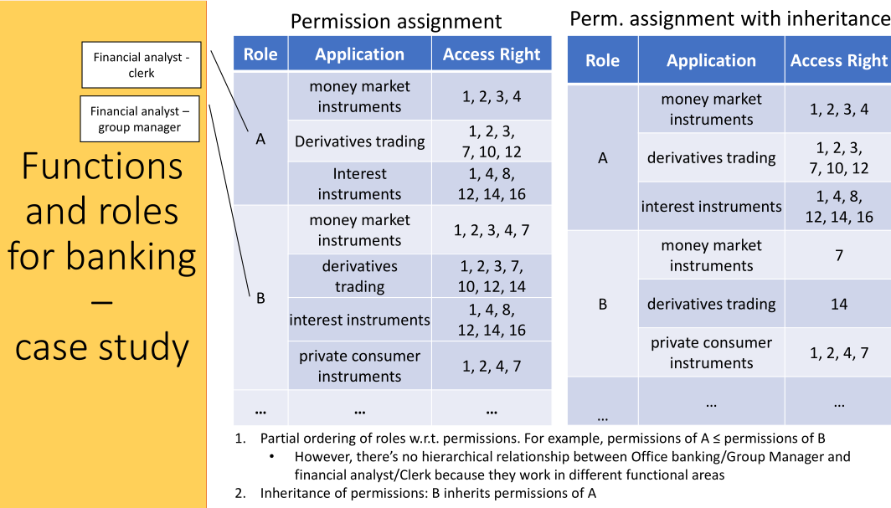

With the original DAC scheme the direct assignment of access rights to the individual user occurred at the application level and was associated with the individual application.

With the new schema scheme,

- an application administration determines the set of access rights associated with each individual application
- a user may not be permitted all of the access rights associated with an application:
  - the application grants access on the basis of a centrally provided security profile.
  - a separate authorization administration associated access rights with roles and creates the security profile for a use based on the user’s role.
- A user is statically assigned to a role (typically one, but in some cases more than one)
- A user selects the appropriate role when starts an application (NIST concept of session)

  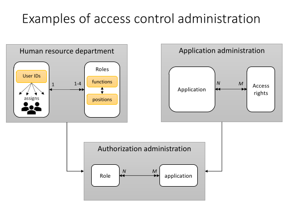

Some figures about this system are of interest:

- Within the bank, there are 65 official positions
  - ranging from a Clerk in a branch, through the Branch Manager, to a Member of the Board.
- These positions are combined with 368 different job functions provided by the human resources database.
- Potentially, there are 23,920 different roles
- The number of roles in current use is about 1,300.

---

### 15. Discuss the Unix model for access control

**UNIX files are administered using inodes (index nodes)**
- Control structures with key information needed for a particular file
- Several file names may be associated with a single inode
- An active inode is associated with exactly one file
- File attributes, permissions and control information are stored in the inode
- On the disk there is an inode table, or inode list, that contains the inodes of all files in the file system
- When a file is opened its node is brought into main memory and stored in a memory-resident inode table

**Directories are structured in a hierarchical tree**
- May contain files and/or other directories
- Containes file names plus pointers to associated inodes

**Traditional Unix file access control**

A user (a subject):
- associated to a unique user identification number (user ID)
- member of a primary group identified by a group ID
- may also belong to several other groups

A file (an object):
- has a owner & group
- 12 protection bits
  - specify read, write, and execute permission for the owner of the file, members of the group and all other users
- the owner ID, group ID, and protection bits are part of the file's inode

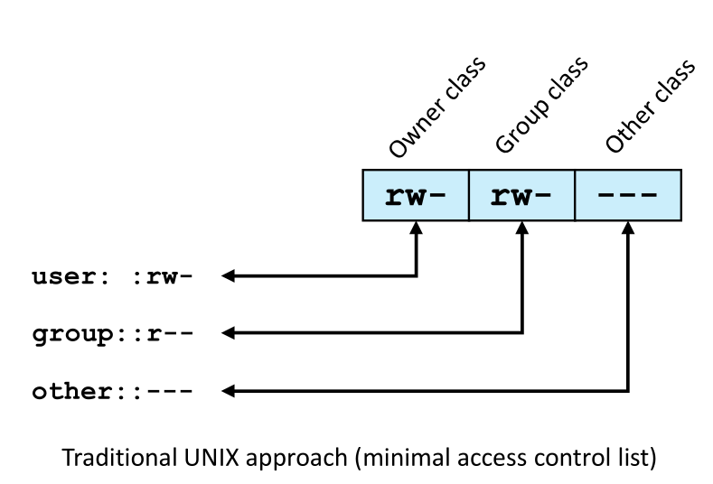

A hierarchy:
owner - group - all others

Concerning directories:
- read grants the "list" capability
- Write grants the create/rename/delete files capability
- Execute grants the ability to descend into subdirectories

- "Set user ID" (SetUID) and "Set group ID" (SetGID)
  - System teporarily uses rights of the file owner/group in addiction to the real user's rights when making access control decisions
  - Enables privileged programs to access files/resources not generally accessible
 
- Sticky bit
  - When applied to a directory it specifies that only the owner of any file in the directory can rename, move or delete that file
  - Useful for shared directories

- Superuser
  - A specific User ID
  - Is exempt from usual access control restrictions
  - Has system-wide accesses

**Access control lists(ACL) in Unix**

- Modern UNIX systems support ACLs: FreeBSD, openBSD, Linux, Solaris
- FreeBSD
  - The administrator can assign a list of UNIX user IDs and groups by means of the Setfacl command
  - Any number of users and groups can be associated with a file, each with read, write, execute protection bits
  - A file does not need to have an ACL: includes an additional protection bit that indicates wheter the file has an extended ACL

- When a process requests access to a file system object two steps are performed:
  1. Selects the appropriate ACL
  2. Checks if the matching entry contains sufficient permissions

---
#### IMAGES

### 14.

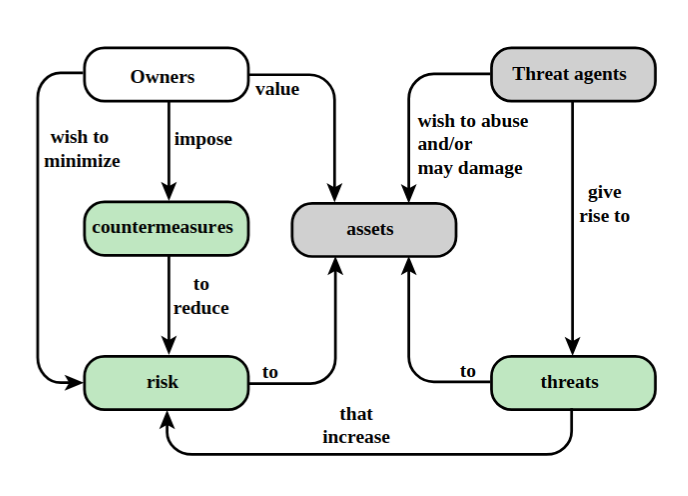

- **Adversary (threat agent)**: Individual, group, organization, or government that conducts or has the intent to conduct detrimental activities.
- **Attack**: Any kind of malicious activity that attempts to collect, disrupt, deny, degrade, or destroy information system resources or the information itself.
- **Countermeasure**: A device or techniques that has as its objective the impairment of the operational effectiveness of ­undesirable or adversarial activity, or the prevention of espionage, sabotage, theft, or unauthorized access to or use of ­sensitive information or information systems.
- **Risk**: A measure of the extent to which an entity is threatened by a potential circumstance or event, and typically a function of 1) the adverse impacts that would arise if the circumstance or event occurs; and 2) the likelihood of occurrence.
- **Security Policy**: A set of criteria for the provision of security services. It defines and constrains the activities of a data processing facility in order to maintain a condition of security for systems and data.
- **System Resource (Asset)**: A major application, general support system, high impact program, physical plant, mission critical system, personnel, equipment, or a logically related group of systems.
- **Threat**: Any circumstance or event with the potential to adversely impact organizational operations (including mission, functions, image, or reputation), organizational assets, individuals, other organizations, or the Nation through an information system via unauthorized access, destruction, disclosure, modification of information, and/or denial of service.
- **Vulnerability**: Weakness in an information system, system security procedures, internal controls, or implementation that could be exploited or triggered by a threat source.

### 15 Symmetric encryption

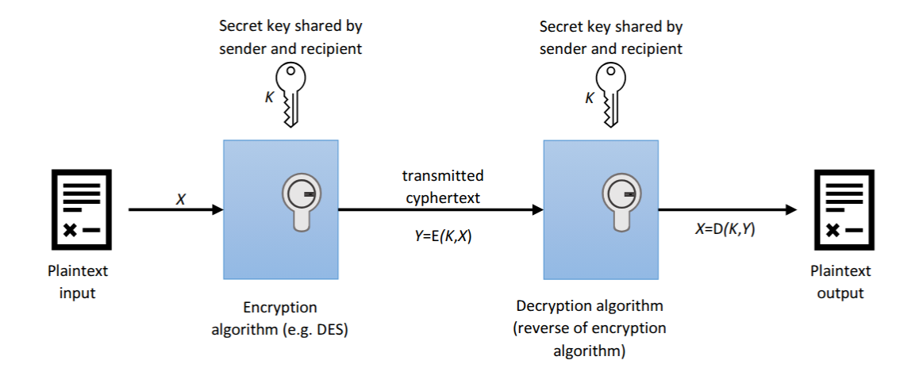

Symmetric encryption is the universal technique for providing confidentiality for transmitted or stored data. Also referred to as convention encryption or single-key encryption.

A symmetric encryption scheme has five ingredients:

- **Plaintext**: This is the original message or data that is fed into the algorithm as input.
- **Encryption algorithm**: The encryption algorithm performs various substitutions and transformations on the plaintext.
- **Secret key**: The secret key is also input to the encryption algorithm. The exact substitutions and transformations performed by the algorithm depend on the key.
- **Ciphertext**: This is the scrambled message produced as output. It depends on the plaintext and the secret key. For a given message, two different keys will produce two different ciphertexts.
- **Decryption algorithm**: This is essentially the encryption algorithm run in reverse. It takes the ciphertext and the secret key and produces the original plaintext.

There are two requirements for secure use of symmetric encryption:

1. We need a strong encryption algorithm. At a minimum, we would like the algorithm to be such that an opponent who knows the algorithm and has access to one or more ciphertexts would be unable to decipher the ciphertext or figure out the key. This requirement is usually stated in a stronger form: The opponent should be unable to decrypt ciphertext or discover the key even if he or she is in possession of a number of ciphertexts together with the plaintext that produced each ciphertext.
2. The sender and receiver must have obtained copies of the secret key in a secure fashion and must keep the key secure. If someone can discover the key and knows the algorithm, all communication using this key is readable.

There are two general approaches to attacking a symmetric encryption scheme.

1. The first attack is known as **cryptanalysis**. Cryptanalytic attacks rely on the nature of the algorithm plus perhaps some knowledge of the general characteristics of the plaintext, or even some sample plaintext-ciphertext pairs. This type of attack exploits the characteristics of the algorithm to attempt to deduce a specific plaintext or to deduce the key being used. If the attack succeeds in deducing the key, the effect is catastrophic: All future and past messages encrypted with that key are compromised.
2. The second method, known as the brute-force attack, is to try every possible key on a piece of ciphertext until an intelligible translation into plaintext is obtained. On average, half of all possible keys must be tried to achieve success. That is, if there are x different keys, on average an attacker would discover the actual key after x/2 tries. There is more to a brute-force attack than simply running through all possible keys. Unless known plaintext is provided, the analyst must be able to recognize plaintext as plaintext. If the message is just plain text in English, then the result pops out easily, although the task of recognizing English would have to be automated. If the text message has been compressed before encryption, then recognition is more difficult. And if the message is some more general type of data, such as a numerical file, and this has been compressed, the problem becomes even more difficult to automate. Thus, to supplement the brute-force approach, some degree of knowledge about the expected plaintext is needed, and some means of automatically distinguishing plaintext from garble is also needed.

### 15. Block cipher encryption (ECB mode)

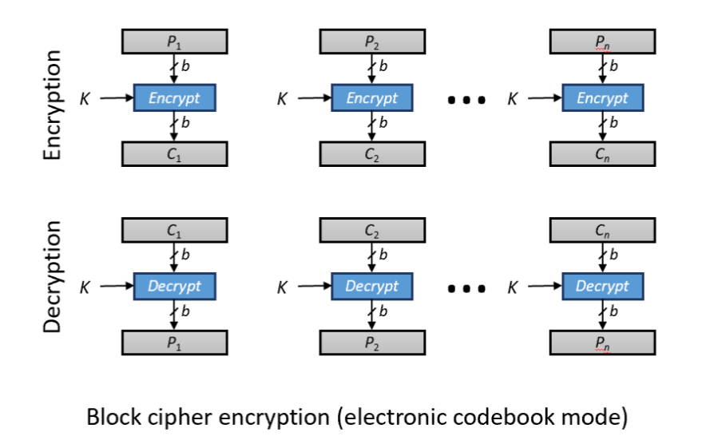

With the Electronic Codebook (ECB) mode a plaintext of length n x b is divided into n b-bit blocks (P1, P2, ..., Pn). Each block is encrypted using the same algorithm and the same encryption key, to produce a sequence of n b-bit blocks of ciphertext (C1, C2, ..., Cn).

Security concerns:

- A crypanalyst may exploit regularities in the plaintext to ease the task of decryption.
- For example, if it is known that the message always starts out with a certain predefined fields, then the cryptanalyst may have a number of known plaintext-ciphertext pairs to work with.

---

### 16. Stream cipher encryption

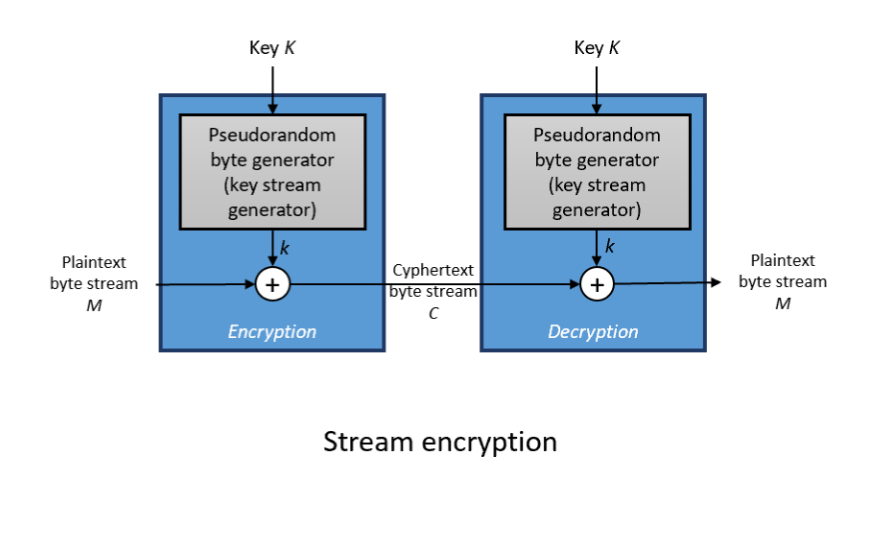

The key is input to a pseudorandom bit generator that produces a stream of numbers that are apparently random.
A pseudorandom stream is unpredictable without knowledge of the input key.
The output of the generator, called a keystream, is combined one byte at a time with the plaintext stream using the bitwise exclusive-OR (XOR) operation.

A stream cipher can also operate on one bit at a time or on units larger than a byte at a time. A stream cipher can be as secure as block cipher of comparable key length. With a properly designed pseudorandom number generator Stream ciphers are typically faster and use far less code than do block ciphers. However, with a block cipher the keys can be reused. Stream cyphers are good for encryption/decryption of data streams: data communications channel or a browser/Web link. Block cyphers are good for file encryption, e-mail, databases etc.
However, both can be used in virtually any application

---

### 17. Message Authentication Code

- Message encryption by itself does not provide a secure form of authentication.
- It is possible to combine authentication and confidentiality in a single algorithm by encrypting a message plus its authentication tag.
- Typically, message authentication is provided as a separate function from message encryption.
- Situations in which message authentication without confidentiality may be preferable include:
  1. There are a number of applications in which the same message is broadcast to a number of destinations
  2. An exchange in which one side has a heavy load and cannot afford the time to decrypt all incoming messages
  3. Authentication of a computer program in plaintext is an attractive service
- Thus, there is a place for both authentication and encryption in meeting security requirements
- **A small block of data (the message authentication code, MAC) is appended to the message to be authenticated.** This MAC generated by means of a secret key:
  `MAC = Func(Key, Message)`
- The secret key is shared between the two communicating parties

**MAC Properties:**

1. The receiver is assured that the message has not been altered.
   - If an attacker aters the message but does not alter the code, then the receiver's calculation of the code will differ from the received code.
   - Because the attacker is assumed not to know the secret key, the attacker cannot alter the code to correspond to the alterations in the message.
2. The receiver is assured that the message is from the alleged sender.
   - Because no one else knows the secret key, no one else could prepare a message with a proper code.
3. The receiver is assured of the proper sequece if the message includes a sequence number.
   - As in X.25, HDLC, and TCP
   - The attacker cannot successfully alter the sequence number.

- DES and AES can both be used to generate the MAC
- Authentication does not need to be reversible while encryption instead must be reversible
- A consequence is that authentication is less vulnerable to being broken than encryption, so one-way hash functions can be used to generate the MAC.

---

### 18. Alternative ways of authenticating a message

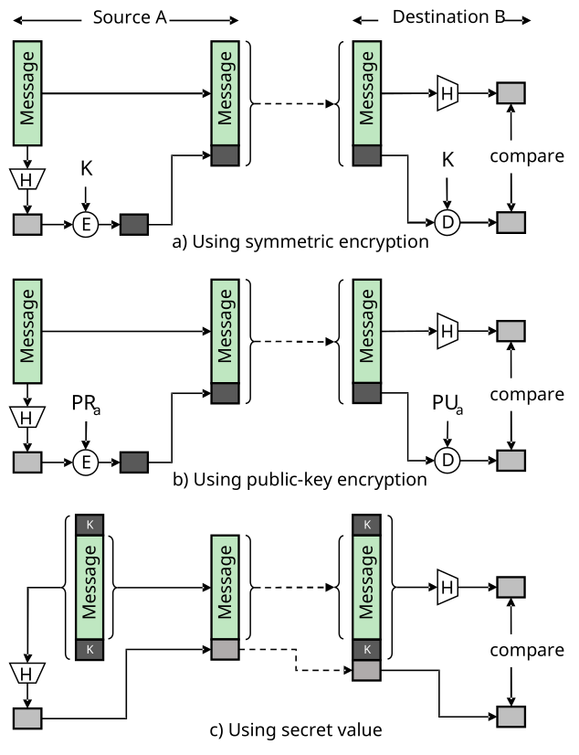

The image shows three alternative ways of authenticating a message.

1. The message digest is encrypted using symmetric encryption
   - Only sender and receiver know the encryption key
   - Assures the authenticity of the digest
2. The message digest is encrypted using public-key encryption
   - Provides a digital signature as well as message authentication
   - Does not require the distribution of keys to communicating parties
   - This method guarantees **non-repudiation**: a security service that provides proof of the origin of data and its integrity, ensuring that the sender cannot later deny having sent the message (repudiate the action). Since only source A possesses $PR_A$, this signature proves that the message must have originated from them.
   - Destination B can decrypt using Source A's public key $PU_A$. Source A cannot later deny sending it because their private key was used for the signature.

Since only the digest is encrypted these approaches require less computation than encrypting the entire message.

3. The third method avoids encryption, this approach has many advantages:
   1. Software encryption is rather slow (even if the message is short, there may be several messages...)
   2. Hardware encryption has costs and it is optimized for large data sizes.
   3. The encryption algorithm may be patented (and thus subject to royalties)

This method is based on the keyed hash MAC technique:

- Assumes that two communicating parties, say A and B, share a common secret key K.
- As long as K is secret there's no way for the attacker to modify the message or to generate a false message.
- Using K at the beginning and at the end makes the scheme more secure.

---

### 19. Public and private key encryption

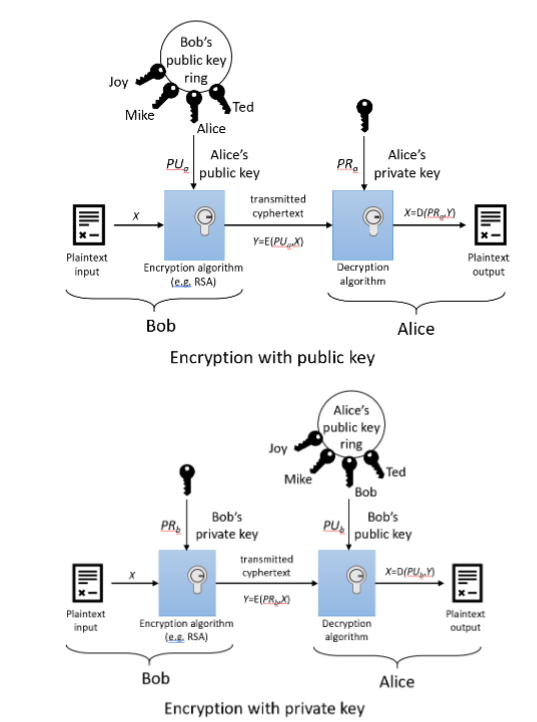

**Encryption with public key**:

- **Plaintext**: readable message or data that is fed into the algorithm as input.
- **Encryption algorithm**: performs transformations on the plaintext.
- **Public and private key**: pair of keys, one for encryption, one for decryption.
- **Ciphertext**: scrambled message produced as output.
- **Decryption key**: produces the original plaintext.

**Encryption with private key**:

- User encrypts using his or her own private key.
- Anyone who knows the corresponding public key will be able to decrypt the message.

#### 20. Essential elements of a digital signature process

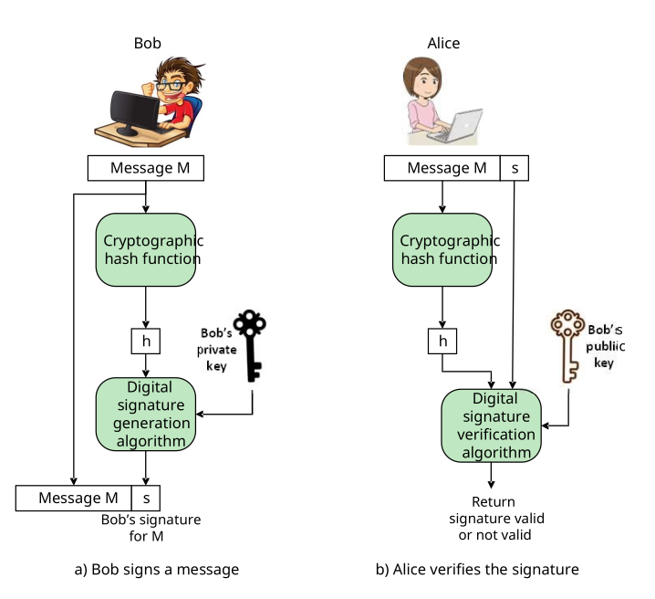

Public-key encryption can be used for authentication with a technique known as the digital signature. NIST defines a digital signature as follows: "The result of a cryptographic transformation of data that, when properly implemented, provides a mechanism for verifying origin authentication, data integrity and signatory non-repudiation".

Thus, a digital signature is a data-dependent bit pattern, generated by an agent as a function of a file, message, or other form of data block. Another agent can access the data block and its associated signature and verify

1. the data block has been signed by the alleged signer, and
2. the data block has not been altered since the signing. 
3. Further, the signer cannot repudiate the signature.

NIST FIPS 186-4 specifies the use of one of three digital signature algorithms:

- **Digital Signature Algorithm (DSA)**: the original NIST-approved algorithm, which is based on the difficulty of computing discrete logarithms.
- **RSA Digital Signature Algorithm**: Based on the RSA public-key encryption algorithm.
- **Elliptic Curve Digital Signature Algorithm (ECDSA)**: Based on the elliptic-curve cryptography.

The figure shows a generic model of the process of making and using digital signatures. All of the digital signature schemes in FIPS 186-4 have this structure. Suppose Bob wants to send a message to Alice. Although it is not important that the message be kept secret, he wants Alice to be certain that the message is indeed from him.

For this purpose, Bob uses a secure hash function, such as SHA-512, to generate a hash value for the message. That hash value, together with Bob’s private key, serve as input to a digital signature generation algorithm that produces a short block that functions as a digital signature. Bob sends the message with the signature attached. When Alice receives the message plus signature, she

1. calculates a hash value for the message;
2. provides the hash value and Bob’s public key as inputs to a digital signature verification algorithm.

If the algorithm returns the result that the signature is valid, Alice is assured that the message must have been signed by Bob. No one else has Bob’s private key, and therefore no one else could have created a signature that could be verified for this message with Bob’s public key. In addition, it is impossible to alter the message without access to Bob’s private key, so the message is authenticated both in terms of source and in terms of data integrity. The digital signature does not provide confidentiality. That is, the message being sent is safe from alteration, but not safe from eavesdropping. This is obvious in the case of a signature based on a portion of the message, because the rest of the message is transmitted in the clear. Even in the case of complete encryption, there is no protection of confidentiality because any observer can decrypt the message by using the sender’s public key.

---

### 20. Public-Key Certificate Use

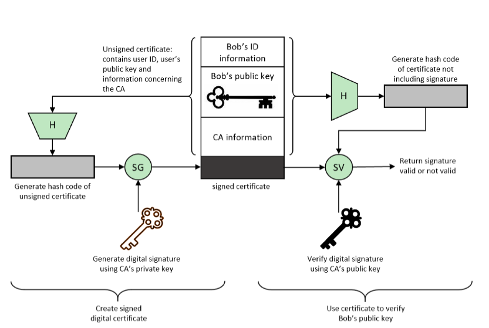

On the face of it, the point of public-key encryption is that the public key is public. Thus, if there is some broadly accepted public-key algorithm, such as RSA, any participant can send his or her public key to any other participant or broadcast the key to the community at large. Although this approach is convenient, it has a major weakness. Anyone can forge such a public announcement. That is, some user could pretend to be Bob and send a public key to another participant or broadcast such a public key. Until such time as Bob discovers the forgery and alerts other participants, the forger is able to read all encrypted messages intended for Bob and can use the forged keys for authentication.

The solution to this problem is the public-key certificate. In essence, a certificate consists of a public key plus a user ID of the key owner, with the whole block signed by a trusted third party. The certificate also includes some information about the third party plus an indication of the period of validity of the certificate. Typically, the third party is a **certificate authority (CA)** that is trusted by the user community, such as a government agency or a financial institution. A user can present his or her public key to the authority in a secure manner and obtain a signed certificate. The user can then publish the certificate. Anyone needing this user’s public key can obtain the certificate and verify that it is valid by means of the attached trusted signature.

The key steps can be summarized as follows:

1. User software (client) creates a pair of keys: one public and one private.
2. Client prepares an unsigned certificate that includes the user ID and user’s public key.
3. User provides the unsigned certificate to a CA in some secure manner. This might require a face-to-face meeting, the use of registered e-mail, or happen via a Web form with e-mail verification.
4. CA creates a signature as follows:
   - CA uses a hash function to calculate the hash code of the unsigned certificate. A hash function is one that maps a variable-length data block or message into a fixed-length value called a hash code, such as SHA family
   - CA generates digital signature using the CA’s private key and a signature generation algorithm.
5. CA attaches the signature to the unsigned certificate to create a signed certificate.
6. CA returns the signed certificate to client.
7. Client may provide the signed certificate to any other user.
8. Any user may verify that the certificate is valid as follows:
   - User calculates the hash code of certificate (not including signature).
   - User verifies digital signature using CA’s public key and the signature verification algorithm. The algorithm returns a result of either signature valid or invalid.

One scheme has become universally accepted for formatting public-key­ certificates: the X.509 standard. X.509 certificates are used in most network security applications, including IP Security (IPsec), Transport Layer Security (TLS), Secure Shell (SSH), and Secure/Multipurpose Internet Mail Extension (S/MIME). We will examine most of these applications in Part Five.

---

### 21. Digital Envelope

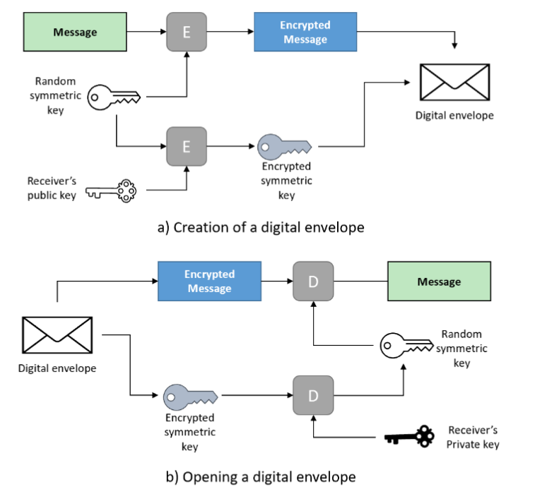

Another application in which public-key encryption is used to protect a symmetric key is the digital envelope, which can be used to protect a message without needing to first arrange for sender and receiver to have the same secret key. The technique is referred to as a digital envelope, which is the equivalent of a sealed envelope containing an unsigned letter.

The general approach in figure suppose that Bob wishes to send a confidential message to Alice, but they do not share a symmetric secret key. Bob does the following:

1. Prepare a message.
2. Generate a random symmetric key that will be used one time only.
3. Encrypt the message using symmetric encryption  with the one-time symmetric key.
4. Encrypt the one-time key using public-key encryption with Alice's public key.
5. Attach the one-time key using public key to the encrypted message and sent it to Alice.

Only Alice is capable of decrypting the one-time key and therefore of recovering the original message. If Bob obtained Alice’s public key by means of Alice’s public-key certificate, then Bob is assured that it is a valid key.

### 22. NIST's authentication architectural model

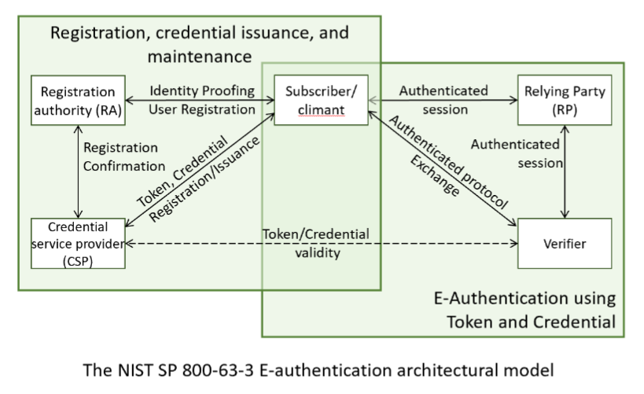

NIST SP 800-63-3 defines a general model for user authentication that involves a ­number of entities and procedures.

The initial requirement for performing user authentication is that the user must be registered with the system. The following is a typical sequence for registration. An applicant applies to a **registration authority (RA)** to become a subscriber of a **credential service provider (CSP)**. In this model, the RA is a trusted entity that establishes and vouches for the identity of an applicant to a CSP. The CSP then engages in an exchange with the subscriber. Depending on the details of the overall authentication system, the CSP issues some sort of electronic credential to the subscriber. The **credential** is a data structure that authoritatively binds an identity and additional attributes to a token possessed by a subscriber, and can be verified when presented to the verifier in an authentication transaction. The token could be an encryption key or an encrypted password that identifies the subscriber.

The token may be issued by the CSP, generated directly by the subscriber, or provided by a third party. The token and credential may be used in subsequent authentication events.

Once a user is registered as a subscriber, the actual authentication process can take place between the subscriber and one or more systems that perform authentication and, subsequently, authorization. The party to be authenticated is called a **claimant**, and the party verifying that identity is called a **verifier**. When a claimant successfully demonstrates possession and control of a token to a verifier through an authentication protocol, the verifier can verify that the claimant is the subscriber named in the corresponding credential. The verifier passes on an assertion about the identity of the subscriber to the **relying party (RP)**. That assertion includes identity information about a subscriber, such as the subscriber name, an identifier assigned at registration, or other subscriber attributes that were verified in the registration process. The RP can use the authenticated information provided by the verifier to make access control or authorization decisions.

An implemented system for authentication will differ from or be more complex than this simplified model, but the model illustrates the key roles and functions needed for a secure authentication system.

---

### 22. Password vulnerabilities

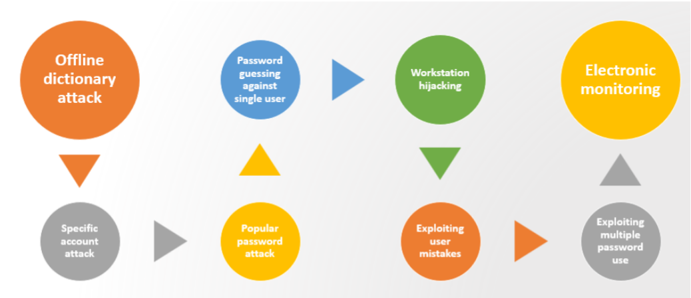

1. **Technical & brute force attacks**
These attacks rely on computing power and databases rather than interacting with the user directly.
  - **Offline Dictionary Attack**

    - What it is: In this scenario, an attacker has managed to steal a file containing encrypted (hashed) passwords from a server. Because they have the file on their own computer ("offline"), they can try millions of words from a dictionary every second to see if they match the stolen hashes, without triggering account lockouts or alarms.

    - Why it works: Many users choose simple dictionary words as passwords.

  - **Specific Account Attack**
    - What it is: Instead of trying to hack everyone, the attacker focuses their efforts on one high-value target (like a System Administrator or CEO).
    - Why it works: It allows the attacker to dedicate more time and resources to a single, valuable entry point.

  - **Popular Password Attack**
    - What it is: Often called "Credential Spraying." The attacker tries a few very common passwords (like 123456, password, or qwerty) against a large list of usernames.
    - Why it works: Statistically, in any large company, someone is using one of these weak passwords.

1. **Targeted & Social Attacks**

These methods move closer to the specific user, relying on personal information or direct access.

  - **Password Guessing Against Single User**
    - What it is: The attacker tries to guess a specific user's password based on personal information they can find online (social media, public records).
    - Examples: Trying birthdays, pet names, children's names, or favorite sports teams.

  - **Workstation Hijacking**
    - What it is: This occurs when an attacker gains control of a user's computer while they are already logged in. This can happen physically (e.g., you walk away from your unlocked desk) or digitally (via malware/trojans that allow remote control).
    - Why it works: It bypasses the need for a password entirely because the active session is already authenticated.

3. **Exploiting Human Behavior**

The final stages of the diagram focus on how user negligence helps attackers expand their reach.

  - **Exploiting User Mistakes**
    - What it is: Taking advantage of poor security hygiene.
    - Examples: Finding a password written on a sticky note under a keyboard, "shoulder surfing" (watching someone type their password), or tricking a user into revealing their password via a phishing email.

  - **Exploiting Multiple Password Use** (Password Reuse)
    - What it is: This is one of the most critical vulnerabilities. If a user utilizes the same password for Facebook, their work email, and their banking, an attacker only needs to crack one to access all of them.
    - Why it works: Once an attacker finds a working password, they immediately try it on other popular services.

4. **Surveillance**
  - **Electronic Monitoring**
  - What it is: This involves using spyware or hardware devices to capture passwords as they are typed or transmitted.
  - Examples:
    - Keyloggers: Software that records every keystroke.
    - Packet Sniffing: Intercepting data traveling over an unsecured Wi-Fi network.
---

### 23. The Use of Hashed Passwords

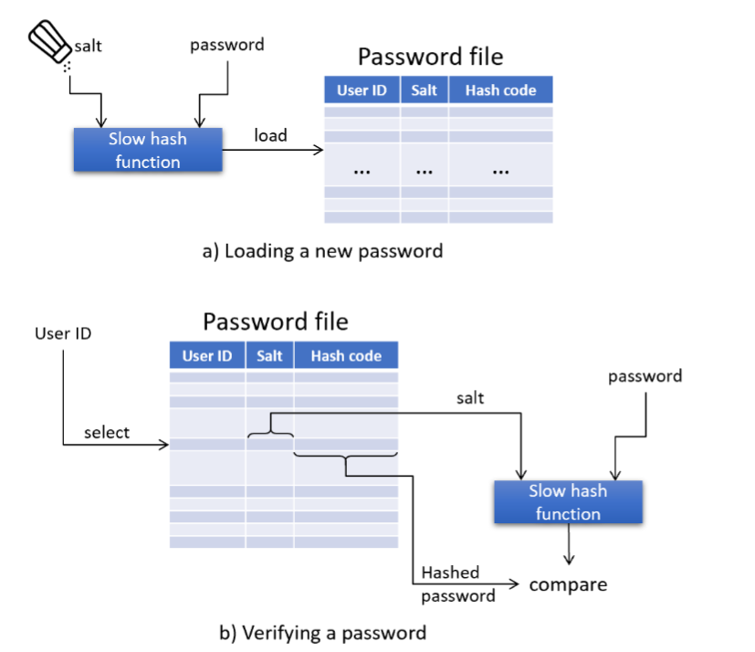

A widely used password security technique is the use of hashed passwords and a salt value. This scheme is found on virtually all UNIX variants as well as on a number of other operating systems.

To load a new password into the system, the user selects or is assigned a password.

This password is combined with a fixed-length salt value [MORR79]. In older implementations, this value is related to the time at which the password is assigned to the user. Newer implementations use a pseudorandom or random number. The password and salt serve as inputs to a hashing algorithm to produce a fixed-length hash code. The hash algorithm is designed to be slow to execute in order to thwart attacks. The hashed password is then stored, together with a plaintext copy of the salt, in the password file for the corresponding user ID. The hashed password method has been shown to be secure against a variety of cryptanalytic attacks [WAGN00].

When a user attempts to log on to a UNIX system, the user provides an ID and a password. The operating system uses the ID to index into the password file and retrieve the plaintext salt and the encrypted password. The salt and user-supplied password are used as input to the encryption routine. If the result matches the stored value, the password is accepted.

The salt serves three purposes:

1. It prevents duplicate passwords from being visible in the password file. Even if two users choose the same password, those passwords will be assigned different salt values. Hence, the hashed passwords of the two users will differ.
2. It greatly increases the difficulty of offline dictionary attacks. For a salt of length b bits, the number of possible passwords is increased by a factor of 2^b, increasing the difficulty of guessing a password in a dictionary attack.
3. It becomes nearly impossible to find out whether a person with passwords on two or more systems has used the same password on all of them.

To see the second point, consider the way that an offline dictionary attack would work. The attacker obtains a copy of the password file. Suppose first that the salt is not used. The attacker’s goal is to guess a single password. To that end, the attacker submits a large number of likely passwords to the hashing function. If any of the guesses matches one of the hashes in the file, then the attacker has found a password that is in the file. But faced with the UNIX scheme, the attacker must take each guess and submit it to the hash function once for each salt value in the dictionary file, multiplying the number of guesses that must be checked.

There are two threats to the UNIX password scheme. 
1. First, a user can gain access on a machine using a guest account or by some other means then run a password guessing program, called a password cracker, on that machine. The attacker should be able to check many thousands of possible passwords with little resource consumption. 
2. In addition, if an opponent is able to obtain a copy of the password file, then a cracker program can be run on another machine at leisure. This enables the opponent to run through millions of possible passwords in a reasonable period.

---

### 23. Actual biometric measurement operating characteristic curves

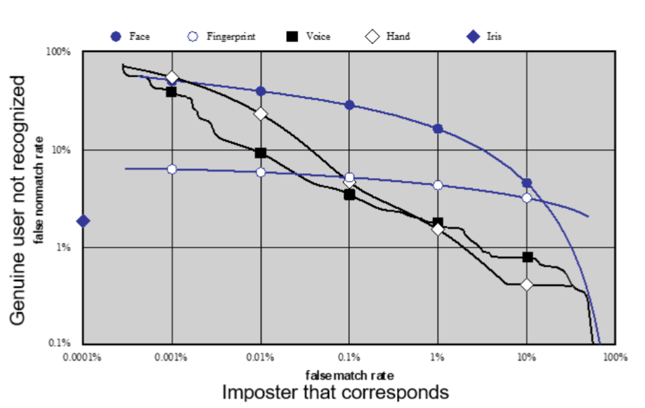

This chart is a technical visualization used to compare the performance and accurcy of different biometric authentication methods (Face, Fingerprint, Voide, Hand, and Iris).

1. **The Axes: Balancing Errors**
The graph plots two types of errors against each other on a logarithmic scale. This visualization helps determine how "good" a biometric system is.
   - **X-Axis (False Match Rate)**: Labeled "Imposter that corresponds".
       -  This represents the security risk. It is the percentage of times an unauthorized person (imposter) is incorrectly accepted by the system.

       - Lower values (further left) are better for security.

   - **Y-Axis (False Non-match Rate)**: Labeled "Genuine user not recognized".
     -  This represents inconvenience. It is the percentage of times a legitimate user is incorrectly rejected by the system.
     -  Lower values (further down) are better for usability.

2. **Interpreting the Curves**

The goal of any biometric system is to be as close to the bottom-left corner as possible, where both the False Match Rate and False Non-match Rate are zero.
   - **Iris (Blue Diamond)**: This is the most accurate method shown. It is represented by a single point on the far left, indicating an extremely low False Match Rate (around 0.0001%) while maintaining a low False Non-match Rate. This suggests it is highly secure and accurate.
   - **Fingerprint (White Circles)**: This curve is relatively flat and low, sitting below the Face and Voice curves. This indicates it is a strong performer, maintaining a low error rate for genuine users even as security settings are tightened.
   - **Hand Geometry (White Diamonds)**: This performs moderately well, generally sitting between fingerprints and voice/face recognition in terms of accuracy.
   - **Voice (Black Squares) and Face (Blue Dots)**: These curves are higher and further to the right. This indicates they are less accurate in this comparison. To achieve a secure low False Match Rate (moving left on the X-axis), these systems are forced to reject a very high number of genuine users (spiking up on the Y-axis).

1. **Key Takeaway: The Trade-off**

Systems operate on a threshold that can be adjusted.
   - **Moving Left**: If you increase the threshold to make the system more secure (lower False Match Rate), you inevitably move up the curve, making it less convenient (higher Genuine User Rejection).
   - **Moving Right**: If you decrease the threshold to make it more convenient, you move down the curve but increase the risk of imposters getting in.

**In summary**: The image illustrates that Iris and Fingerprint technologies generally offer a better balance of security and convenience (lower error rates) compared to Face and Voice recognition for the data presented in the lecture.

### 24. Basic challenge-response protocols for Remote User Authentication

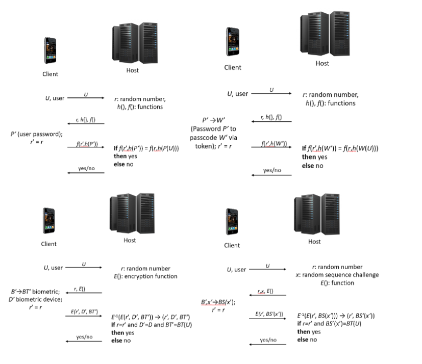

(See answer to question 8)

---

### 25. Relationship Among Access Control and Other Security Functions

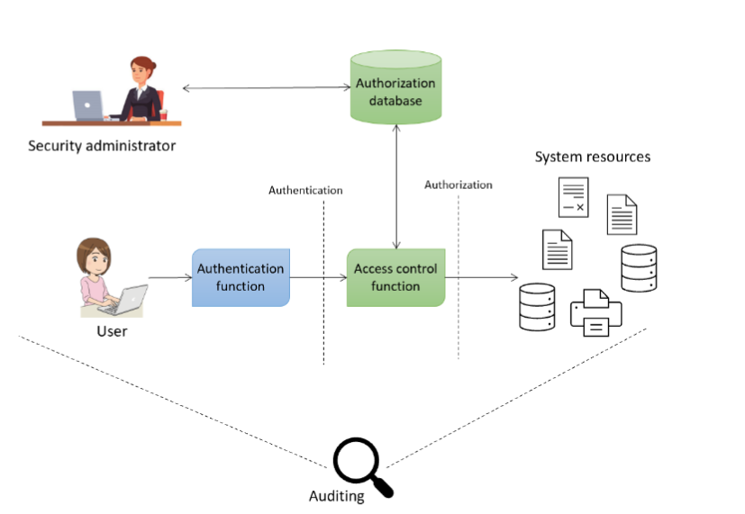

This context of access control involves the following entities and functions:

- **Authentication**: Verification that the credentials of a user or other system entity are valid.
- **Authorization**: The granting of a right or permission to a system entity to access a system resource. This function determines who is trusted for a given purpose.
- **Audit**: An independent review and examination of system records and activities in order to test for adequacy of system controls, to ensure compliance with established policy and operational procedures, to detect breaches in security, and to recommend any indicated changes in control, policy, and procedures.

An access control mechanism mediates between a user (or a process executing on behalf of a user) and system resources, such as applications, operating systems, firewalls, routers, files, and databases. The system must first authenticate an entity seeking access. Typically, the authentication function determines whether the user is permitted to access the system at all. Then the access control function determines if the specific requested access by this user is permitted. A security administrator maintains an authorization database that specifies what type of access to which resources is allowed for this user. The access control function consults this database to determine whether to grant access. An auditing function monitors and keeps a record of user accesses to system resources.

In the simple model the access control function is shown as a single logical module. In practice, a number of components may cooperatively share the access control function. All operating systems have at least a rudimentary, and in many cases a quite robust, access control component. Add-on security packages can supplement the native access control capabilities of the operating system. Particular applications or utilities, such as a database management system, also incorporate access control functions. External devices, such as firewalls, can also provide access control services.

---

### 26. Access Control System Commands

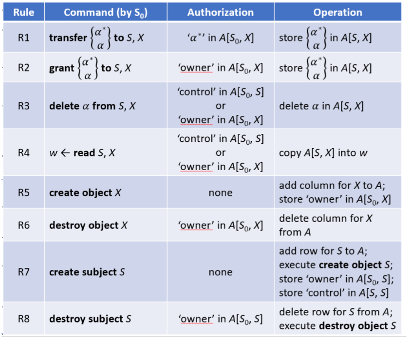

The set of rules in the table is an example of the rule set that could be defined for an access control system.

The first three rules deal with transferring, granting, and deleting access rights. Suppose the entry $a*$ exists in $A[S_0, X]$. This means $S_0$ has access right $a$ to subject X and, because of the presence of the copy flag, can transfer this right, with or without copy flag, to another subject.

- Rule R1 expresses this capability. A subject would transfer the access right without the copy flag if there were a concern that the new subject would maliciously transfer the right to another subject that should not have that access right. For example, S1 may place 'read' or 'read*' in any matrix entry in the F1 column. Rule R2 states that if S0 is designated as the owner of object X, then S0 can grant an access right to that object for any other subject.
- Rule R2 states that S0 can add any access right to $A[S, X]$ for any S, if S0 has 'owner' access to X.
- Rule R3 permits S0 to delete any access right from any matrix entry in a row for which S0 controls the subject, and for any matrix entry in a column for which S0 owns the object.
- Rule R4 permits a subject to read that portion of the matrix that it owns or controls. The remaining rules in the table govern the creation and deletion of subjects and objects.
- Rule R5 states that any subject can create a new object, which it owns, and can then grant and delete access to the object.
- Under Rule R6, the owner of an object can destroy the object, resulting in the deletion of the corresponding column of the access matrix.
- Rule R7 enables any subject to create a new subject; the creator owns the new subject and the new subject has control access to itself.
- Rule R8 permits the owner of a subject to delete the row and column (if there are subject columns) of the access matrix designated by that subject.

---

### 27.  RBAC  reference models

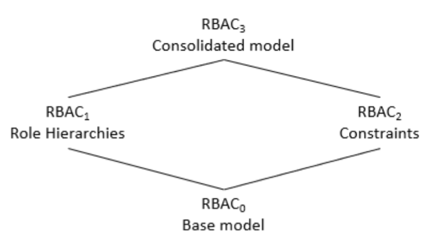

A variety of functions and services can be included under the general RBAC approach. To clarify the various aspects of RBAC, it is useful to define a set of abstract models of RBAC functionality.

[SAND96] defines a family of reference models that has served as the basis for ongoing standardization efforts.

This family consists of four models that are related
to each other.

- $RBAC_0$ contains the minimum functionality for an RBAC system.
- $RBAC_1$ includes the $RBAC_0$ functionality and adds role hierarchies, which enable one role to inherit permissions from another role.
- $RBAC_2$ includes $RBAC_0$ and adds constraints, which restrict the ways in which the components of an RBAC system may be configured.
- $RBAC_3$ contains the functionality of $RBAC_0$, $RBAC_1$ and $RBAC_2$.

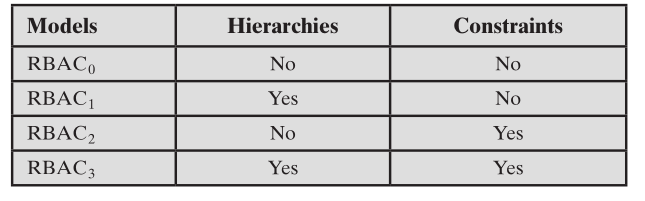

---

### 28. $RBAC_0$ model

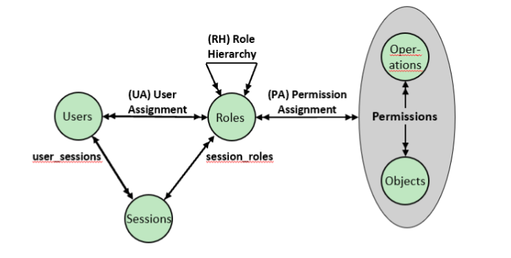

$RBAC_0$ is without the role hierarchy and constraints, contains the four types of entities in an $RBAC_0$ system.

- **User**: An individual that has access to his computer system. Each individual has an associated used ID.
- **Role**: A named job function within the organization that controls this computer system. Typically, associated with each role is a description of the authority and responsibility conferred on this role, and on any user who assumes this role.
- **Permission**: An approval of a particular mode of access to one or more objects. Equivalent terms are access right, privilege, and authorization.
- **Session**: A mapping between a user and an activated subset of the set of roles to which the user is assigned.

---

### 29. Attribute-based access control: logical architecture

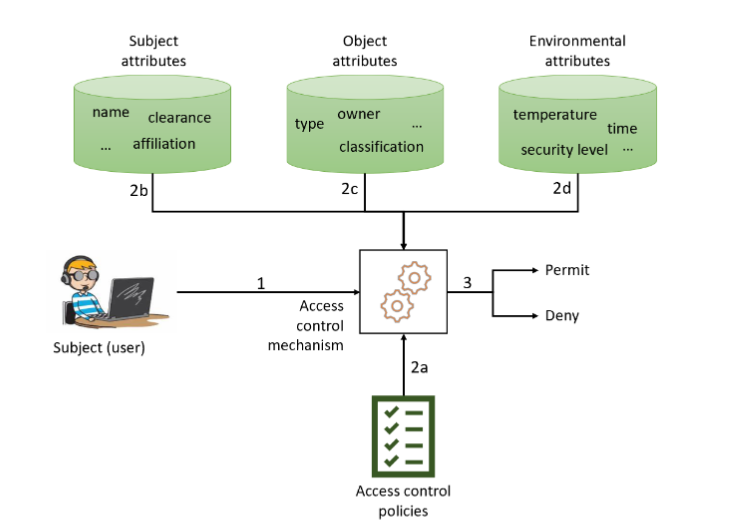

The picture illustrates in a logical architecture the essential components of an ABAC system. An access by subjcet to an object proceeds according to the following steps:

1. A subject requests access to an object. This request is routed to an access control mechanism.
2. The access control mechanism is governated by a set of rules (2a) that are defined by a preconfigured access control policy. Based on these rules, the access control mechanism assesses the attributes of the subject (2b), object (2c), and current environmental conditions (2d) to determine authorization.
3. The access control mechanism grants the subject access to the object if access is authorized, and denies access if it is not authorized.

It is clear from the logical architecture that there are four independent sources of information used for the access control decision. The system designer can decide
which attributes are important for access control with respect to subjects, objects, and environmental conditions. The system designer or other authority can then define access control policies, in the form of rules, for any desired combination of attributes of subject, object, and environmental conditions. It should be evident that this approach is very powerful and flexible. However, the cost, both in terms of the complexity of the design and implementation, and in terms of the performance impact, is likely to exceed that of other access control approaches. This is a trade-off that the system authority must make.

### 30. ACL and ABAC relationships

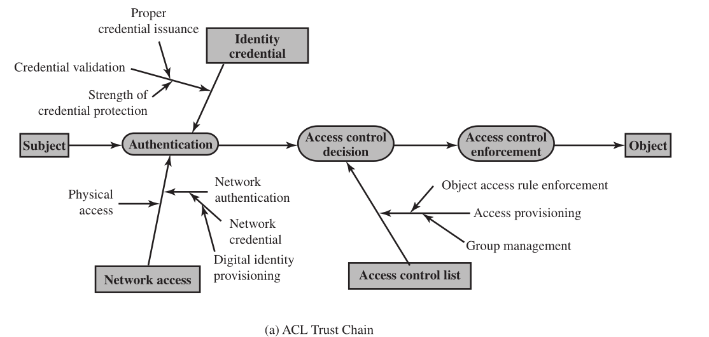

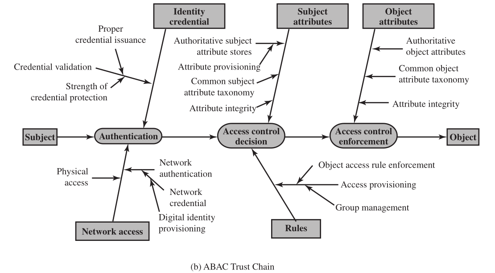

** The **root of trust** is essentially the answer to the question: "Who is the ultimate authority that decides if a user is safe or allowed to do something?"

It is the foundational source that the system relies on to ensure security rules are valid. If you cannot trust this "root," you cannot trust any decision the system makes.

- With ACLs the **root of trust** is with the object owner:
  - who ultimately enforces the object access rules by provisioning access to the object through addition of a user to an ACL.
- In ABAC, **the root of trust** is derived from many sources of which the object owner has no control.
  - ...such as Subject Attribute Authorities, Policy Developers and Credential Issuers.

Hence the standard (SP 800-162) recommend to form an enterprise governance body, to manage:
- identities,
- credentials,
- access management capability deployment operation

Additionally, the standards recommend to develop a trust model:
- to illustrate the trust relationships
- to determine ownership and liability of information and services
- to determine needs for additional policy and governance,
- …

### 31. Key functions in identity management

The picture provides an overview of the logical components of an ICAM (Identity, Credential and Access Management) architecture.
- ICAM is a comprehensive approach to managing and implementing digital identities, credentials and access control
- Developed by the U.S. government
- Designed to:
  - Create trusted digital identity representations of individuals and nonperson entities (NPEs)
  - Bind identities to credentials
    - that serve as a proxy for individuals or NPE in access transactions
    - A credential is an object or data structure that authoritatively binds an identity to a token possessed and controlled by a subscriber
  - Use the credentials to provide authorized access to an agency’s resources

**Identity management**

Identity management is concerned with assigning attributes to a digital identity and connecting that digital identity to an individual or NPE. The goal is to establish a trustworthy digital identity that is independent of a specific application or context. The traditional, and still most common, approach to access control for applications and programs is to create a digital representation of an identity for the specific use of the application or program. As a result, maintenance and protection of the identity itself is treated as secondary to the mission associated with the application. ­Further, there is considerable overlap in effort in establishing these application-specific identities.

Unlike accounts used to log on to networks, systems, or applications, enterprise identity records are not tied to job title, job duties, location, or whether access is needed to a specific system. Those items may become attributes tied to an enterprise identity record, and may also become part of what uniquely identifies an individual in a specific application. Access control decisions will be based on the context and relevant attributes of a user—not solely their identity. The concept of an enterprise identity is that individuals will have a single digital representation of themselves that can be lever-aged across departments and agencies for multiple purposes, including access control.

The figure depicts the key functions involved in identity management. Establishment of a digital identity typically begins with collecting identity data as part of an enrollment process. A digital identity is often comprised of a set of attributes that when aggregated uniquely identify a user within a system or an enterprise. In order to establish trust in the individual represented by a digital identity, an agency may also conduct a background investigation. Attributes about an individual may be stored in various authoritative sources within an agency and linked to form an enterprise view of the digital identity. This digital identity may then be provisioned into applications in order to support physical and logical access (part of Access Management) and ­de-provisioned when access is no longer required.

A final element of identity management is lifecycle management, which includes the following:
  - Mechanisms, policies, and procedures for protecting personal identity information
  - Controlling access to identity data
  - Techniques for sharing authoritative identity data with applications that need it
  - Revocation of an enterprise identity

**Credential Management**

As mentioned, a credential is an object or data structure that authoritatively binds an identity (and optionally, additional attributes) to a token possessed and controlled by a subscriber. Examples of credentials are smart cards, private/public cryptographic keys, and digital certificates. Credential management is the management of the life cycle of the credential. Credential management encompasses the following five logical components:

1. An authorized individual sponsors an individual or entity for a credential to establish the need for the credential. For example, a department supervisor sponsors a department employee.
2. The sponsored individual enrolls for the credential, a process which typically consists of identity proofing and the capture of biographic and biometric data. This step may also involve incorporating authoritative attribute data, maintained by the identity management component.
3. A credential is produced. Depending on the credential type, production may involve encryption, the use of a digital signature, the production of a smartcard, or other functions.
4. The credential is issued to the individual or NPE.
5. Finally, a credential must be maintained over its life cycle, which might include revocation, reissuance/replacement, reenrollment, expiration, personal identification number (PIN) reset, suspension, or reinstatement.

**Access Management**

The access management component deals with the management and control of the ways entities are granted access to resources. It covers both logical and physical access, and may be internal to a system or an external element. The purpose of access management is to ensure that the proper identity verification is made when an individual attempts to access security-sensitive buildings, computer systems, or data. The access control function makes use of credentials presented by those requesting access and the digital identity of the requestor. Three support elements are needed for an enterprise-wide access control facility:
- **Resource management**: This element is concerned with defining rules for a resource that requires access control. The rules would include credential requirements and what user attributes, resource attributes, and environmental conditions are required for access of a given resource for a given function.
- **Privilege management**: This element is concerned with establishing and maintaining the entitlement or privilege attributes that comprise an individual’s access profile. These attributes represent features of an individual that can be used as the basis for determining access decisions to both physical and logical resources. Privileges are considered attributes that can be linked to a digital identity.
- **Policy management**: This element governs what is allowable and unallowable in an access transaction. That is, given the identity and attributes of the requestor, the attributes of the resource or object, and environmental conditions, a policy specifies what actions this user can perform on this object.

**Identity Federation**
Identity federation addresses two questions:
  1. How do you trust identities of individuals from external organizations who need access to your systems?
  2. How do you vouch for identities of individuals in your organization when they need to collaborate with external organizations?
Identity federation is a term used to describe the technology, standards, policies, and processes that allow an organization to trust digital identities, identity attributes, and credentials created and issued by another organization. We will discuss identity federation in the following section.