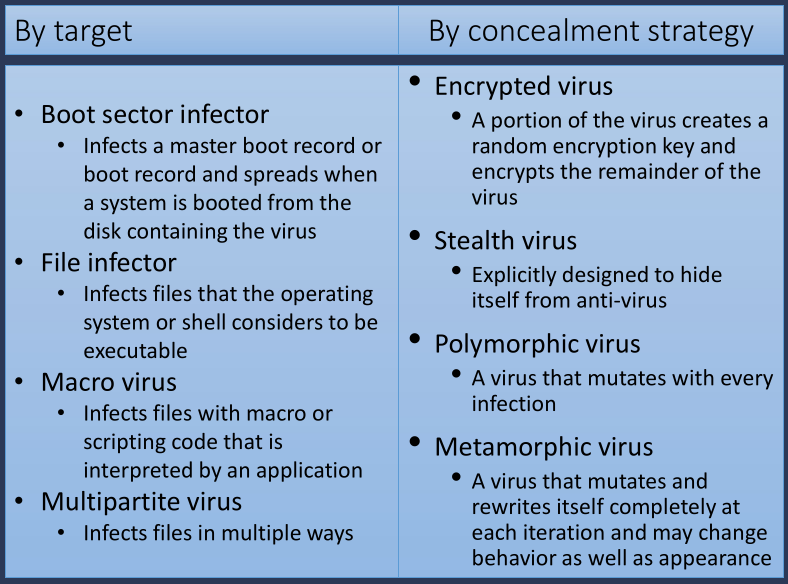
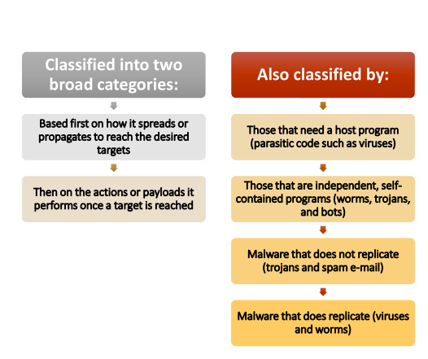
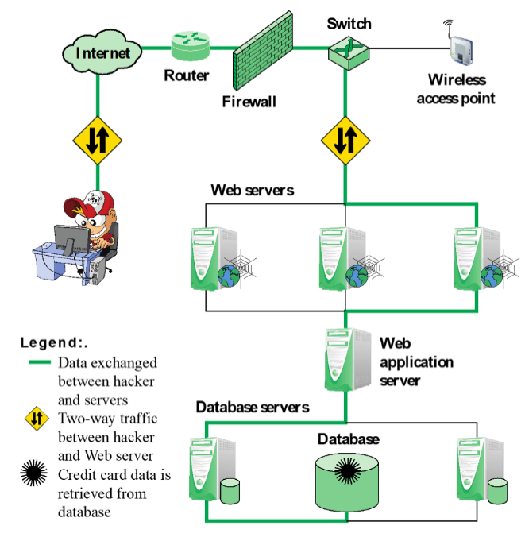
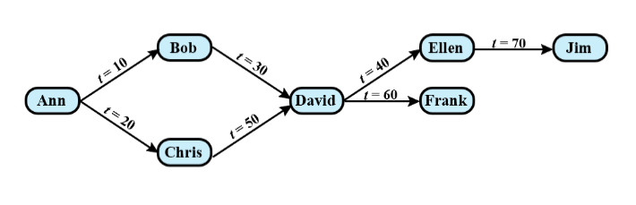
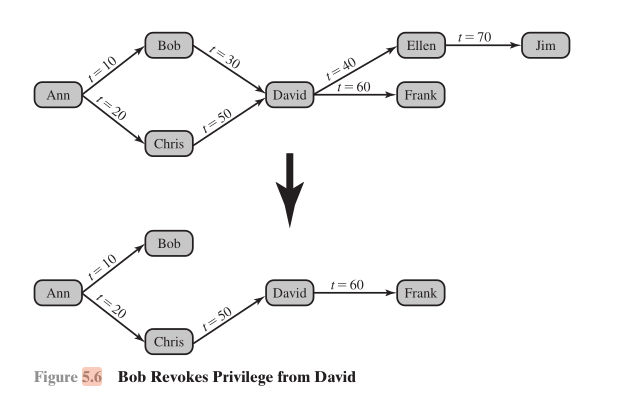
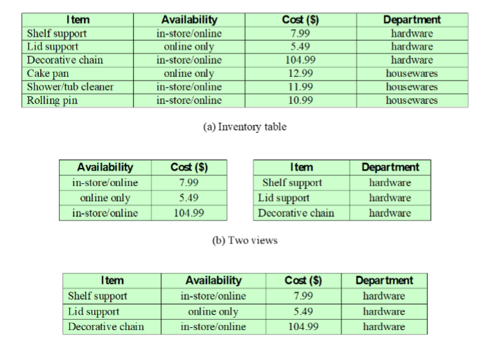
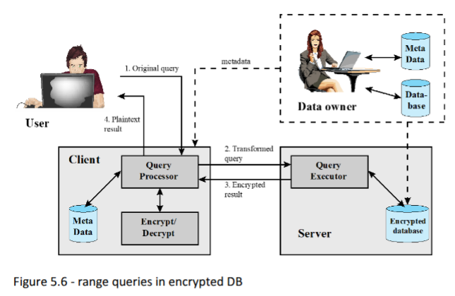
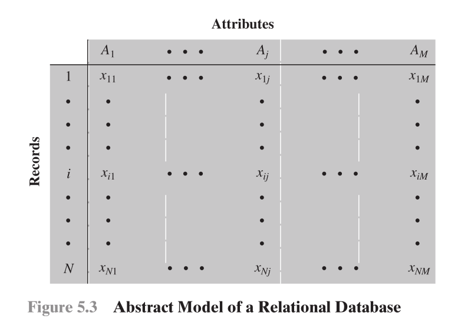
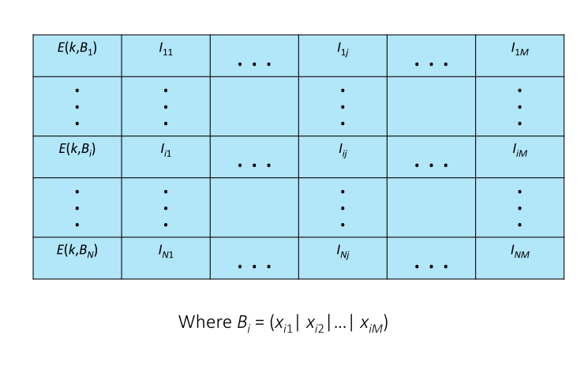

## Part 2

#### 1. Explain the need for security in databases

Organizational databases tend to concentrate sensitive information in a single logical system. Examples include:

- Corporate financial data
- Confidential phone records
- Customer and employee information, such as name, Social Security number, bank account information, and credit card information
- Proprietary product information
- Health care information and medical records

For many businesses and other organizations, it is important to be able to provide customers, partners, and employees with access to this information. But such information can be targeted by internal and external threats of misuse or unauthorized change. Accordingly, security specifically tailored to databases is an increasingly important component of an overall organizational security strategy.

[BENN06] cites the following reasons why database security has not kept pace with the increased reliance on databases:

1. There is a dramatic imbalance between the complexity of modern **database management systems (DBMS)** and the security techniques used to protect these critical systems. A DBMS is a very complex, large piece of software, providing many options, all of which need to be well understood and then secured to avoid data breaches. Although security techniques have advanced, the increasing complexity of the DBMS—with many new features and services—has brought a number of new vulnerabilities and the potential for misuse.
2. Databases have a sophisticated interaction protocol called the **Structured Query Language (SQL)**, which is far more complex, than for example, the Hypertext Transfer Protocol (HTTP) used to interact with a Web service. Effective database security requires a strategy based on a full understanding of the security vulnerabilities of SQL.
3. The typical organization lacks full-time database security personnel. The result is a mismatch between requirements and capabilities. Most organizations have a staff of database administrators, whose job is to manage the database to ensure availability, performance, correctness, and ease of use. Such administrators may have limited knowledge of security and little available time to master and apply security techniques. On the other hand, those responsible for security within an organization may have very limited understanding of database and DBMS technology.
4. Most enterprise environments consist of a heterogeneous mixture of database platforms (Oracle, IBM DB2 and Informix, Microsoft, Sybase, etc.), enterprise platforms (Oracle E-Business Suite, PeopleSoft, SAP, Siebel, etc.), and OS platforms (UNIX, Linux, z/OS, and Windows, etc.). This creates an additional complexity hurdle for security personnel.

An additional recent challenge for organizations is their increasing reliance on cloud technology to host part or all of the corporate database. This adds an additional burden to the security staff.

---

#### 2. Explain what is an SQL-injection attack and what are its "avenues". Provide an example of an SQL-injection attack.

The SQL injection (SQLi) attack is one of the most prevalent and dangerous network-based security threats.

In general terms, an SQLi attack is designed to exploit the nature of Web application pages. In contrast to the static webpages of years gone by, most current websites have dynamic components and content. Many such pages ask for information, such as location, personal identity information, and credit card information.

This dynamic content is usually transferred to and from back-end databases that contain volumes of information—anything from cardholder data to which type of running shoes is most purchased. An application server webpage will make SQL queries to databases to send and receive information critical to making a positive user experience. In such an environment, an SQLi attack is designed to send malicious SQL commands to the database server. The most common attack goal is bulk extraction of data. Attackers can dump database tables with hundreds of thousands of customer records. Depending on the environment, SQL injection can also be exploited to modify or delete data, execute arbitrary operating system commands, or launch denial-of-service (DoS) attacks.

**A Typical SQLi Attack**

SQLi is an attack that exploits a security vulnerability occurring in the database layer of an application (such as queries). Using SQL injection, the attacker can extract or manipulate the Web application’s data. The attack is viable when user input is either incorrectly filtered for string literal escape characters embedded in SQL statements or user input is not strongly typed, and thereby unexpectedly executed.

A typical example of an SQLi attack. The steps involved are as follows:

1. Hacker finds a vulnerability in a custom Web application and injects an SQL command to a database by sending the command to the Web server. The command is injected into traffic that will be accepted by the firewall.
2. The Web server receives the malicious code and sends it to the Web application server.
3. The Web application server receives the malicious code from the Web server and sends it to the database server.
4. The database server executes the malicious code on the database. The database returns data from credit cards table.
5. The Web application server dynamically generates a page with data including credit card details from the database.
6. The Web server sends the credit card details to the hacker.

---

#### 3. Discuss advanced persistent threats

Advanced Persistent Threats (APTs) have risen to prominence in recent years. These are not a new type of malware, but rather the well-resourced, persistent application of a wide variety of intrusion technologies and malware to selected targets, usually business or political. APTs are typically attributed to state-sponsored organizations, with some attacks likely from criminal enterprises as well.

APTs differ from other types of attack by their careful target selection, and persistent, often stealthy, intrusion efforts over extended periods. A number of high-profile attacks, including Aurora, RSA, APT1, and Stuxnet, are often cited as examples. They are named as a result of these characteristics:

- **Advanced**: Use by the attackers of a wide variety of intrusion technologies and malware, including the development of custom malware if required. The individual components may not necessarily be technically advanced, but are carefully selected to suit the chosen target.
- **Persistent**: Determined application of the attacks over an extended period against the chosen target in order to maximize the chance of success. A variety of attacks may be progressively, and often stealthily, applied until the target is compromised.
- **Threats**: Threats to the selected targets as a result of the organized, capable, and well-funded attackers intent to compromise the specifically chosen targets. The active involvement of people in the process greatly raises the threat level from that due to automated attacks tools, and also the likelihood of successful attack.

The aim of these attacks varies from theft of intellectual property or security- and infrastructure- related data to the physical disruption of infrastructure. ­Techniques used include social engineering, spear-phishing e-mails, and drive-­by-downloads from selected compromised Web sites likely to be visited by personnel in the target ­organization. The intent is to infect the target with sophisticated malware with multiple propagation mechanisms and payloads. Once they have gained initial access to systems in the target organization, a further range of attack tools are used to maintain and extend their access.

As a result, these attacks are much harder to defend against due to this specific targeting and persistence. It requires a combination of technical countermeasures as well as awareness training to assist personnel to resist such attacks. Even with current best practice countermeasures, the use of zero-day exploits and new attack approaches means that some of these attacks are likely to succeed [SYMA16, MAND13]. Thus multiple layers of defense are needed, with mechanisms to detect, respond, and mitigate such attacks. These may include monitoring for malware command and control traffic, and detection of exfiltration traffic.
------------------------------------------------------------------------------------------------------------------------------------------------------------------------------------------------------------------------------------------------------------------------------------------------------------------------------------------------------------------------------------------------------------------------------------------------------------------------------------------------------------------------------------------------------------------------------------------------------------------------------------------------------

### 4. Define a virus and a worm and discuss their differences

**Viruses**

The first category of malware propagation concerns parasitic software fragments that attach themselves to some existing executable content. The fragment may be machine code that infects some existing application, utility, or system program, or even the code used to boot a computer system. Computer virus infections formed the majority of malware seen in the early personal computer era. The term "computer virus" is still often used to refer to malware in general, rather than just computer viruses specifically. More recently, the virus software fragment has been some form of scripting code, typically used to support active content within data files such as Microsoft Word documents, Excel spreadsheets, or Adobe PDF documents.

**The Nature of Viruses**

A **computer virus** is a piece of software that can "infect" other programs, or indeed any type of executable content, by modifying them. The modification includes injecting the original code with a routine to make copies of the virus code, which can then go on to infect other content. Biological viruses are tiny scraps of genetic code—DNA or RNA—that can take over the machinery of a living cell and trick it into making thousands of flawless replicas of the original virus.
Like its biological counterpart, a computer virus carries in its instructional code the recipe for making perfect copies of itself.

The typical virus becomes embedded in a program, or carrier of executable content, on a computer. Then, whenever the infected computer comes into contact with an uninfected piece of code, a fresh copy of the virus passes into the new location. Thus, the infection can spread from computer to computer, aided by unsuspecting users, who exchange these programs or carrier files on disk or USB stick; or who send them to one another over a network. In a network environment, the ability to access documents, applications, and system services on other computers provides a perfect culture for the spread of such viral code. A virus that attaches to an executable program can do anything that the program is permitted to do. It executes secretly when the host program is run. Once the virus code is executing, it can perform any function, such as erasing files and programs, that is allowed by the privileges of the current user. One reason viruses dominated the malware scene in earlier years was the lack of user authentication and access controls on personal computer systems at that time. This enabled a virus to infect any executable content on the system. The significant quantity of programs shared on floppy disk also enabled its easy, if somewhat slow, spread. The inclusion of tighter access controls on modern operating systems significantly hinders the ease of infection of such traditional, machine executable code, viruses. 
This resulted in the development of **macro viruses** that exploit the active content supported by some documents types, such as Microsoft Word or Excel files, or Adobe PDF documents. Such documents are easily modified and shared by users as part of their normal system use, and are not protected by the same access controls as programs. Currently, a viral mode of infection is typically one of several propagation mechanisms used by contemporary malware, which may also include worm and Trojan capabilities.

A computer virus has three parts. More generally, many contemporary types of malware also include one or more variants of these components:

- **Infection mechanism**: The means by which a virus spreads or propagates, enabling it to replicate. The mechanism is also referred to as the **infection vector**.
- **Trigger**: The event or condition that determines when the payload is activated or delivered, sometimes known as a **logic bomb**.
- **Payload**: What the virus does, besides spreading. The payload may involve damage or may involve benign but noticeable activity.

During its lifetime, a typical virus goes through the following phases:

- **Dormant phase**: The virus is idle. The virus will eventually be activated by some event, such as a date, the presence of another program or file, or the capacity of the disk exceeding some limit. Not all viruses have this stage.
- **Propagation phase**: The virus places a copy of itself into other programs or into certain system areas on the disk. The copy may not be identical to the propagating version; viruses often morph to evade detection. Each infected program will now contain a clone of the virus, which will itself enter a propagation phase.
- **Triggering phase**: The virus is activated to perform the function for which it was intended. As with the dormant phase, the triggering phase can be caused by a variety of system events, including a count of the number of times that this copy of the virus has made copies of itself.
- **Execution phase**: The function is performed. The function may be harmless, such as a message on the screen, or damaging, such as the destruction of programs and data files.

Most viruses that infect executable program files carry out their work in a manner that is specific to a particular operating system and, in some cases, specific to a particular hardware platform. Thus, they are designed to take advantage of the details and weaknesses of particular systems. Macro viruses however target specific document types, which are often supported on a variety of systems. Once a virus has gained entry to a system by infecting a single program, it is in a position to potentially infect some or all of the other files on that system with executable content when the infected program executes, depending on the access permissions the infected program has. Thus, viral infection can be completely prevented by blocking the virus from gaining entry in the first place. Unfortunately, prevention is extraordinarily difficult because a virus can be part of any program outside a system. Thus, unless one is content to take an absolutely bare piece of iron and write all one’s own system and application programs, one is vulnerable. Many forms of infection can also be blocked by denying normal users the right to modify programs on the system.

**Worms**
The next category of malware propagation concerns the exploit of software vulnerabilities, which are commonly exploited by computer worms, and in hacking attacks on systems. A worm is a program that actively seeks out more machines to infect, and then each infected machine serves as an automated launching pad for attacks on other machines. Worm programs exploit software vulnerabilities in client or server programs to gain access to each new system. They can use network connections to spread from system to system. They can also spread through shared media, such as USB drives or CD and DVD data disks. E-mail worms can spread in macro or script code included in documents attached to e-mail or to instant messenger file transfers. Upon activation, the worm may replicate and propagate again. In addition to propagation, the worm usually carries some form of payload, such as those we discuss later.

To replicate itself, a worm uses some means to access remote systems. These include the following, most of which are still seen in active use:

- **Electronic mail or instant messenger facility**: A worm e-mails a copy of itself to other systems, or sends itself as an attachment via an instant message service, so that its code is run when the e-mail or attachment is received or viewed.
- **File sharing**: A worm either creates a copy of itself or infects other suitable files as a virus on removable media such as a USB drive; it then executes when the drive is connected to another system using the autorun mechanism by exploiting some software vulnerability, or when a user opens the infected file on the target system.
- **Remote execution capability**: A worm executes a copy of itself on another system, either by using an explicit remote execution facility or by exploiting a program flaw in a network service to subvert its operations.
- **Remote file access or transfer capability**: A worm uses a remote file access or transfer service to another system to copy itself from one system to the other, where users on that system may then execute it.
- **Remote login capability**: A worm logs onto a remote system as a user and then uses commands to copy itself from one system to the other, where it then executes.

The new copy of the worm program is then run on the remote system where, in addition to any payload functions that it performs on that system, it continues to propagate.

A worm typically uses the same phases as a computer virus: dormant, propagation, triggering, and execution. The propagation phase generally performs the following functions:

- Search for appropriate access mechanisms on other systems to infect by examining host tables, address books, buddy lists, trusted peers, and other similar repositories of remote system access details; by scanning possible target host addresses; or by searching for suitable removable media devices to use.
- Use the access mechanisms found to transfer a copy of itself to the remote system, and cause the copy to be run.

The worm may also attempt to determine whether a system has previously been infected before copying itself to the system. In a multiprogramming system, it can also disguise its presence by naming itself as a system process or using some other name that may not be noticed by a system operator. More recent worms can even inject their code into existing processes on the system, and run using additional threads in that process, to further disguise their presence.

**State of Worm Technology**
The state of the art in worm technology includes the following:

- **Multiplatform**: Newer worms are not limited to Windows machines but can attack a variety of platforms, especially the popular varieties of UNIX; or exploit macro or scripting languages supported in popular document types.
- **Multi-exploit**: New worms penetrate systems in a variety of ways, using exploits against Web servers, browsers, e-mail, file sharing, and other network-based applications; or via shared media.
- **Ultrafast spreading**: Exploit various techniques to optimize the rate of spread of a worm to maximize its likelihood of locating as many vulnerable machines as possible in a short time period.
- **Polymorphic**: To evade detection, skip past filters, and foil real-time analysis, worms adopt virus polymorphic techniques. Each copy of the worm has new code generated on the fly using functionally equivalent instructions and encryption techniques.
- **Metamorphic**: In addition to changing their appearance, metamorphic worms have a repertoire of behavior patterns that are unleashed at different stages of propagation.
- **Transport vehicles**: Because worms can rapidly compromise a large number of systems, they are ideal for spreading a wide variety of malicious payloads, such as distributed denial-of-service bots, rootkits, spam e-mail generators, and spyware.
- **Zero-day exploit**: To achievemaximum surprise and distribution, a worm should exploit an unknown vulnerability that is only discovered by the general network community when the worm is launched. In 2015, 54 zero-day exploits were discovered and exploited, significantly more than in previous years. Many of these were in common computer and mobile software. Some, though, were in common libraries and development packages, and some in industrial control systems. This indicates the range of systems being targeted.

#### Differences between Viruses and Worms

The main difference between a virus and a worm is how they spread and replicate.

A virus must attach itself to a host file (like a document or an executable program) and requires human action to spread, such as opening the infected file. A worm, on the other hand, is a standalone program that spreads automatically across networks by exploiting security vulnerabilities.

- A **virus** is like a parasite. It can't do anything on its own. It needs to infect a host (a file) to survive. It only spreads if you move that host, like emailing an infected document to a friend.
- A **worm** is like a self-replicating robot. It's an independent entity that can travel on its own (through the network) and build copies of itself on new machines without any help from you.

### 5. Explain the purpose and the methodologies for intrusion detection

- **security intrusion**: Unauthorized act of bypassing the security mechanisms of a system.
- **intrusion detection**: A hardware or software function that gathers and analyzes information from various areas within a computer or a network to identify possible security intrusions.

An IDS comprises three logical components:

- **Sensors**: Sensors are responsible for collecting data. The input for a sensor may be any part of a system that could contain evidence of an intrusion. Types of input to a sensor includes network packets, log files, and system call traces. Sensors collect and forward this information to the analyzer.
- **Analyzers**: Analyzers receive input from one or more sensors or from other analyzers. The analyzer is responsible for determining if an intrusion has occurred. The output of this component is an indication that an intrusion has occurred. The output may include evidence supporting the conclusion that an intrusion occurred. The analyzer may provide guidance about what actions to take as a result of the intrusion. The sensor inputs may also be stored for future analysis and review in a storage or database component.
- **User interface**: The user interface to an IDS enables a user to view output from the system or control the behavior of the system. In some systems, the user interface may equate to a manager, director, or console component.

An IDS may use a single sensor and analyzer, such as a classic HIDS on a host or NIDS in a firewall device. More sophisticated IDSs can use multiple sensors, across a range of host and network devices, sending information to a centralized analyzer and user interface in a distributed architecture. IDSs are often classified based on the source and type of data analyzed, as:

- **Host-based IDS (HIDS)**: Monitors the characteristics of a single host and the events occurring within that host, such as process identifiers and the system calls they make, for evidence of suspicious activity.
- **Network-based IDS (NIDS)**: Monitors network traffic for particular network segments or devices and analyzes network, transport, and application protocols to identify suspicious activity.
- **Distributed or hybrid IDS**: Combines information from a number of sensors, often both host and network-based, in a central analyzer that is able to better identify and respond to intrusion activity.

**Basic Principles**
Authentication facilities, access control facilities, and firewalls all play a role in countering intrusions. Another line of defense is intrusion detection, and this has been the focus of much research in recent years. This interest is motivated by a number of considerations, including the following:

1. If an intrusion is detected quickly enough, the intruder can be identified and ejected from the system before any damage is done or any data are compromised. Even if the detection is not sufficiently timely to preempt the intruder, the sooner that the intrusion is detected, the less the amount of damage and the more quickly that recovery can be achieved.
2. An effective IDS can serve as a deterrent, thus acting to prevent intrusions.
3. Intrusion detection enables the collection of information about intrusion techniques that can be used to strengthen intrusion prevention measures.

Intrusion detection is based on the assumption that the behavior of the intruder differs from that of a legitimate user in ways that can be quantified. Of course, we cannot expect that there will be a crisp, exact distinction between an attack by an intruder and the normal use of resources by an authorized user. Rather, we must expect that there will be some overlap.

**Methodologies**
IDSs typically use one of the following alternative approaches to analyze sensor data to detect intrusions:

1. **Anomaly detection**: Involves the collection of data relating to the behavior of legitimate users over a period of time. Then, current observed behavior is analyzed to determine with a high level of confidence whether this behavior is that of a legitimate user or alternatively that of an intruder.
2. **Signature or Heuristic detection**: Uses a set of known malicious data patterns (signatures) or attack rules (heuristics) that are compared with current behavior to decide if it is that of an intruder. It is also known as misuse detection. This approach can only identify known attacks for which it has patterns or rules.

In essence, anomaly approaches aim to define normal, or expected, behavior, in order to identify malicious or unauthorized behavior. Signature or heuristic-based approaches directly define malicious or unauthorized behavior. They can quickly and efficiently identify known attacks. However, only anomaly detection is able to detect unknown, zero-day attacks, as it starts with known good behavior and identifies anomalies to it. Given this advantage, clearly anomaly detection would be the preferred approach, were it not for the difficulty in collecting and analyzing the data required, and the high level of false alarms, as we will discuss in the following sections.

---

### 6. Figure 5.1 SQLi attack schema

The figure shows a typical example of an SQLi attack. The steps involved

1. Hacker finds a vulnerability in a custom Web application and injects an SQL command to a database by sending the command to the Web server. The command is injected into traffic that will be accepted by the firewall.
2. The Web server receives the malicious code and sends it to the Web application server.
3. The Web application server receives the malicious code from the Web server and sends it to the database server.
4. The database server executes the malicious code on the database. The database returns data from credit cards table.
5. The Web application server dynamically generates a page with data including credit card details from the database.
6. The Web server sends the credit card details to the hacker

---

#### 7. Cascading Authorizations

The grant option enables an access right to cascade through a number of users.

The figure indicates that Ann grants the access right to Bob at time $t = 10$ and to Chris at time $t = 20$. Assume the grant option is always used. Thus, Bob is able to grant the access right to David at $t = 30$. Chris redundantly grants the access right to David at $t = 50$. Meanwhile, David grants the right to Ellen, who in turn grants it to Jim; and subsequently David grants the right to Frank.
Just as the granting of privileges cascades from one user to another using the grant option, the revocation of privileges also cascaded. Thus, if Ann revokes the access right to Bob and Chris, then the access right is also revoked to David, Ellen, Jim, and Frank. A complication arises when a user receives the same access right multiple times, as happens in the case of David. Suppose Bob revokes the privilege from David. David still has the access right because it was granted by Chris at $t = 50$.
However, David granted the access right to Ellen after receiving the right, with grant option, from Bob but prior to receiving it from Chris. Most implementations dictate that in this circumstance, the access right to Ellen and therefore Jim is revoked when Bob revokes the access right to David. This is because at $t = 40$, when David granted the access right to Ellen, David only had the grant option to do this from Bob. When Bob revokes the right, this causes all subsequent cascaded grants that are traceable solely to Bob via David to be revoked. Because David granted the access right to Frank after David was granted the access right with grant option from Chris, the access right to Frank remains.

---

#### 8. Inference

Inference, as it relates to database security, is the process of performing authorized queries and deducing unauthorized information from the legitimate responses received. The inference problem arises when the combination of a number of data items is more sensitive than the individual items, or when a combination of data items can be used to infer data of higher sensitivity.

The figure illustrates the process. The attacker may make use of nonsensitive data as well as metadata. **Metadata** refers to knowledge about correlations or dependencies among data items that can be used to deduce information not otherwise available to a particular user. The information transfer path by which unauthorized data is obtained is referred to as an **inference channel**. In general terms, two inference techniques can be used to derive additional information: Analyzing functional dependencies between attributes within a table or across tables, and merging views with the same constraints.
----------------------------------------------------------------------------------------------------------------------------------------------------------------------------------------------------------------------------------------------------------------------------------------------------------------------------------------------------------------------------------------------------------------------------------------------------------------------------------------------------------------------------------------------------------------------------------------------------------------------

#### 9. Inference problem

a. The first table is an Invetory table with four columns. 

b. he second table shows two views defined in SQL as follows:

CREATE view V1 AS
SELECT Availability, Cost
FROM Inventory
WHERE Department = "hardware"

CREATE view V2 AS
SELECT Item, Department
FROM Inventory
WHERE Department = "hardware"

Users of these views are not authorized to access the relationship between Item and Cost. A user who has access to either or both views cannot infer the relationship by functional dependencies. That is, there is not a functional relationship between Item and Cost such that knowing Item and perhaps other information is sufficient to deduce Cost. However, suppose the two views are created with the access constraint that Item and Cost cannot be accessed together.

A user who knows the structure of the Inventory table and who knows that the view tables maintain the same row order as the Inventory table is then able to merge the two views to construct the table shown in Figure (c).

This violates the access control policy that the relationship of attributes Item and Cost must not be disclosed.

In general terms, there are two approaches to dealing with the threat of disclosure by inference:

- **Inference detection during database design**: This approach removes an inference channel by altering the database structure or by changing the access control regime to prevent inference. Examples include removing data dependencies by splitting a table into multiple tables or using more fine-grained access control roles in an RBAC scheme. Techniques in this category often result in unnecessarily stricter access controls that reduce availability.
- **Inference detection at query time**: This approach seeks to eliminate an inference channel violation during a query or series of queries. If an inference channel is detected, the query is denied or altered.

#### 10. Database encryption scheme

Let us first examine the simplest possible arrangement based on this scenario. Suppose each individual item in the database is encrypted separately, all using the same encryption key. The encrypted database is stored at the server, but the server does not have the key, so the data are secure at the server. Even if someone were able to hack into the server’s system, all he or she would have access to is encrypted data. The client system does have a copy of the encryption key. A user at the client can retrieve a record from the database with the following sequence:

1. The user issues an SQL query for fields from one or more records with a specific value of the primary key.
2. The query processor at the client encrypts the primary key, modifies the SQL query accordingly, and transmits the query to the server.
3. The server processes the query using the encrypted value of the primary key and return the appropriate record of records.
4. The query processor decrypts the data and returns the results.

For example consider this query:

SELECT Ename, Eid, Ephone
FROM Employee
WHERE Did = 15

Assume the encryption key $k$ is used and the encrypted value of the department id 15 is $E(k, 15) = 1000110111001110$. Then, the query processor at the client could transform the preceding query into

SELECT Ename, Eid, Ephone
FROM Employee
WHERE Did = 1000110111001110

This method is certainly straighforward but, as was mentioned, lacks of flexibility for range queries.

#### 11. range queries in encrypted DB

For example, suppose the Employee table contains a salary attribute and the user wishes to retrieve all records for salaries less than $70K$. There is no obvious way to do this, because the attribute value for salary in each record is encrypted. The set of encrypted values do not preserve the ordering of values in the original attribute. To provide more flexibility, the following approach is taken. Each record (row) of a table in the database is encrypted as a block.

Say that we have to store this record in a table:
$B_i = (x_{i1}|x_{i2}|...|x_{iM})$.

Let's consider its encryption with key $k$:
$E(k, Bi) = E(k, (x_{i1}||x_{i2}||...||x_{iM}))$.

Let's now assume that, for each attribute, we can define classes in which it may range

- For example, if $x_{i2}$ is a salary, we can define ranges of salaries: ${[0, 59K], [60K, 79K], ...}$, and hence $x_{i2}$ would fit in one of those classes, denoted $I_{i2}$.
- For example:, if $x_{i3}$ is a name, we can refine ranges of names based on the first latter: ${[A, B], [C, D], ...}$, and hence $x_{i3}$ would fit in one of those classes, denoted $I_{i3}$

We then may store in the DB the tuple:

$[E(k, B_i), I_{i1},I_{i2}, ..., I_{iM}]$

- A query looking for salaries $<70K$ would look then for all records in which:

$I_{i1} \in {[0,59K], [60K,79K]}$

- The result would include also records with salary in [70, 80], which can be easily filtered out after decryption.
- Similarly, a query looking for employees from Abram to Elizabeth would look for all records in which:

$I_{i3} \in {[A,B], [C,D], [E,F]}$

The result would include also records with names before Abram and beyond Elizabeth, that can also be easily filtered out after the decryption.

Some considerations about the use of ranges of values:

- The range queries are less selective: the client obtains more data than necessary. After decription it has to filter out to return the result to the user
- A potential vulterability (for example due to the implicit ordering of the ranges)
  - What kind of inference may be possible?
  - Countermeasures?
- Metadata: should include the association ranges values on the client
- Can still be combined with a separate encrypted primary key for selective queries
- Can make use of different keys for different parts of the DB to enforce RBAC
