## Parte 3

#### 1. Explain the purpose of the shellcode in a buffer overflow attack and explain its main functionalities.

An essential component of many buffer overflow attacks is the transfer of execution to code supplied by the attacker and often saved in the buffer being overflowed.
This code is known as **shellcode**, because traditionally its function was to transfer control to a user command-line interpreter, or shell, which gave access to any program available on the system with the privileges of the attacked program.

- On UNIX systems this was often achieved by compiling the code for a call to the $execve ("/bin/sh")$ system function, which replaces the current program code with that of the Bourne shell (or whichever other shell the attacker preferred).
- On Windows systems, it typically involved a call to the $system("command.exe")$ function (or $"cmd.exe"$ on older systems) to run the DOS Command shell.

**Shellcode** then is simply machine code, a series of binary values corresponding to the machine instructions and data values that implement the attacker’s desired functionality. This means shellcode is specific to a particular processor architecture, and indeed usually to a specific operating system, as it needs to be able to run on the targeted system and interact with its system functions. This is the major reason why buffer overflow attacks are usually targeted at a specific piece of software running on a specific operating system. Because shellcode is machine code, writing it traditionally required a good understanding of the assembly language and operation of the targeted system. Indeed, many of the classic guides to writing shellcode, including the original [LEVY96], assumed such knowledge. However, more recently a number of sites and tools have been developed that automate this process (as indeed has occurred in the development of security exploits generally), thus making the development of shellcode exploits available to a much larger potential audience. One site of interest is the Metasploit Project, which aims to provide useful information to people who perform penetration testing, IDS signature development, and exploit research. It includes an advanced open-source platform for developing, testing, and using exploit code, which can be used to create shellcode that performs any one of a variety of tasks and that exploits a range of known buffer overflow vulnerabilities.
---------------------------------------------------------------------------------------------------

#### 2. Discuss the following defenses against stack overflow: random canary, Stackshield and Return Address Defender, stack space randomization, guard pages, executable address space protection

The defences against buffer overflow can be broadly classified into two categories:

- **Compile-time defences**, which aim to harden programs to resist attacks in new programs.
- **Run-time defences**, which aim to detect and abort attacks in existing programs.

##### Compile-time defences

All these solutions needs recompiling the code

- **Random Canary**: stack protection by adding function entry and exit code to check stack for signs of corruption by means of a **random canary**:

  - value needs to be unpredictable
  - should be different on different systems
  - changes the structure of the stack, which could be problematic for debuggers
- **Stackshield and Return Address Defender (RAD)**: include additional function entry and exit code (also in some GCC extensions)

  - function **entry** writes a **copy of the return address** to a safe region of memory.
  - function **exit** code **checks the return address** in the stack frame against the saved copy.
  - if change is found, aborts the program.

##### Run-time defences

- **Randomize stack location at each execution**: makes almost impossible to get the right address of shellcode
  - Shift can be much larger than any buffer size (cannot just be filled with NOP...).
- **Guard pages**: place guard pages between critical regions of memory. Flagged in MMU as illegal addresses. Any attempted access aborts process. Further extension places guard pages between stack frames and heap buffers.
  - Prevents stack and heap from rewriting each other
  - Cost in execution time to support the large number of page mappings necessary
- **Executable address space protection**: use virtual memory support to make some regions of memory non-executable
  - prevent execution of code on the stack
  - requires support from memory management unit (MMU)
  - long existed on SPARC / SOLARIS systems
  - Recent on x86 Linux/Unix/Windows systems
  - **issues**:
    - Support for executable stack code (e.g. just-in-time compilers such as the Java Runtime NEED to put code on the stack. Nested functions in C and Linux signal handlers also put code on the stack)
    - Special provisions are needed

---

### 3.  Explain the relationship between software security, quality and reliability

Software security is closely related to **softare quality** and **reliability**, but with subtle differences. Software quality and reliability is concerned with the accidental failure of a program as a result of some theoretically random, unanticipated input, system interaction, or use of incorrect code.

These failures are expected to follow some form of probability distribution. The usual approach to improve software quality is to use some form of structured design and testing to identify and eliminate as many bugs as is reasonably possible from a program. The testing usually involves variations of likely inputs and common errors, with the intent of minimizing the number of bugs that would be seen in general use. **The concern is not the total number of bugs in a program, but how often they are triggered, resulting in program failure**. 

**Software security** differs in that the attacker chooses the probability distribution, targeting specific bugs that result in a failure that can be exploited by the attacker. These bugs may often be triggered by inputs that differ dramatically from what is usually expected, and hence are unlikely to be identified by common testing approaches. Writing secure, safe code requires attention to all aspects of how a program executes, the environment it executes in, and the type of data it processes. Nothing can be assumed, and all potential errors must be checked. These issues are highlighted in the following definition:

- **Defensive** or **Secure Programming** is the process of designing and implementing software so it continues to function even when under attack. Software written using this process is able to detect erroneous conditions resulting from some attack, and to either continue executing safely, or to fail gracefully. The key rule in defensive programming is to never assume anything, but to check all assumptions and to handle any possible error states.

This definition emphasizes the need to make explicit any assumptions about how a program will run, and the types of input it will process.

---

### 4. Discuss the best practices for defense programming

**Defensive programming** is an approach to software design and implementation that aims to ensure the software continues to function predictably and gracefully, even when facing unexpected inputs, environmental conditions, or attacks. It's often referred to as secure programming.

The core principle is to **never assume anything** and to check all assumptions, handling any possible error states safely.

The key best practices for defensive programming are the following:

1. **Handling Program Input**
   Input refers to any data source from outside the program whose value isn't explicitly known to the programmer when the code is written.
   - **Validate all input**: Explicitly identify all external data sources and rigorously validate assumptions about the input's size, type, syntax, and value before use.
     - **Size Check**: programmers often assume the maximum inut size, leading to vulnerabilities like buffer overflow if the allocated buffer size isn't checked. Always ensure suffcicient space is available before writing to a buffer.
     - **Syntax Check**: compare input data against what is wanted (allow-list validation) rather than conparing against known dangerous values (block-list validation), making the program more secure.
   - **Avoid Unsafe Functions**: Be aware of and avoid common unsafe C standard library routines like $gets$, $sprintf$, $strcat$, and $strcpy$, which can lead to buffer overflows because they don't check buffer limits. Use safer variants or functions like fgets with size checks.
   - **Prevent injection attacks**: Inputs passed to other programs or databases must be meticulously sanitized. For example:
     - Use regular expressions to validate input and reject shell meta-characters to prevent **OS Command Injection**.
     - Use **prepared statements** or functions like $mysql_real_escape_string()$ to sanitize input, preventing **SQL injection**.
     - Filter output to prevent **Cross-Site Scripting (XSS)** attacks, which occur when user-supplied

2. **Secure Code Implementation**

- **Correct Algorithm Implementation**: Ensure the algorithm handles all problem variants correctly to prevent exploitable bugs. This includes avoiding unintended code, such as debug code left in production, that could bypass security checks.
- **Correct Use of Memory**: Pay attention to correct data interpretation (preferring strongly typed languages over C to mitigate buffer overflows) and the correct use of memory, especially with dynamic memory allocation, to prevent issues like memory leaks.
- **Prevent Race Conditions**: When accessing shared resources (like files or memory), use suitable synchronization mechanisms (like acquiring a lock) to ensure data integrity and prevent attacks that exploit bad synchronization between concurrent components.

3. **Interacting with the Operating System (OS)**

- **Priciple of least privilege**: Run programs with the least privilege needed to complete their function.
  - Determine the minimal user and group required
  - Programs requiring root/administrator privileges should drop those privileges after initial tasks are complete, running the majority of their code as a normal user.
- **Manage Environment Variables**: Treat environment variables (like $PATH$ or $LD_LIBRARY_PATH$) as another source of untrusted input. For privileged programs, these must be explicitly reset to "safe" values or their use prevented to avoid attacks like environment variable manipulation in shell scripts.
- **Handle System Calls Safely**: Do not make incorrect assumptions about the operations of system calls or standard library functions, especially regarding resource optimization, as these can conflict with security goals (e.g., in file shredding).
- **Use Safe Temporary Files**: Use random names for temporary files to prevent an attacker from guessing and creating their own file between the program checking and creating a file (a race condition).

4. **Handling Program Output**

- **System calls and standard library functions**: Programs use system calls and standard library functions for common operations. Programmers make assumptions about their operations that may result not correct
  - e.g. If incorrect behavior is not what is expected
  - May be a result of system optimizing access to shared resources
  - Results in requests for services being buffered, resequenced, or otherwise modified to optimized system use
  - Optimizations can conflict with program goals
- **file shredding**. Securely delete a file so its contents cannot subsequently be recovered. Consists in overwriting disk sectors with bit patterns.
- **Preventing Race Conditions**: programs may need to access a common system resource, so there's a need for suitable synchronization mechanisms. The most common technique is to acquire a lock on the shared file.
  - **Lockfile**: process must create and own the lockfile to gain access to a shared file.
  - **Security concerns with lockfile**: If a program chooses to ignore the existence of the lockfile and access the shared resource the system will not prevent this. Race conditions in the generation of the creation of the lockfile.
- **Safe Temporary Files**: Many programs use temporary files, often in a common, shared system area. The shared system area must be unique, not accessed by others. Commonly create name using process ID.
  - Unique, but predictable
  - Attacker might guess and attempt to create its own file between program checking and creating
- Secure temporary file creation and use requires the use of random names.

---

### 5. Explain the concept of operating system hardening and its main steps

Operating system hardening is the first critical step in securing a system and consists in securing the base operating system.

The basic steps are:

- Install and patch the operating system
- Harden and configure the operating system to adequately address the identified security needs of the system by:
  - Removing unnecessary services, applications, and protocols
  - Configuring users, groups, and permissions
  - Configuring resource controls
- Install and configure additional security controls, such as anti-virus, host-based firewalls, and intrusion detection system (IDS)
- Test the security of the basic operating system to ensure it addresses adequately the security needs

---

### 6. Explain the following protection methods: system call filtering, sandbox, code signing, compile-based/language-based protection.

##### System Call Filtering

Usual protection methods assume that the kernel can be trusted. Protection in fact leverages the dual mode user/kernel and the system calls to switch between two modes.
However, an attack may be directed to system calls unprotected.

**System-call filtering** introduce an additional level of control of system calls.

- May limit the kind of system calls a process can invoke
  - Like a firewall...
  - Based on profiles specific for a process
- May also inspect the system call argument
  - May be necessary because apparently innocuous system calls may reveal problematic
  - The case of fast mutex(futex) in Linux
- An example is the SECCOMP-BPF (Berkeley packet filtering) used in Linux

##### Sandboxes

Normally a process is executed with the credential of its owner. However, the process does not often need all these privileges.
With **sandboxing** a process is run in a constrained environment:

- Imposes set of irremovible restrictions early in startup of process, much before the execution of its $main()$.
- Limits system calls
- Process cannot access any resources beyond its allowed set

Examples:

- Java and .net implement sandboxing at the level of the virtual machine
- Android implements sandboxing by combining Linux system calls filtering and a strong policy of mandatory access control (MAC).

##### Code Signing

Consists in using crypto hashes to let the developer sign his code

- Ensures that the code is exactly as when compiled by the developer
- Nobody can change the code without being detected: any changes alters the signature
- The system may decide whatever to trust that specific developer and consider that code trusted
- Can also be used to disable obsolete programs: just by invalidating the signature

##### Compile-based/language-based protection

High level programming languages enforce protection mechanisms in the generated codes.

- Leverages high-level description of policies for the allocation and use of resources
- These mechanisms also work without specific hardware support. Maps language-specific protection mechanisms on the protection mechanisms provided by the underlying OS and hardware.
- JAVA is a notable example of language enforcing protection.

---

### 7. Discuss the security concerns about virtualization.

##### Definition

**Virtualization** is a technology that provides an abstraction of the resources used by some software which runs in a simulated environment called a virtual machine (VM).
Benefits include:

- better efficiency in the use of physical system resources
- isolation of different OS/SW systems over the same Hardware (of interest for security)
- simplified management of OS (restart, migration, checkpointing, cloning, etc.

Virtualization proviedes support for multiple distinct operating systems and associated applications on one physical system.

Virtualization abstracts the hardware of computer into several "virtual" computers (virtual machines):

- Each virtual computer (in general) identical to the underlying one
- It provides an independet execution environment in which an operating system (but even an application) can run
- A single physicial computer can host multiple operating systems, each in its own virtual machine

Analogy with the layers of an operating system:

- Each layer of an OS creates an abstraction of the underlying layers
- The virtual machine creates an abstraction of the HW into several HW.

Typical interplay among three elements:

- The underlying hardware (**Host**)
- The **Hypervisor**: the software that implements the virtual machines abstraction
- The **guest** Operating System that runs on the virtual machine

Main requirements for virtualization:

- A virtual machine is identical to the physical machine
- The overhead should be negligible (limited performance loss due to execution on a virtual machine)
- Security: each virtual machine should be isolated from the others

The idea proved successful, nowadays virtualization is widely used

- Now widely supported on many CPUs and OSs
- Adopted in cloud systems and even in personal OSs

##### Security concerns

There are several security concerns related to virtualization:

- **Guest OS isolation**: ensuring that programs executing within a guest OS may only access and use the resources allocated to it
- **Guest OS monitring by the hypervisor**: which has privileged access to the programs and data in each guest OS
- **Virtualized environment security**: particularly image and snapshot management which attackers may attempt to view or modify

These are similar to those of operating systems and applications

- If an OS or an app is vulnerable when running directly on hardware in some context, it will most likely also be vulnerable when running in a virtualized environment.
- A compromised system may attack other nearby systems, whether they are running on hardware or as guests in a virtualized machine.

Virtualized environments may improve security:

- Isolate network traffic between guests more than would be the case otherwise
- But this traffic is not visible to external IDS or firewall systems and it may require the use of
  virtual firewalls for its management.

1. The hypervisor may act as virtual firewall due to its ability to monitor deeply the guest OSs

- However, vulnerabilities in the hypervisor itself may severely reduce security
- Attackers may exploit these vulnerabilities to take over a number of guests OSs
- This is known as **VM escape**

2. Virtualized systems ofted provide support for suspending an executing guest OS in a shanpshot, saving that image, and then restarting executing at a later time, possibly even on another system.
   - Attacks can be directed to modify this image, to compromise the security of the data and programs contained within it
   - The use of infastructure with many virtualized systems within and between data centers, linked using software-defined networks, raise further security concerns.

Securing virtualized systems means extending the security process to:

- Secure and harden guest OSs
- Secure and harden the virtualized environment
- Secure and harden the Hypervisor

According to NIST SP 800-125, organizations using virtualization should:

- Carefully plan the security for the virtualized system
- Secure all elements of their virtualization solution and maintain their security
- Ensure that the hypervisor is properly secured
- Restrict and protect administrator access to the virtualization solution

##### Hypervisor security

The hypervisor should be secured using a process similar to securing an operating system:

- Installed in an isolated environment
- Configured so that it is updated automatically
- Monitored for any signs of compromise
- Accessed only by authorized administration
- Tested for security
- May support both local and remote administration so must be configured appropriately.

Remote administration access should be considered and secured in the design of any network firewall and IDS capability in use.

Ideally **administration traffic should use a separate management network** with very limited access provided from outside the organization.

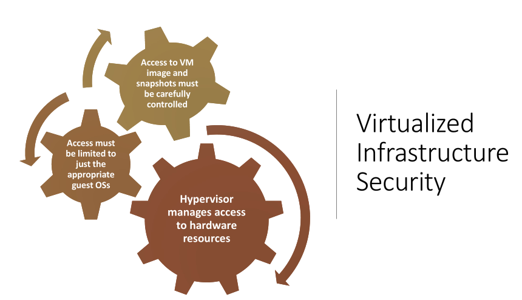

##### Virtualized Infrastructure security

When multiple virtualized systems are used, NIST SP 800-125B (Secure Virtual Network Configuration for Virtual Machine (VM) Protection, March 2016) notes three distinct categories of traffic:

- **Management traffic**: used for hypervisor administration and configuration of the virtualized infrastructure.
- **Infrastructure traffic**: such as migration of VM images, or connections to network storage
  technologies.
- **Application traffic**: between applications running VMs and to external networks.

This traffic may be further separated into a number of segments, isolating traffic from applications with different sensitivity levels, or from different organizations or departments.

#### Virtual Firewall

Provides firewall capabilities for the network traffic flowing between guest hosts

- this traffic is not routed out to a physically separate network supporting traditional firewall services

Three ways to achieve this;

- **VM Bastion Host**: A separate VM is used as a bastion host. Implements firewall and other security services (Intrusion detection, Intrusion prevention, ...) that normally run on a physically separate bastion.
- **VM Host-Based Firewall**: A host-based firewall provided by the Guest OS running on the VM. Configured to secure that host in the same manner as used in physically separate systems.
- **Hypervisor Firewall**: firewall capabilities are provided directly by the hypervisor.

---

### 8. Figure 6.1 fgets buffer overflow

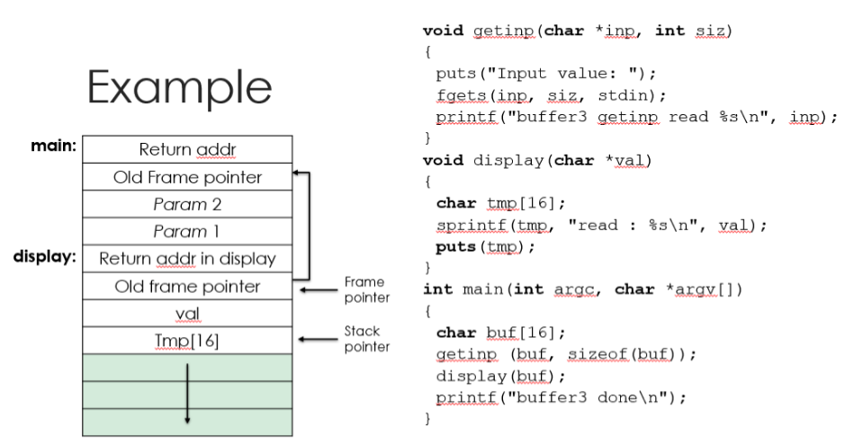

The vulnerability demonstrated in the provided code is a **Stack Buffer Overflow** within the display function.

1. **The Code**

- The main function calls getinp to read input into $buf[16]$, which is safe because $fgets$ limits the read to sizeof(buf), or 16 bytes (15 characters plus the null terminator \0).
- The main function then calls $display(buf)$, passing the input as the val argument.
- The display function declares a local buffer: $char tmp[16]$.
- It then uses $sprintf$: $sprintf(tmp, "read: \%s\n", val);$

2. **The Flaw (Buffer Overflow)**

- The problem is the sprintf call in display:
  - $sprintf$ is an unsafe function because it does not check the size of the destination buffer (tmp[16]) before writing to it.
  - The input passed as val (from main's buf) can be up to 15 characters long.
  - The output written to tmp includes the prefix "read : "(8 characters) plus the input string (\%s) plus newline (\n) and the null terminator (\0).
- If the input string (val) is the maximum safe length (15 characters, e.g., "XXXXXXXXXXXXXXX"), sprintf attempts to write:
- "read : " (8 chars)
- "XXXXXXXXXXXXXXX" (15 chars)
- "\n" (1 char)
- "\0" (1 char)
- Total: 8 + 15 + 1 + 1 = 25 bytes,

However, the destination buffer tmp is only 16 bytes (char tmp[16]). This results in a stack buffer overflow, as 25 > 16.

3. **Consequences (Segmentation Fault)**
   As shown in the example's execution output:

- The input consists of many 'X's (more than 15).
- Even though getinp only read 15 characters into buf, this large string of 15 'X's is passed to display.
- The sprintf in display attempts to write 25 bytes into the 16-byte tmp buffer.
- The sprintf in display attempts to write 25 bytes into the 16-byte tmp buffer.
- This overwrites the memory locations on the stack immediately following tmp[16].

##### Referring to the stack diagram

The $tmp[16]$ buffer is at the bottom of the display function's stack frame. By overwriting memory beyond tmp[15], the attacker can corrupt critical data stored above it, such as:

- The display function's **Old Frame Pointer**.
- The display function's **Return Address** (the address where execution should resume in $main$ after $display$ finishes).

The execution output shows a "Segmentation fault (core dumped)" when the input is too long. This happens because the overflow corrupted the Return Address. When the display function tries to return to main, it attempts to jump to the corrupted/overwritten address, which points to an invalid or restricted memory location, thus triggering the operating system to terminate the program with a segmentation fault.

##### Mitigation

To fix this vulnerability, one must use a safe string function that respects the buffer size:

- replace `sprintf(tmp, "read : %s\n", val);` with `snprintf` (safe, size-aware version):

  `snprintf(tmp, sizeof(tmp), "read : %s\n", val);`

This ensures that at most sizeof(tmp) (16) bytes, including the null terminator, are written to the `tmp` buffer, preventing overflow.

---

#### 9. Figure 6.2

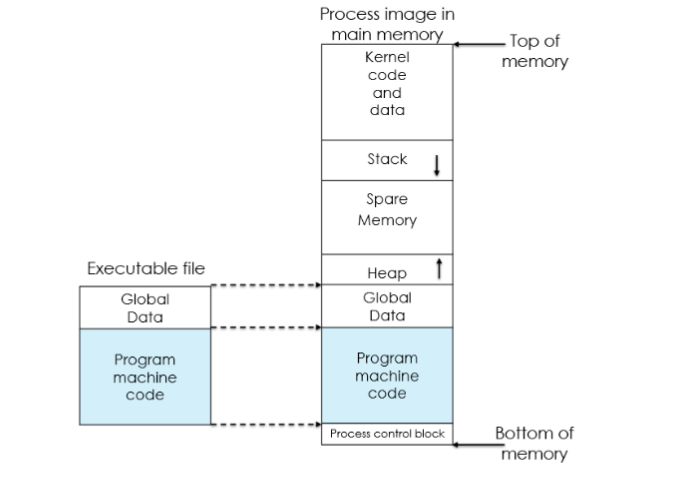

When a program is run, the operating system typically creates a new process for it. The process is given its own virtual address space, with a general structure as shown in Figure.

This consists of the contents of the executable program file (including global data, relocation table, and actual program code segments) near the bottom of this address space, space for the program heap to then grow upward from above the code, and room for the stack to grow down from near the middle (if room is reserved for kernel space in the upper half) or top. The stack frames we discussed are hence placed one below another in the stack area, as the stack grows downward through memory.

---

#### Figure 6.3 Vulnerable heap overflow code

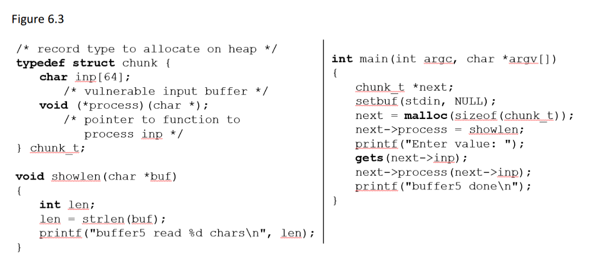

With growing awareness of problems with buffer overflows on the stack and the development of defenses against them, attackers have turned their attention to exploiting overflows in buffers located elsewhere in the process address space. One possible target is a buffer located in memory dynamically allocated from the heap.

The heap is typically located above the program code and global data and grows up in memory (while the stack grows down toward it). Memory is requested from the heap by programs for use in dynamic data structures, such as linked lists of records.
If such a record contains a buffer vulnerable to overflow, the memory following it can be corrupted.

Unlike the stack, there will not be return addresses here to easily cause a transfer of control. However, if the allocated space includes a pointer to a function, which the code then subsequently calls, an attacker can arrange for this address to be modified to point to shellcode in the overwritten buffer. Typically, this might occur when a program uses a list of records to hold chunks of data while processing input/output or decoding a compressed image or video file. As well as holding the current chunk of data, this record may contain a pointer to the function processing this class of input (thus allowing different categories of data chunks to be processed by the one generic function). Such code is used and has been successfully attacked.

As an example, considering the Figure this declares a structure containing a buffer and a function pointer.
Consider the lines of code shown in the `main()` routine.
This uses the standard `malloc()` library function to allocate space for a new instance of the structure on the heap and then places a reference to the function `showlen()` in its function pointer to process the buffer. Again, the unsafe `gets()` library routine is used to illustrate an unsafe buffer copy. Following this, the function pointer is invoked to process the buffer.

- An attacker, having identified a program containing such a heap overflow vulnerability, would construct an attack sequence as follows. Examining the program when it runs would identify that it is typically located at address `0x080497a8` and that the structure contains just the 64-byte buffer and then the function pointer.
- The attacker would discover the size of the block allocated and the position of the function pointer.
- Then the attacker would use the shellcode by padding it with NOP to fit the size of the buffer and using proper address of the shellcode.

#### NOTE

- Even if the vulnerable structure on the heap does not directly contain function pointers, attacks have been found.
- These exploit the fact that the allocated areas of memory on the heap include additional memory beyond what the user requested.
- This may hold data structures used by the memory allocation and deallocation library routines.
- These surrounding structures may either directly or indirectly give an attacker access to a function pointer that is eventually called.

#### Defenses

- **Make the heap also nonexecutable**:
  - this prevents the execution of code written into the heap
  - However, a variant of the return-to-system call is still possible
- **(main defense) Randomizing the allocation of memory on the heap**:
  - makes the prediction of the address of targeted buffers extremely difficult, thus thwarting the successful execution of some heap overflow
- **Memory allocator and deallocator** may include checks for corruption of the management data

---

#### Figure 6.4 Global data overflow

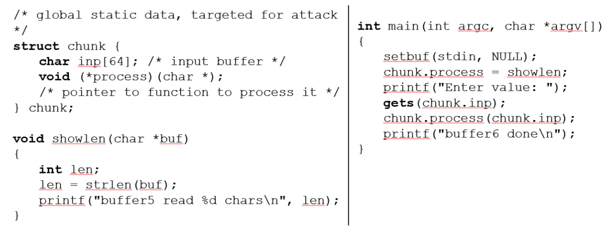

The figure shows a **Global Data Overflow**

This attacks buffers located in global data

- May be located above program code
- If there is function pointers and vulnerable buffers or adjacent process management tables.
- Or adjacent process management tables.
- Aims to overwrite function pointer later called.

The main defenses to this kind of attack are:

- Non executable or random global data region
- Allocate function pointers below other data
- Guard pages between global data and other areas

---

#### Figure 6.5

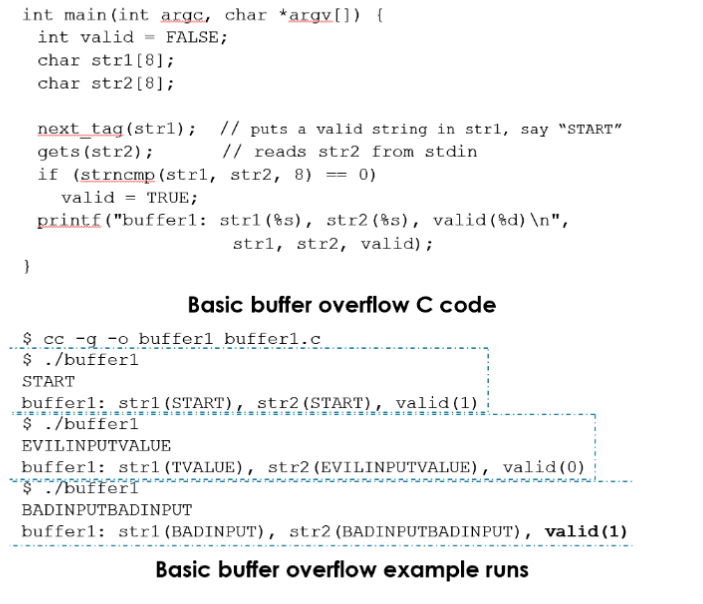
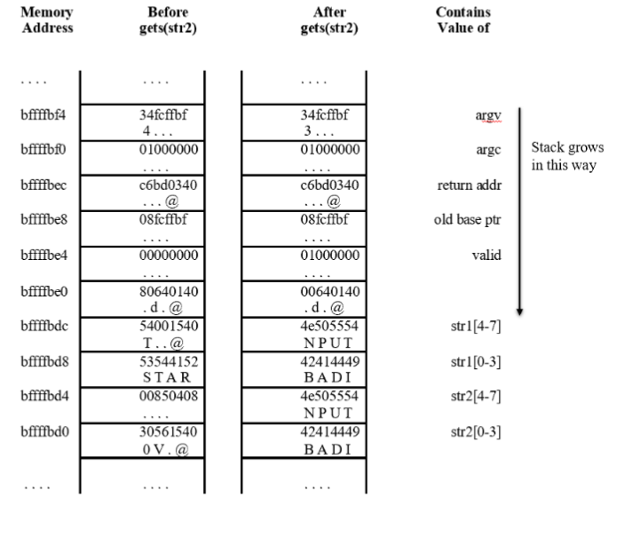

The figure illustrates a **basic buffer overflow vulnerability** in a C program and shows example runs demonstrating both normal and unexpected behavior.

The top section shows:

- `main(int argc, char *argv[])`: The main function.
- `int valid = FALSE;`: A flag initialized to 0 (since FALSE is usually defined as 0 in C, or it would be 0 by default anyway).

`char str1[8];` and `char str2[8];`: Two character arrays (buffers), both allocated to hold 8 characters (including the null terminator, so 7 visible characters).

- `next_tag(str1);`: A hypothetical function that populates str1 with a valid string, which the example shows as "START".
- `gets(str2);`: This is the vulnerable part. The gets() function reads input from the standard input (stdin) into the buffer str2. Crucially, gets() does not check the size of the buffer (str2), allowing an attacker to input a string longer than 7 characters and overflow the buffer.
- `if (strncmp(str1, str2, 8) == 0)`: Compares the first 8 characters of str1 and str2. If they are the same, the valid flag is set to TRUE (likely 1). Note that comparing 8 characters is fine since both arrays are 8 bytes long.
- `printf(...)`: Prints the contents of str1, str2, and the value of valid.

#### Bottom part: Buffer overflow example runs

The bottom section shows three example runs after the program is compiled (`cc -g -o buffer1 buffer1.c`):

1. Normal execution:
   - Input: `START`
   - Result: `str1` is "START, `str2` is "START"
   - `strncmp`: Returns 0 (strings match).
   - Output: valid(1) (correctly validated).
2. Extpected mismatch:
   - Input: `EVILINPUTVALUE`
   - Result: `str1` is "TVALUE" (Unexpected! This is the core of the overflow), `str2` is "EVILINPUTVALUE".
   - `strncmp`: Mismatch
   - Output: `valid(0)` (correctly not validated, but `str1` is corrupted).
     - **Explanation of Corruption (Buffer Overflow)**: The input `EVILINPUTVALUE` is 14 characters long (plus the null terminator), which is much larger than the `str2` buffer size of 8 bytes. Because `str1` and `str2` are likely placed adjacent to each other on the stack, the excess data written to `str2` overwrites the data in the adjacent str1 buffer, corrupting its value. The original "START" in `str1` is overwritten by the end of `"EVILINPUTVALUE"` (the last 8 bytes of the input, minus one for the null terminator, likely replacing `str1` with a portion of the overflow data).
3. Unexpected Validation (Exploit Scenario)
   - Input: `BADINPUTBADINPUT`
   - Result: `str1` is "BADINPUT" (Corrupted), `str2` is "BADINPUTBADINPUT".
   - `strncmp`: Match (Unexpected!).
   - Output: `valid(1)` (incorrectly validated).
     - **Explanation of Exploit**: The input is crafted such that the first 8 bytes read into `str2` cause the remainder of the input to overflow and overwrite `str1` with a specific value. If the attacker can control both the content of the `str2` buffer and the value that overwrites `str1` such that the first 8 characters of the new, corrupted `str1` match the first 8 characters of `str2`, the strncmp check will pass, and the valid flag is set to 1. This demonstrates how a buffer overflow can be exploited to bypass a security check.

---

#### Figure 6.6 Kernel Mode Rootkits

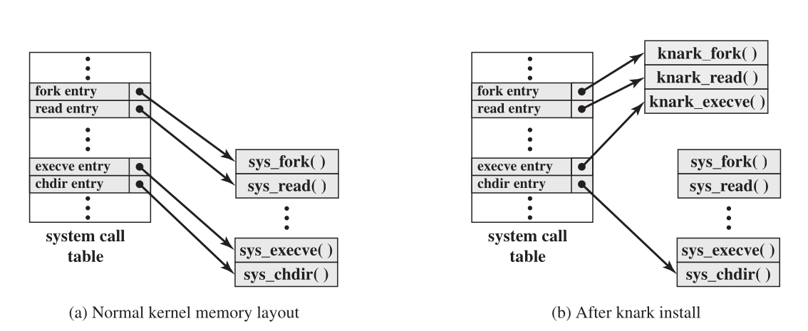

The next generation of rootkits moved down a layer, making changes inside the kernel and co-existing with the operating systems code, in order to make their detection much harder. Any "anti-virus" program would now be subject to the same "low-level" modifications that the rootkit uses to hide its presence. However, methods were developed to detect these changes.
Programs operating at the user level interact with the kernel through system calls. Thus, system calls are a primary target of kernel-level rootkits to achieve concealment. As an example of how rootkits operate, we look at the implementation of system calls in Linux. In Linux, each system call is assigned a unique syscall number.
When a user-mode process executes a system call, the process refers to the system call by this number. The kernel maintains a system call table with one entry per system call routine; each entry contains a pointer to the corresponding routine. The syscall number serves as an index into the system call table.

[LEVI06] lists three techniques that can be used to change system calls:

- **Modify the system call table**: The attacker modifies selected syscall addresses stored in the system call table. This enables the rootkit to direct a system call away from the legitimate routine to the rootkit’s replacement. The figure shows how the knark rootkit achieves this.
- **Modify system call table targets**: The attacker overwrites selected legitimate system call routines with malicious code. The system call table is note changed.
- **Redirect the system call table**: The attacker redirects references to the entire system call table to a new table in a new kernel memory location.

---

#### Figure 6.7 Architecture of distributed IDS

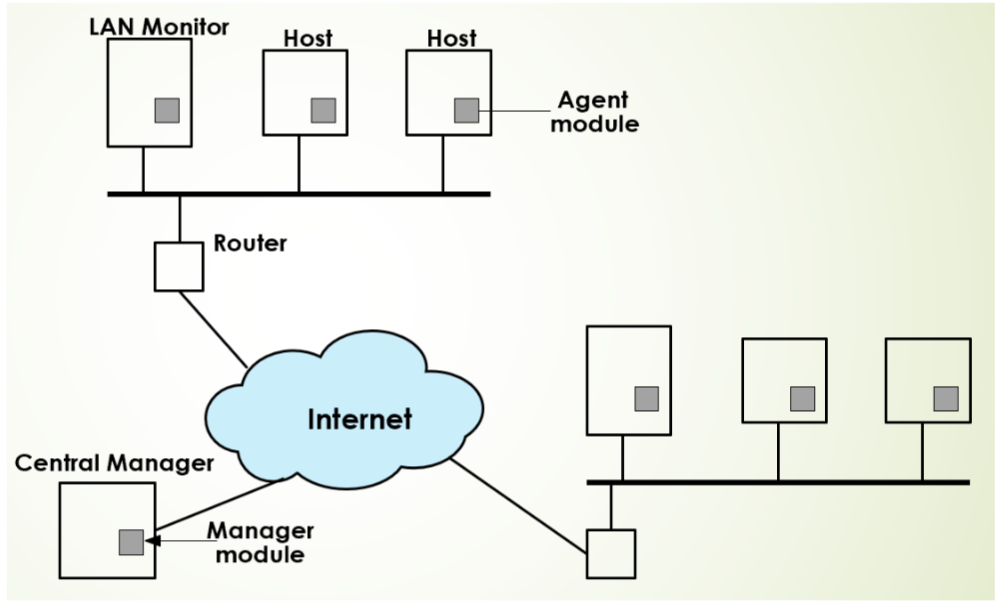

The figure shows an example of distributed IDS architecture. The figure shows the overall architecture, which consists of three main components:

1. **Host agent module**: An audit collection module operating as a background process on a monitored system. Its purpose is to collect data on security-related events on the host and transmit these to the central manager. The figure shows details of the agent module architecture.
2. **LAN monitor agent module**: Operates in the same fashion as a host agent module except that it analyzes LAN traffic and reports the results to the central manager.
3. **Central manager module**: Receives reports from LAN monitor and host agents and processors and correlates these reports to detect intrusion.

The scheme is designed to be independent of any operating system or system auditing implementation.
---------------------------------------------------------------------------------------------------

#### Figure 6.8 NIDS Sensor Deployment

Consider an organization with multiple sites, each of which has one or more LANs, with all of the networks interconnected via the Internet or some other WAN technology. For a comprehensive NIDS strategy, one or more sensors are needed at each site. Within a single site, a key decision for the security administrator is the placement of the sensors.

The figure illustrates a number of possibilities. In general terms, this configuration is typical of larger organizations. All internet traffic passes through an external firewall that protects the entire facility. Traffic from the outside world, such as customers and vendors that need access to public services, such as Web and mail, is monitored. The external firewall also provides a degree of protection for those parts of the network that should be used to provide more specific protection to certain parts of the network.

A common location for a NIDS sensor is just inside the external firewall (location 1 in the figure). This position has a number of advantages:

- Sees attacks, originating from the outside world, that penetrate the network’s perimeter defenses (external firewall).
- Highlights problems with the network firewall policy or performance.
- Sees attacks that might target the Web server or ftp server.
- Even if the incoming attack is not recognized, the IDS can sometimes recognize the outgoing traffic that results from the compromised server.

Instead of placing a NIDS sensor inside the external firewall, the security administrator may choose to place a NIDS sensor between the external firewall and the internet or WAN (location 2). In this position, the sensor can monitor all network traffic, unfiltered. The advantages of this approache are as follows:

- Documents **number** of attacks originating on the internet that target the network.
- Documents **types** of attacks originating on the internet that target the network.

A sensor at location 2 has a higher processing burden than any sensor located elsewhere on the site network.
In addition to a sensor at the boundary of the network, on either side of the external firewall, the administrator may configure a firewall and one or more sensors to protect major backbone networks, such as those that support internal servers and database resources (location 3). The benefits of this placement include the following:

- Monitors large amount of a network's traffic, thus increasing the possibility of spotting attacks.
- Detects unauthorized activity by authorized users within the organization's security perimeter.

Thus, a sensor at location 3 is able to monitor for both internal and external attacks. Because the sensor monitors traffic to only a subset of devices at the site, it can be tuned to specific protocols and attack types, thus reducing the processing burden.

Finally, the network facilities at a site may include separate LANs that support user workstations and servers specific to a single department. The administrator could configure a firewall and NIDS sensor to provide additional protection for all of these networks or target the protection to critical subsystems, such as personnel and financial networks (location 4). A sensor used in this latter fashion provides the following benefits:

- Detects attacks targeting critical systems and resources
- Allows focusing of limited resources to the network assets considered of greatest value

As with a sensor at location 3, a sensor at location 4 can be tuned to specific protocols and attack types, thus reducing the processing burden.

#### Intrusion detection techniques for NIDS

- **Attacks suitable for signature detection**:
  - Application layer reconnaissance and attacks
  - Transport layer reconnaissance and attacks
  - Network layer reconnaissance and attacks
  - Unexpected application services
  - Policy violations

**Attacks suitable for Anomaly detection**:

- Denial-of-service (DoS) attacks
- Scanning
- Worms

---

#### Figure 6.9 Honeypots deployment

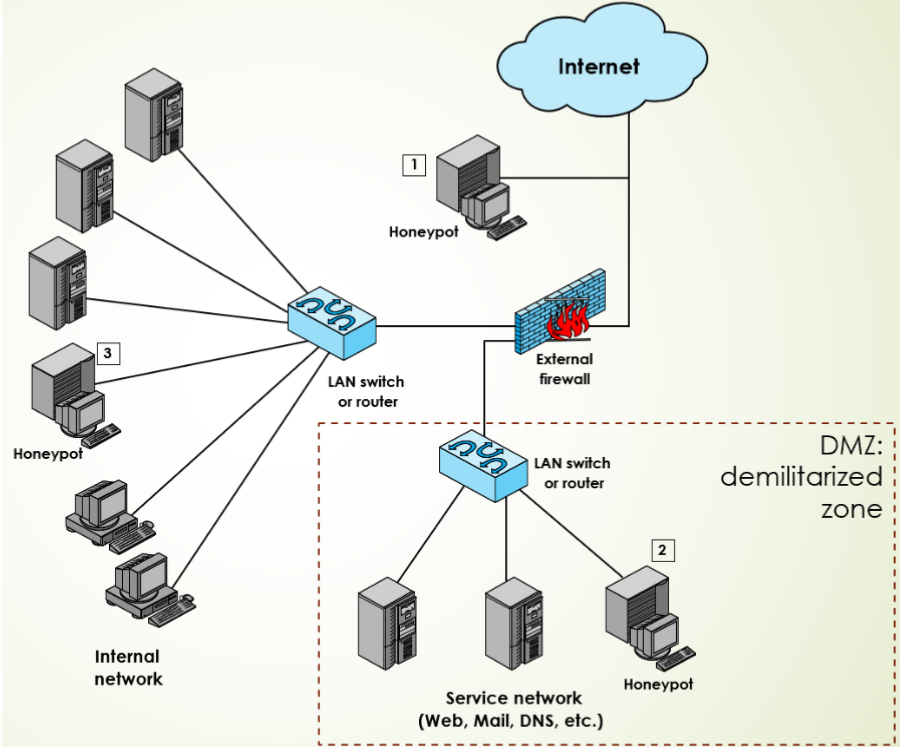

Honeypots are decoy ("esche") systems designed to:

- lure a potential attacker away from critical systems
- collect information about the attacker's activity
- encourage the attacker to stay on the system long enough for administrators to respond

Systems are filled with fabricated information that a legitimate user of the system wouldn't access.
Resources that have no production value:

- Hence any incoming communication is most likely a probe, scan, or an attack
- Initiated outbound communication suggests that the system has probably been compromised

#### Honeypot Classifications

Low interaction honeypot

- Consists of a software package that emulates particular IT services or systems well enough to provide a realistic initial interaction, but does not execute a full version of those services or systems
- Provides a less realistic target
- Often sufficient for use as a component of a distributed IDS to warn of imminent attack

High interaction honeypot

- A real system, with a full operating system, services and applications, which are instrumented and deployed where they can be accessed by attackers
- Is a more realistic target that may occupy an attacker for an extended period
- However, it requires significantly more resources
- If compromised could be used to initiate attacks on other systems

#### Honeypot deployment

Honeypots can be deployed in a variety of locations. The figure illustrates some possibilities. The location depends on a number of factors, such as the type of information the organization is interested in gathering and the level of risk that organizations can tolerate to obtain the maximum amount of data.

A honeypot outside the external firewall (location 1) is useful for tracking attempts to connect to unused IP addresses within the scope of the network. A honeypot at this location does not increase the risk for the internal network. The danger of having a compromised system behind the firewall is avoided. Further, because the honeypot attracts many potential attacks, it reduces the alerts issued by the firewall and by internal IDS sensors, easing the management burden. The disadvantage of an external honeypot is that it has little or no ability to trap internal attackers, especially if the external firewall filters traffic in both directions.

The network of externally available services, such as Web and mail, often called the DMZ (demilitarized zone), is another candidate for locating a honeypot (location 2). The security administrator must assure that the other systems in the DMZ are secure against any activity generated by the honeypot. A disadvantage of this location is that a typical DMZ is not fully accessible, and the firewall typically blocks traffic to the DMZ the attempts to access unneeded services. Thus, the firewall either has to open up the traffic beyond what is permissible, which is risky, or limit the effectiveness of the honeypot.

A fully internal honeypot (location 3) has several advantages. Its most important advantage is that it can catch internal attacks. A honeypot at this location can also detect a misconfigured firewall that forwards impermissible traffic from the Internet to the internal network. There are several disadvantages. The most serious of these is if the honeypot is compromised so it can attack other internal systems. Any further traffic from the Internet to the attacker is not blocked by the firewall because it is regarded as traffic to the honeypot only. Another difficulty for this honeypot location is that, as with location 2, the firewall must adjust its filtering to allow traffic to the honeypot, thus complicating firewall configuration and potentially compromising the internal network.

An emerging related technology is the use of honeyfiles, that emulate legitimate documents with realistic, enticing names and possibly content. These documents should not be accessed by legitimate users of a system, but rather act as bait for intruders exploring a system. Any access of them is assumed to be suspicious [WHIT13]. Appropriate generation, placement, and monitoring of honeyfiles is an area of current research.

---

#### 12. Figure 10.1 Hypervisor types

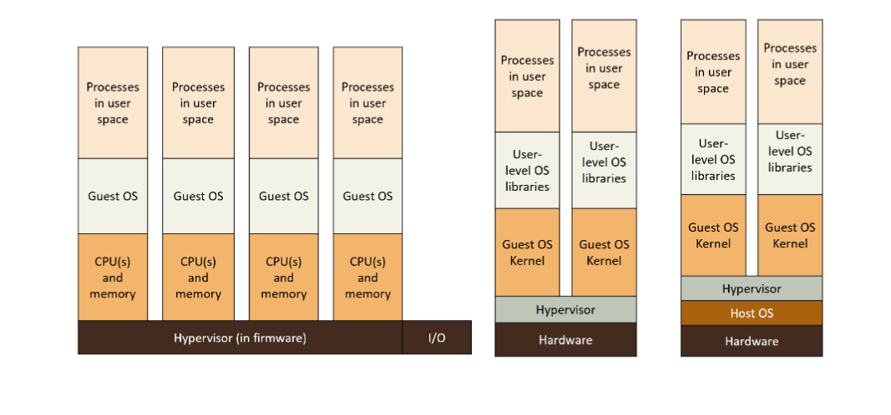

The figure represents the three main types of hypervisors

- **Hypervisors of type 0**:
  - Implemented in firmware
  - Examples: Logical partitioning (LPAR) or POWER Hypervisor (PHYP) by IBM
- **Hypervisors of type 1**:
  - Software hypervisors, implement virtualization directly on hardware (AKA bare-metal hypervisors)
    - Examples: VMware ESXi, Oracle VM Server,...
    - Operating systems on top of hypervisor (AKA native hypervisors)
  - In some cases are full OS with virtualization services
    - Examples: Microsoft HyperV, RedHat Linux KVM
- **Hypervisors type 2**:
  - Run over conventional OS
  - Guest OS runs as a process of the hosting OS
  - Examples: Oracle VirtualBox, VMware, Parallels Desktop

##### Hypervisors type 0

Entirely implemented in the firmware of the CPU

- Software does nothing, OSs just installed as guest hosts
- Offers a smaller set of functionalities as compared to other types of hypervisor
  - Firmware implementation are quite "rigid"
- Often based on physical partitioning of the hardware resources
  - Can be difficult for I/O devices if they are not enough, in this case either:
    - Devices must be shared, or
    - Devices are virtualized and their access is thorugh a "remote" partition and virtual devices are implemented by daemons
- May also provide virtualization-within-virtualization
  - a guest can be a virtual machine for other guests

##### Hypervisors type 1 (native virtualization)

- Commonly used in datacenters
- Often viewed as the operating systems of the datacenters
- In some cases they are special purpose operating systems that run over bare metal
  - Do not offer system calls to upper layers rather, they offer functionalities to create and manage virtual machines
- In others they are general purpose operating systems also offering virtualization capabilities
  - Typically they are less powerfull and offers less features than dedicated type 1 Hypervisors
  - Trap guest OSs as user-level processes

Hypervisors type 1:

- Run in kernel mode
- Implement device drivers for the hosting hardware
- Guests don't know they are running in a virtual machine
- Also provide other traditional OS services like CPU and memory management
- Cannot run over other type 1 Hypervisors
  - But they can run on top of type 0 Hypervisors
- **Advantages**:
  - Datacenter managers can control and manage several guest OSs in a simple and sophisticated way, just by acting on the Hypervisor
  - Allows for consolidation of OSs and apps onto less HW
  - Move guests between systems to balance performance
  - Snapshots and cloning

##### Hypervisors type 2 (hosted virtualization)

No host OS involvment in virtualization. The virtual machine is just one of the processes managed by the host OS.

- Even the host OS does not need to know the existence of a virtual machine

They have severe **limitations**:

- The virtual machine is executed without any special privileges
- In some cases do not even take advantage of specific HW features for virtualization
- Tend to have very poor performances

They have also have **advantages**:
- They do not require any change to the hosting OS
- Easy to deploy and use

---

#### 13. Figure 10.2 Trap and Emulate Mechanism

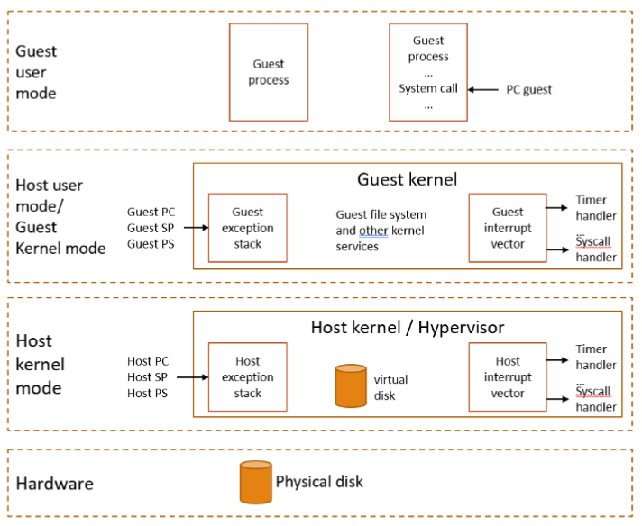

The picture describes the **trap-and-emulate** mechanism used in **full virtualization**, showing the interactions between the **Guest** (the virtualized operating system and its applications), the **Host** (the underlying operating system or hypervisor), and the **Hardware**.

##### Architecture and modes

The diagram is structured into four layers representing different execution contexts and privilege levels:

1. **Guest user mode**: Where normal **Guest processes** execute.
2. **Host user mode/Guest Kernel mode**: This represents the context where the **Guest kernel** runs. In trap-and-emulate, the Guest kernel usually runs in a less-privileged ring (user mode) on the Host, giving up its hardware-privileged status
3. **Host kernel mode**: Where the **Host kernel** or **Hypervisor** runs with full hardware privileges (kernel mode).
4. **Hardware**: The physicical resources, includig the **Physical disk**.

##### The Trap-and-Emulate mechaism

The core idea is to intercept (trap) privileged instructions from Guest and handle (emulate) their effect in the Hypervisor.

- **Trap from Guest User Mode**:
  - A **Guest process** executes an instruction, potentially a System call or a privileged instruction
  - If the instruction is privileged (like one that attempts to directly access hardware or change mode), it causes an exception or trap because the Guest is not running with full privileges
  - This trap saves the Guest's state (like Guest PC, Guest SP, Guest PS) and transfers control to the Host environment.
- **Emulation in Host Kernel/Hypervisor**:
  - The trap is caught by the Host kernel/hypervisor in Host kernel mode
  - The Host uses its Host exception stack and Host interrupt vector to manage the transition
  - The Hypervisor then emulates the intended effect of the privileged instruction (e.g., performing the required I/O operation on the virtual disk which is mapped to the physicial disk). This ensures the Guest believes its request succeeded without having direct hardware access
  - After emulation, the Host restores the Guest's state and returns control to the Guest's execution flow

##### Key components

- **Guest kernel**: Contains standard OS components like the Guest file system and other kernel services, plus handlers for internal Guest events like the Guest interrupt vector, Timer handler, and Syscall handler.
- **Host kernel / Hypervisor**: The Virtual Machine Monitor (VMM) responsible for managing hardware resources and presenting the illusion of hardware to the Guest. It has its own Host exception stack, Host interrupt vector, and manages the mapping of resources (like the virtual disk).
- **PC, SP, PS: Program Counter, Stack Pointer, and processor status** register, used to save and restore the execution context for both the Guest and the Host during mode switches.

In essence, trap-and-emulate is a software technique where the Hypervisor acts as an intermediary, catching all privileged operations from the Guest OS and safely executing them on the hardware's behalf.
-----------------------------------------------------------------------------------------------------------------------------------------------------------------------------------------------------------

#### 14 Figure 10.3

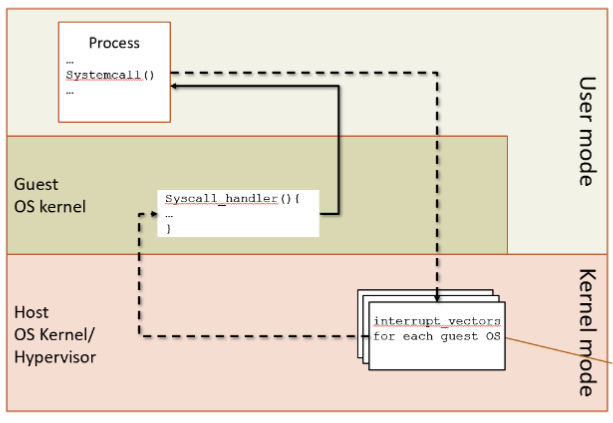

When a process in the guest host runs in user mode no problem

- Processing occurs at full speed of CPU in user mode

However, the guest host need to switch to virtual kernel mode:

- The process attempts to execute a privileged instruction (trap)
- The process violates protection (trap)
- The process invokes a system call to the guest kernel (trap)

In these cases:

- The host kernel gains control
- Analyses the reason for the trap
- Executes the privileged operation requested by the guest process
- Returns control to guest in user mode

This is known as **trap-and-emulate** used by most virtualization systems
---------------------------------------------------------------------

#### 15. Figure 10.4 Real time migration

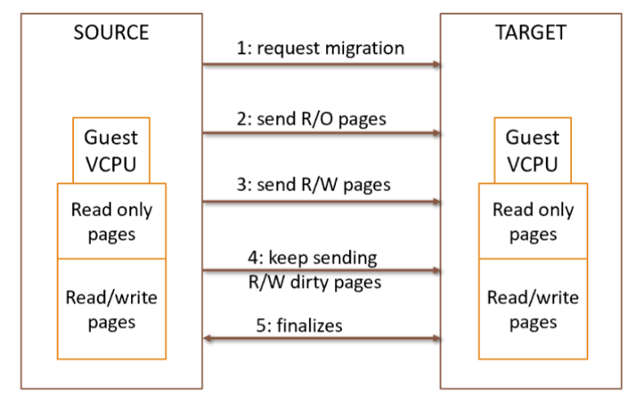

**Real rime migration** is an advantage of OS installed on virtual machines that cannot be offerd by OS on a physical machine.

An entire guest can be duplicated on another physical machine or on another virtual machine without interrupting the guest OS and its applications.

How it works:

1. The source virtual machine (SOURCE) request the migration to a target virtual machine (TARGET)

- TARGET creates a new guest: allocates the VCPU, memory, disk, I/O etc.

2. SOURCE sends to TARGET all read-only guest memory pages
3. SOURCE sends to TARGET all read-write pages, marking them as clean
4. Step 3 is repeated, because during its execution some pages of the guest may have changed (are
   now dirty)

- Afterall, the guest is still running…

5. When only few pages are dirty in steps 4 and 5 (below a threshold):

- SOURCE freezes guest, sends VCPU’s state and any other state details to TARGET
- SOURCE sends last dirty pages
- TARGET starts running the guest
- SOURCE can now kill guest

#### 16. Figure 10.5 containers

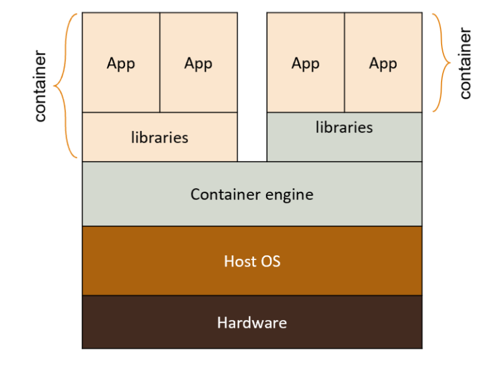

A recent approach to virtualization is known as container virtualization or application virtualization.
Motivated by the need of giving the same advantages of virtualization to a set of applications:

- Segregation of apps for security
- Simplified management of applications (restart, migration, checkpointing, cloning etc…)
- Sharing of resources among different applications
  If these applications are indeed written for the same OS: HW virtualization unnecessary, but a higher level of virtualization can be used.
  In this approach, software known as a virtualization container, runs on top of the host OS kernel and provides an isolated execution environment for applications
- It’s the OS that is virtualized this time
- Only the host kernel in the system
- Each container provides a virtualized OS and devices to its applications
- Unlike hypervisor-based VMs, containers do not aim at emulating physical servers
- All containerized applications on a host share a common OS kernel
- Built on top of an OS, run as a process, enforces portability
- For containers, only a small container engine is required as support for the containers

  - Containers are lightweight and efficient
- Examples: Docker, Oracle Solaris Zones, BSD Jails, IBM AIX WPARs
- Containerization sits in between the OS and applications and incurs lower overhead, but
- potentially introduces greater security vulnerabilities
