## Part 4

#### 1. Explain the security model of Windows. Discuss its discretionary access control and its mandatory access control

Key elements of WIndows security:

- **Security Reference Monitor** (SRM): manages access control
- **Local Security Authority** (LSA): manages security policies
- **Security Account Manager** (SAM): database with users and groups information
- **Active Directory** (AD): user authentication in a domain

Plus:

- Authentication packages
- WinLogon and netLogon, handle logons at the keyboard and across the network, respectively

**Rights and privileges**

Privileges are systemwide permissions assigned to user accounts

- control access to system resources and system-related tasks whereas access rights & ACL control access to securable objects.
- e.g. backup computer, change system time, ...
  - Note that these two actions are privileged because cannot be granted to anybody
  - Change system time may affect authentication protocols
  - Backup need to bypass all access checks...
- some privileges are deemed "benign"
  - e.g. the "bypass traverse checking privilege" that premits to traverse the directories even though the user may not have permissions in the traversed directories

some privileges are deemed "dangerous" such as:

- act as part of operating system privilege
  - AKA Trusted Computing Base (TCB) privilege
  - Grants te privilege to run as the most secure part of the system (the security code itself)
  - The most dangerous in Windows
  - Granted only to the Local System account (administrators do not have it)
- debug programs privilege
  - Allows to debug any program in Windows
  - Normally not needed by users
  - It implies the ability to run any code in any running processes...
- backup files and directories privilege
  - need to access the entire file system bypassing access controls
  - also to restore files and directories need to bypass access control and it is dangerous

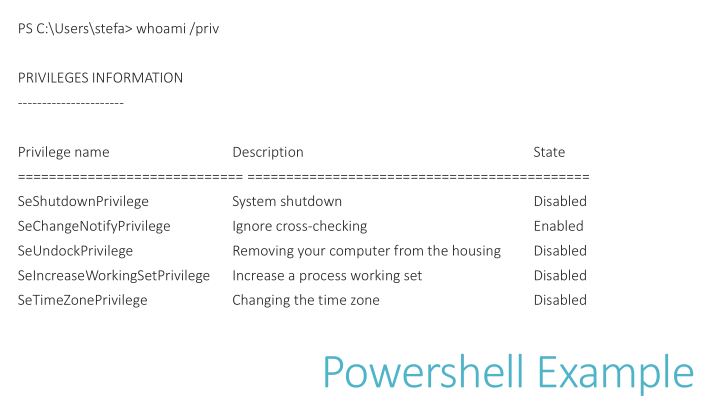

**Access Control Lists**
Windows has two forms of access control lists(ACL):
**Discretionary ACL (DACL)**:

- grants or denies access to protected resources (objects) such as files, shared memory, named pipes etc.

**System ACL (SACL)**:

- used for auditing, enables the log of attempts to access an object. An entry in SACL:
  - specifies the types of access attempts that generate audit reports in the security event log.
  - identifies a trustee, a set of access rights, and a set of flags
  - flags: generate audit records when an access attempt fails, when it succeeds, or both.
- also used to enforce mandatory integrity policy

Objects needing protection are assigned a DACL (and possibly a SACL) that includes a list of access control entries (ACEs).
Each ACE includes a SID and an access mask:

- The SID specifies a user or a group
- The access mask can include ability to read, write, create, delete, modify, etc.
- Access masks are object-type specific

  - e.g. service abilities are create, enumerate
- The Security Descriptor (SD) is a data structure that contains object owner, group, DACL, & SACL (if present)
- each "securable object" has its own SD

  - a securable object is any system resource (file, directory, registry entry, process, thread, pipes, etc...) that need to be protected

Example of an SD:
Owner: CORP\Blake
Group: CORP\Clerks
ACE[0]: Allow CORP\Blake Full_Control
ACE[1]: Allow CORP\Paige Full_Control
ACE[2]: Allow Administrators Full_Control
ACE[3]: Allow CORP\Cheryl Read, Write, Delete

- This gives full control to users: Blake (who is the owner), Paige and Administrators
  - In newer versions of Windows it is possible to limit full control of the owner, and owner too should be included in the DACL
- There is no implied access, if there is no ACE for a user, then the access to the object by processes of that user is denied
- Processes must request correct type of access
- if just request “all access” when need less (e.g. read) and when not all is not allowed, access will be denied

Each ACE in the DACL determines access: either allow or deny.
Windows evaluats each ACE in the ACL until access is granted or explicitly denied

- hence deny ACEs come before allow ACEs
- order by default if set using GUI
- But the order is up to programmer if set by program

When user attempts to access a protected object, the OS performs an access check

- comparing user/group info with ACE's in ACL
- access granted if all requested operations are granted; else access is denied

In powershell it is possible to set the DACL and the SACL by means of set-acl.
It can also use the SDDL syntax to express the SD:

- is just a textual representation of a SD into a single string
- can be converted into binary format to be used to set the SD to another object

Windows also supports "conditional ACEs"

- allow application-level access conditions to be evaluated when an object is accessed
- conditions on user/group attributes

For example, a conditional ACE may incapsulate the rule:
`(Title==”Manager” && (Division==”Sales” || Division== ”Marketing”))`

…that expresses the fact that a user is a Manager in Sales or Marketing.
Conditional ACEs cannot be set by GUI, can only be set by
programs using SDDL.

**Mandatory Access Control**

ACL allow fine-grained control, but in addittion Windows also provides Mandatory Access Control called Integrity Control

- this limits operations changing an object's state
- each object and principal (user) is assiged an integrity level stored in the SACL (System-ACL)
- there are 4 integrity levels in Windows
- a process of a given integrity level can only change state of objects of equal or lower integrity levels

When a user launches an executable file:

- the new process is created with the minimum between the user integrity level and the executable file integrity level
  - i.e. the new process will never execute with higher integrity than the executable file.
  - i.e. If the administrator user executes a low integrity program, the token for the new process functions with the low integrity level.
  - this helps protect a user who launches untrustworthy code from malicious acts performed by that code: the user data, which is at the typical user integrity level, is write-protected against this new process.

Objects and users are labeled as:

- Low integrity (S-1-16-4096)
- Medium integrity (S-1-16-8192)
- High integrity (S-1-16-12288)
- System integrity (S-1-16-16384)

Note the SID associated to the integrity levels, that’s how Windows implements them:
- The process token includes the integrity level; e.g. the token of a high-integrity process will include the SID: S-1-16-12288
- processes or objects that do not have an integrity label are deemed at medium integrity

when a write operation (a change of an object state) occurs:

- Windows first checks whether the subject’s integrity level dominates object’s integrity level. If lower checks if the operation is permitted anyway by the integrity level mask
- If integrity check succeeds, and the normal DACL check also succeeds, then the write operation is granted
  Note: much of OS marked medium or higher integrity

Example: Integrity levels to create a sandbox:

- Explorer uses integrity levels to run potentially hostile code from the Internet
- its process runs at low integrity level
- while the rest of the OS is marked medium or higher integrity

---

#### 2. In Windows discuss the purpose of these components: Security reference monitor, Local security authority, Security account manager, Active directory (DA RIVEDERE LE IMMAGINI COL LOGIN)

**Security Reference Monitor (SRM)** - a kernel--mode component that:

- performs access control. When a process opens a handle to an object:
  - checks the process's **security token**
  - checks the object's **access control list**
  - verifies whether the process has the necessary rights
- generates audit log entries
- manipulates user rights (privileges)

Small component that can be easily verified and made vulnerability-proof

A similar component included in most modern OS

**Local Security Authority (LSA)** - responsible for enforcing local security policy that manages:

- password policy, such as complexity rules and expiration times
- auditing policy, specifying which operations on what objects to audit
- privilege settings, specifying which accounts on a computer can perform privileged operations

It also provides security tokens to accounts as they log on the system.

It runs in a user-mode process named Isass.exe (in VTL-0) that communicates with the counterpart Isaiso.exe in isolated User Mode - VTL 1.

**Security Account Manager (SAM)** - a database that stores user accounts and local users and groups security information:

- **Local**: only user and groups information for a specific machine, different than `domain` accounts (which are managed centrally for an entire organization by the **Active Directory**)
- local logins perform lookup against SAM database
- In old Windows passwords were stored using MD4, now uses password-based key derivation function (PBKCS).

Resides in the `\Windows\System32\Config` directory (equivalent to the `/etc/passwd` of Unix).

NOTE: SAM does not perform logon, that's the role of the Local Security Authority (LSA).

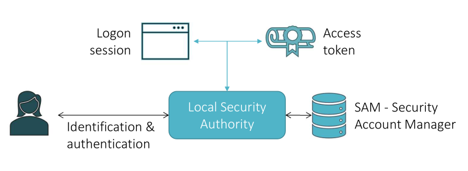

**Active Directory (AD)**

- It's the Microsoft's LDAP directory
  - LDAP (Lightweight Directory Access Protocol) is a standard protocol for managing directory services that are cerntralized managers of information and resources in a computer network (with its respective access control)
- All Windows clients can use AD to perform security operations including account logon
- Authenticate using AD when the user logs on using a domain rather than local account
- User's credential information is sent securely across the network to be verified by AD
  - credentials and not just passwords: they can take other forms (refer to user authentication classes)
- WinLogon (local) and NetLogon (net) handle login request.

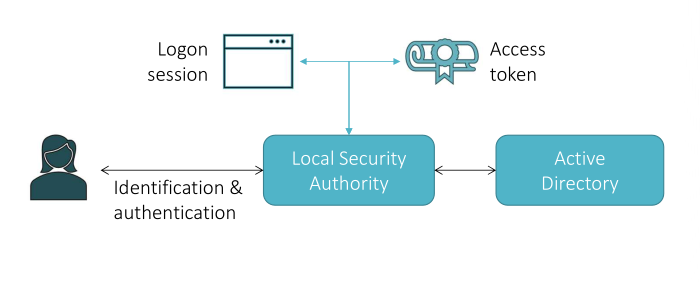

---

#### 3. Discuss how journaling works in Windows NTFS
Journaling is a feature of Windows NTFS introduced to improve FS reliability:
- all NTFS data structure update are performed inside logged transactions (log file described by MFT record #2).
- active only on the NTFS metadata and structure, not on the actual data
- journaling method similar in EXT4
- aims at keeping the FS data structures consistent after a crash

**Journaling - NTFS, EXT3 and EXT4**
- Most often updates to file system are not immediate
  - Updates may remain in main memory before being flushed to disk
- In case of system crash (e.g. power down) the file system may remain inconsistent
  - To overcome this problem, old file systems made a FS check at each reboot
- Journaling makes the FS more robust and avoids the need of periodic consistency checks
  - Recovery by means of a **"journal"** (a special file on disk) that contains the most recent disk write operations.

Each update to the file system first written in the journal in the form of a transaction
- Each transaction on the journal has a sequence number
Updates to the file system follow the procedure:
- First write a copy of the blocks to be written in the journal
- When data is committed in the journal then update the file system

Normal operations
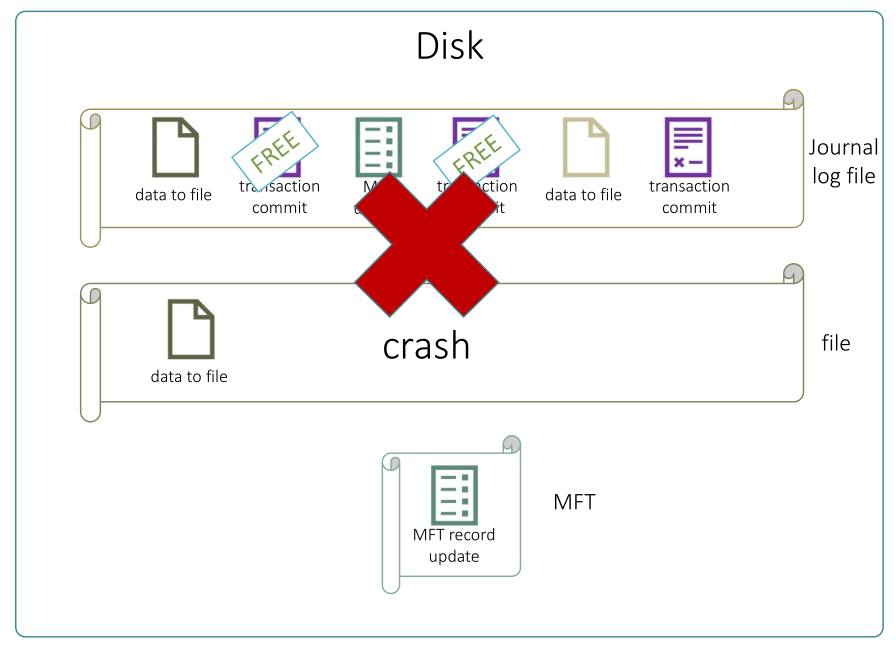

Crash recovery
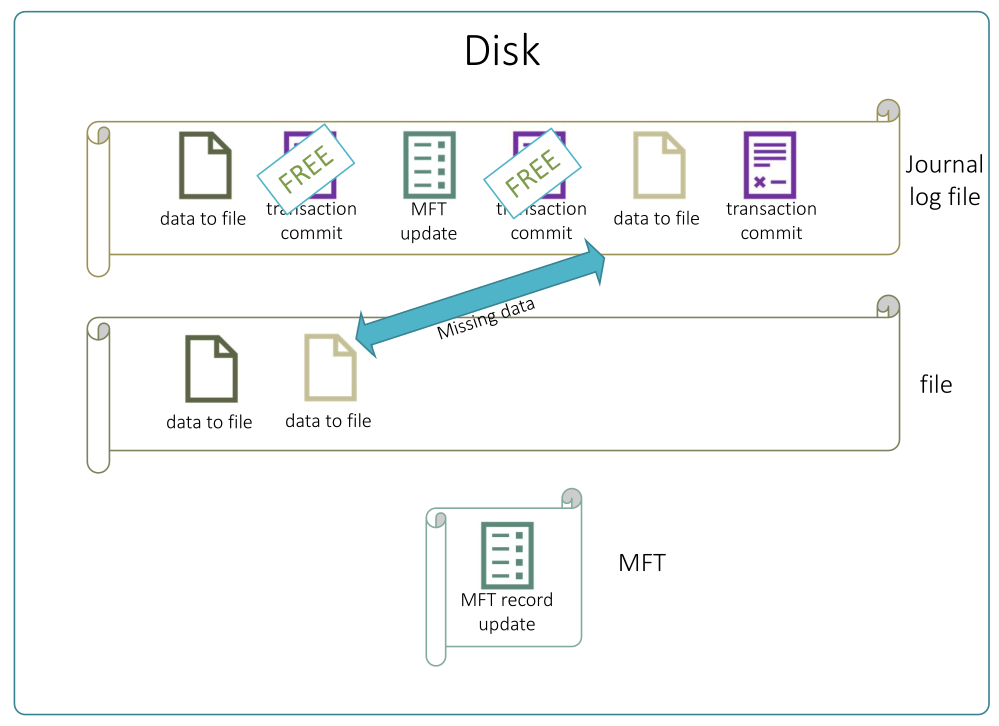

When file system crashes **before** a commit to the journal:
- Either the copies of the blocks relative to the high-level change are missing from the journal or they are incomplete;
- Ignore the journal

When file system crashes **after** a commit to the journal:
- The blocks in the journal are valid
- Copy them in the file system

**Journaling methods**
- DATA:
  - All data and meatadata changes are logged into the journal.
  - It's the safest but slowest (requires many additional disk accesses)

- ORDERED:
  - It's the default journaling mode.
  - Only changes to metadata are logged into the journal.
  - Data blocks are written to disk before making any change to the associated metadata

- WRITEBACK
  - Only changes to metadata are logged 
  - Data blocks can be written at any time
  - it is the fastest mode (but not the safest)

**ORDERED METHOD (used in Windows NTFS)**
1. **Write data block**: write data to final location; wait for completion
2. **Write metadata in the journal**; write the begin block and metadata in the log; wait for writes to complete.
3. **Journal commit**: Write the transaction commit block to the journal; wait for the write to complete; the transaction (including the data block) is now committed.
4. **Checkpoint metadata**: Write the contents of the metadata update to their final locations within the file system.
5. **Free**: Later, mark the transaction free in the journal

#### 4. Discuss the NTFS security features

The file system itself is a driver, hence all considerations for driver security holds:
- operations initiated by a driver bypass most security checks

However, unlike most other types of drivers, file systems are intimately involved in normal security processing.
- this is because of the nature of security and its implementation within Windows

The specific granularity of security control is entirely up to the file system
- In NTFS files and directories are objects
- hence all the considerations concerning DACL and SACL also holds for NTFS
- In particular, it supports a per-file (or directory) security descriptor model.

That's not true for all FS supported in Windows:
- For example, FAT, CDFS, UDFS do not support security descriptors.

Here we focus on NTFS

**Security descriptor**
The file (or directory) security is one of the file attributes in the MFT record

The security descriptor contains the usual information:
- SID of the file (or directory) owner
- SID of the group of the object
- DACL
- SACL

Note: an object's owner always has the ability to reset the security on the object.
- this allows to remove all accesses to an object
- even if owners remove their ability to perform all operations, this inherent right allows them to restore their security rights on the object.

**Access control list**
NTFS access control lists provide a discretionary access control enviroment
- hence the owner of an object is allowed to grant access to the object

**DACL** contains a list of Access Control Entries (ACE) that describes the access policy of the security descriptor (discretionary access control policy)

**SACL** contains a list of ACE that describe the auditing policy of the security descriptor

And, of course, Mandatory Access Control implemented with the integrity levels also present in NTFS

**Access control Entries**
Each ACE defines the access rights of a particular SID.
Access rights in a compact form represented by means of a 32-bit access mask.
The mask takes different meanings depending on the object it is associated.

For FS objects:
- generic rights (4 bits)
- standard rights (5 bits)
- specific rights (16 bits)
- right to accaess SACL (1 bit)
- other bits reserved or not used

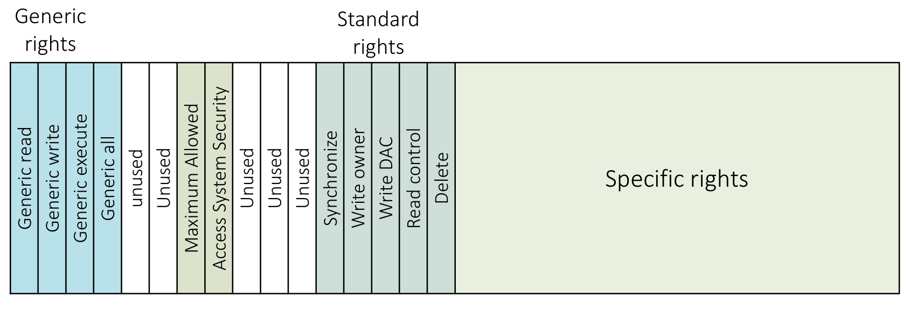

Generic rights (4 bits):
- GENERIC\_READ: the right to read the information in the object
- GENERIC\_WRITE: the irght to write the information in the object
- GENERIC\_EXECUTE: the right to execute the object
- GENERIC\_ALL: read, write and execute together.
- Can be combined together, same as rwx in Unix

Standard rights (5 bits)
- DELETE: the right to delete the particular object
- READ\_CONTROL: the right to read the control (security) information of the object
- WRITE\_DAC: the right to modify the control (security) information for the object.
- WRITE\_OWNER: the right to modify the owner SID of the object. Recall that owners always have the right to modify the object.
- SYNCHRONIZE: the right to wait on the given object (assuming that this is a valid concept for the object)

Specific rights for files:
- FILE\_READ\_DATA: the right to read data from the given file.
- FILE\_WRITE\_DATA: the right to write data to the given file (within the existing range of the file).
- FILE\_APPEND\_DATA: the right to extend the given file.
- FILE\_READ\_EA: the right to read the extended attributes of the file.
- FILE\_WRITE\_EA: the right to modify the extended attributes of the file.
- FILE\_EXECUTE: the right to locally execute the given file. Executing a file stored on a remote share requires read permission, since the file is read from the server, but executed on the client.
- FILE\_READ\_ATTRIBUTES: the right to read the file's attribute information.
- FILE\_WRITE\_ATTRIBUTES: the right to modify the file's attribute information.

Specific rights for directories:
- FILE\_LIST\_DIRECTORY: list the contents of the directory.
- FILE\_ADD\_FILE: create a new file within the directory.
- FILE\_ADD\_SUBDIRECTORY: create a subdirectory within the directory.
- FILE\_READ\_EA: read the extended attributes of the given directory
- FILE\_WRITE\_EA: write the extended attributes of the given directory
- FILE\_TRAVERSE: the right to access objects within the
directory.
- FILE\_DELETE\_CHILD: delete a file or directory within the current directory.
- FILE\_READ\_ATTRIBUTES: read a directory's attribute information.
- FILE\_WRITE\_ATTRIBUTES: modify a directory's attribute information.

**Privileges**
Privilege is a separate mechanism wrt ACL and integrity levels.
Each privilege is associated to particular operations that may be performed if the privilege is held and enabled by the caller.

Note the two conditions here:
- the privilege must be held by the caller.
- the privilege must also be enabled.

The privilege must be enabled prior to its use rather than simply assumed.

Example: the **SeRestorePrivilege** privilege:
- allows a user to bypass the usual checks for write access to a file.
- an administrator may not wish to actually override the normal security checks when copying a file...
- but would wish to do so when restoring that same file using a backup/restore utility.

Normally the administratore operates without this privilege.
It enables this privilege only when it needs it.
Minimizes the chance a user might inadvertently perform an operation they did not intend.

Several privileges are associated to the file system. The main are:
- **SeBackupPrivilege**: allows file content retrieval
  - even if the security descriptor on the file might not grant such access
  - a caller with this privilege enabled obviates any ACL-based security check
- **SeRestorePrivilege**: allows file content modification
  - even if the security descriptor on the file might not grant such access
  - this function can also be used to change the owner and protection
- **SeChangeNotifyPrivilege**: allows traverse right.
  - it is an important optimization in Windows
  - the cost of performing a security check on every single directory in a path is obviated by holding the privilege.
- **SeManageVolumePrivilege**: allows specific volume-level management operations
  - such as lock volume, defragmenting, volume dismount etc.

**Auditing**
The auditing system provides a mechanism for tracking specific events
- the resulting logs can be analyzed off-line to perform post-mortem analysis of a damaged or compromised system.
- auditing intimately involves the file system because it maintains the persistent storage of system data.
- when security needs are low, auditing can be disabled. Some FS (like FAT) do not implement auditing

NTFS implements auditing:
- several tools to analyze audit logs
- in Windows Event Visualizer (Eventvwr.exe)

Services in Windows correspond to daemons in Unix
The Service Control Manager:
- is a component of the executive 
- keeps a database on the installed services and their configurations
- the registry key of the DB is:
  - **HKEY\_LOCAL\_MACHINE\SYSTEM\CurrentControlSet\Services**

Each service runs in the security context of a user account:
- it's a user account specific for the service
- when it starts it logs on with the credential of the user account and it thus obtain the corresponding security token
#### 5. Present the Windows defences
Nowadays attackers are often criminals that are highly motivated by money.
Windows defenses are grouped into four categories:
- account defenses
- network defenes
- buffer overrun defenses
- browser defenses

**Windows System Hardening**
Process of shoring up defenses, reducing exposed functionality, disabling features
- known as attack surface reduction
- use 80/20 rule on features: if not used by 80% population it should be disabled...
- ...but it's not always archiavable, may result in a system not usable for non-technical users
- e.g. requiring RPC authentication in XP SP 2
- e.g. strip mobile code support on servers

servers easier to harden:
1. are used for very specific and controlled purposes
2. server users are generally administrators with better computer configuration skills than typical users

**Account Defenses**
some user accounts can have privileged SIDs
- e.g. administrators

least privilege dictates that users operate with just enough privilege for tasks.
In Windows XP users normally operate as local Administrators.
- for application compatibility reasons, most apps for previous Windows would not work otherwise
- Although XP introduced "secondary logon" to run apps with other user privileges (option "run as...")
- ...and it also introduced restricted tokens to limit per-thread privilege

From Windows Vista this all reversed with User Control Account (UAC)
- by default, all user accounts are users and not administrators 
- when a user wants to perform a privileged operation it is prompted to introduce admin credentials
- ...unless it is administrator, in which case it is notified to give consent to the operation

**Low Privilege Service accounts**
Windows services are long-lived processes started after booting
- many ran with elevated privileges
- but many do not need elevated requirements
- effort to design services so to use elevated privileges only when needed

Windows XP introduced Local Service and Network service accounts
- allow a service local or network access
- but with a very low privilege level

**Network Defenses**
Windows have IPSec and IPv6 with authenticated network packets enabled by default
- IPv4 also enabled by default, except less use

Windows have built-in software firewall
- block inbound connections on specific ports
- Vista can allow local net access only
- optionally block outbound connections
- default was off (XP) but then default since Vista

**Memory Corruption Defenses**
Most OS code and many software is written in C/C++
- as already discussed, C was designed as a high-level assembly
- gives direct memory access to the programmer
- for example

Char password[32];
Char *p=password;

- with this flexibility come risks: the ability to corrupt memory.

Rewriting the OS in Java or C# is not an option of course and it would not solve the real problem, that programmers have too much trust on the data they receive.

Hence many OS introduce defenses against memory corruption. Windows is not an exception.

**Stack-based Overrun Detection**
The figure shows a conventional structure of a stack (only the portion corresponding to the invocation of a function)
- Non-buffers are like variables, that may also contain pointers to data structures
- Buffers may be subject to buffer overrun attacks

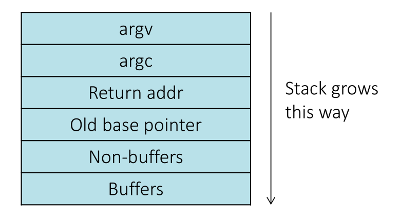

Windows compiler (Visual C++) offers the /GS option when you compile code, which does two things:
1. Inserts a random number (Cookie AKA random canary) between all variables allocated in the function. This number is checked at the end of the function: if it is changed: buffer overrun, abort process.
2. Reverses the placement of non-buffer variables and buffers. Prevents buffer overrun from overwriting non-buffers, which are sensible variables (like pointers to data structures)

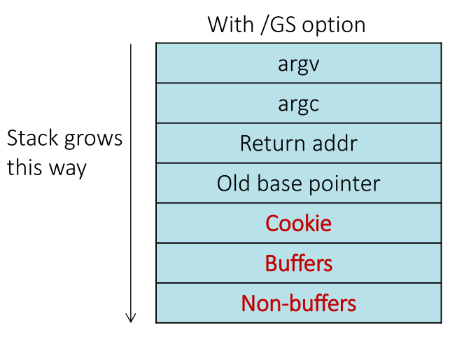

**Other memory corruption defenses**
1. Prevents code executing in data segments
   - It's a control introuced in modern CPUs (AMD, Intel,...)
   - ...and exploited in Windows since XP and Vista
   - ...as commonly used by buffer overrun exploits
2. Stack Randomization (since Vista)
   - randomizes thread stack base addresses
   - makes impossible for the attacker to predict where the stack will be and thus set its shellcode appropriately
3. Heap-based buffer overrun defenses:
   - add and check random values (cookies) on each heap block and checks heap integrity (since XP)
   - also introduce heap randomization: places the start of the heap at a random offset (0-4MB) (since Vista)
 
**Other Defenses**
**OS Image Randomization**
- OS boots in one of 256 configurations
- i.e. the entire OS is shifted up or down in memory when it is booted
- makes OS less predictable for attackers

**Service Restart Policy**
- services can be configured to restart if fail
- great for reliability but lousy for security
- since Vista, some critical services so can only restart twice, then manual restart is needed
- **gives attacker only two attempts**

**Browser Defenses**
Web browser is a key point of attack.
Via script code, graphics, helper objects
- runs ActiveX controls, Flash, Java applets, .NET apps
- renders various multimedia objects, mp3/4, JPEG, BMP, ...
- Invokes helper objects (MIME) to manipulate data formats (Windows Media Player, Quicktime, etc...)

Microsoft added many addresses to IE7.
ActiveX opt-in
- unloads ActiveX controls by default
- when requested then first run prompyes user to confirm protected mode
- IE runs at low integrity level
- so more difficult for malware to manipulate OS

**Encrypting File System (EFS)**
A number of low-level crypto functionalities for encryption, hashig, signing

EFS allows files/directories to be encrypted/decrypted transparently for authorized users.
1. The administrator just set the encryption property for a directory
   - from that point on any file in the directory is encrypted
2. Generate random File Encryption Key (FEK)
   - the key us protected by DPAPI (Data Protection API)
3. To grant access to an encrypted file to another user:
   - the FEK itself is encrypted with the user encryption key and stored along with other files' in the MFT

EFS also supports recovery if the FEK key is lost

The Data Protection API (DPAPI)
- Allow users to encrypt and decrypt data transparently
- The management of encryption keys (maintaining, protecting,...) is removed from the users and given to the OS
- Keys generated automatically by the OS and derived in part from user's password
- Developers need only to call `CryptProtectData` to encrypt and `CryptUnprotectData` to decrypt.

Trusted Platform Module (TPM)
It's a hardware solution to enhance security, from a specification of the Trusted Computing Group
Moves many sensitive cryptographic operations into hardware.
Windows uses TPM to validate that Windows itself had not been tampered with.

- this is known as trusted boot, or secure startup
- as the OS boots, critical portions of the OS are hashed and the hashes verified.

Another use of TPM is to encrypt entire File System.

**BitLocker Drive Encryption**
Especially useful to protect data disclosure on stolen laptops.
It is a policy that can be set locally or on the Active Directory.
Encrypts an entire volume with AES at almost no performance degradation.
Key either on USB or on a chip in the motherboard (the Trusted Platform Module, TPM) or in the Active Directory.
- BitLocker also supports key recovery

When booting a system the key must be available
- Either the USB drive with the key must be connected
- Or the key must be available in the TPM or AD

Bitlocker different than EFS:
- EFS need explicit management, for each single file/directory
- Bitlocker is "set and forget" and operates on an entire volume.

Example with powershell (run as administrator):

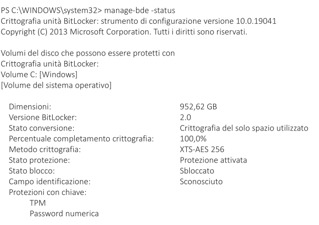


#### 6. Discuss the purpose of integrity levels in Windows

The purpose of Integrity Levels in Windows is to implement a form of Mandatory Access Control (MAC), often referred to as Mandatory Integrity Control (MIC). This mechanism is designed to restrict operations that change an object's state, essentially limiting the trustworthiness of running processes and protecting higher-trust system objects from lower-trust code.

This is a layer of security in addition to the traditional **Discretionary Access Control (DAC)** enforced by Access Control Lists (ACLs).

**Core Functionality**

Integrity levels are a way to enforce a trust policy on the system.

- **Assigning Levels**: Both securable objects (like files, registry keys, and other processes) and security principals (users, or more precisely, their processes and threads) are assigned an integrity level.
  - **Subjects (Processes/Threads)**: The integrity level is stored as a Security ID (SID) in the subject's access token.
  - **Objects (Resources)**: The integrity level for an object is stored as a special Access Control Entry (ACE) called SYSTEM_MANDATORY_LABEL_ACE in the object's System Access Control List (SACL). An object without an integrity SID is treated as having Medium integrity.
- **Access Check**: The Security Reference Monitor (SRM) performs the access check by comparing the integrity level of the subject with the integrity level of the object before checking the Discretionary Access Control List (DACL).
  - A subject (process) can only change the state (write to or delete) of an object if its integrity level is equal to or higher than the object's integrity level. This is the "no write up" policy, enabled by default with the SYSTEM\_MANDATORY\_LABEL\_NO\_WRITE\_UP flag.
  - This integrity rule applies even if the DACL would otherwise grant access.

**Primary Use Case: Sandboxing**

The primary goal of integrity levels is to enable sandboxing for potentially less trustworthy applications, like web browsers.

For instance:

1. A user's general documents and profile data are typically marked with Medium integrity.
2. An internet browser running in Protected Mode is launched with a Low integrity level.
3. Even if the user's security token (which the browser process uses) has full permission to write to their own documents via the DACL, the MIC check will prevent the Low-integrity browser process from writing to the Medium-integrity user documents.

This means if malware compromises the browser, the exploit runs at Low integrity and is severely limited in its ability to modify the user's data or critical system resources, which are protected by the higher integrity levels. Would you like to know more about how processes inherit their integrity level?

---

#### 7. Discuss the Byzantine Generals Problem (DA RIVEDERE)

###### Original Formulation

n generals need to reach consensus on either attacking or retreating from battle.

The plan will fail only if some generals will attack and some others to retreat (with a traitor general convincing another one to retreat with him)

###### Simplified Version

**1** ***Commanding*** General + **n-1** ***Liutenant*** Generals

The Commander takes a decision, if **all** the Liutenants obey the plan succeeds, and it fails otherwise.

Also its important to know that:

- **Any** General can be a traitor
- if the Commanding one is the traitor, he could send different messages to different Liutenants

`<u>`To solve the problem`</u>` there is the need to guarantee 2 properties:

1. **Consensus**: guaranteeing that **all loyal liutenants will obey to the same order**.
2. **Validity**: if the **Commandin general is loyal**, then **each loyal liutenant obeys to his order**.

`<u>`Assuming that`</u>`:

- There are **m** **Traitors**
- Reliable Communications: messages are sent/delivered correctly
- Authenticated Dispatches: receiver knows sender's identity
- Synchronous Communications: dispatch is never delayed

Under these assumptions, there is `<u>`no solution`</u>` for $n ≤ 3m$ and there is `<u>`always a solution `</u>`for $n ≥ 3m+1$

`<u>`**Solving Algorithm**`</u>`:

1. Commanding general sends n-1 messages
2. Each Liutenant:

   - if receives no command -> assumes Retreat
   - Forwards command to n-2 liutenants
   - Receives n-2 commands from liutenants
   - evaluates the majority of the commands and acts on this result

Total number of dispatches: **O(**$n^2$**)**

---

#### 7. Blockchains Vulnerabilities & Attacks (DA RIVEDERE)

- **51% Attacks**
  An entity or a Group controls more than 50% of the network's mining power of a POW Blockchain.
  They can potentially manipulate the chain controlling the consensus mechanism, double spending money and not allowing transactions.
- **Sybil Attacks**
  Malicious actor creates multiple fake nodes to gain control over a significant portion of the network, especially effective against POS blockchains.
- **Private Keys**
  Losing a the private key of an account also means losing the wallet and all of its associated cryptocurrencies
- **Double Spending**
  A user spends the same amount of cryptocurrencies twice, effectively creating a duplicate and fraudulent transaction.
  Can be performed in various ways, for example:

  - **Finney's Attack**:
    Attacker produces a "Solo" Block, with a single transaction to himself, without broadcasting it yet.
    Issue another transaction with another User, with the same quantity as the Solo Block.
    When the goods are delivered both the Solo Block and the other one are broadcasted, and the attacker has a 50% chance that the Solo Block gets picked for approval, accomplishing the Double Spending.
  - **Vector76 Attack**:
    Attacker produces a "Solo" Block **b1** containing the transaction with another user and then waits for another user to produce another b1 block, called **b1'** (they have the same precedessor block **b0**). At this point the attacker broadcasts his block **b1**, that will be discarded due to the presence of **b1'**, making the transaction refunded.
  - **Rosenfeld's Attack**:
    Attacker issues a transaction with another user. The user waits for the block commit, waiting for a series of block to be appended after it. The attacker builds a chain of Solo Blocks longer than the real appended serie, and commits it. Again here there is a chance that the Attacker's blockchain gets approved and the money refunded.

  ---
#### Figure 13.0 Backing store

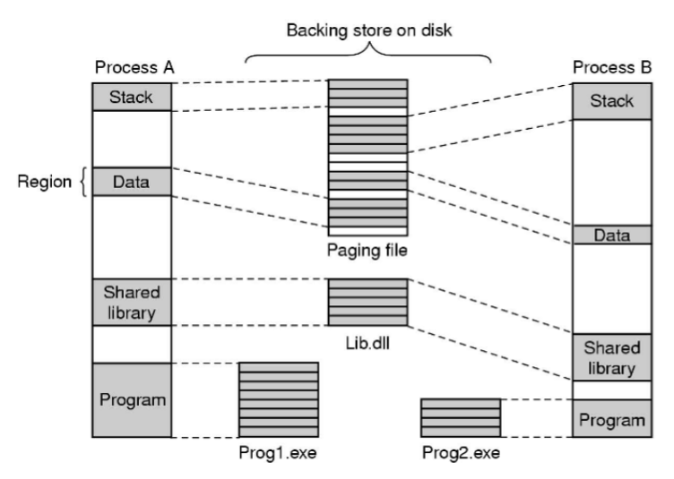

The image illustrates the Virtual Memory Management mechanism in Windows, specifically focusing on how process memory interacts with the backing store on the disk.

The diagram demonstrates how different regions of a process's virtual memory adress space are mapped to specific files on hard drive.

1. **The Backing Store Concept**
  The "Backing store on disk" represents the physicial files on the hard drive that support the virtual memory used by running processes. Windows uses this to manage memory usage efficiently. 
  - **Memory Mapping**: As in Unix, a Windows process can map a file directly into its virtual memory.
  - **Virtual Space**: The vertical bars for **Process A** and **Process B** represents their virtual memory spaces, which are divided into regions (such as Stack, Data, Shared Library, and Program).

2. **Shared Memory (DLL)**
  The diagram highlights how Windows handles shared resources efficiently:
  - **Visual evidence**: Both Process A and Process B have a memory region labeled **Shared library**.
  - **Mapping**: Dashed lines connect the shared library regions of both processes to the single file **Lib.dll** on the disk.
  - **Explanation**: this illustrates that two processes can share memory by mapping the exact same file (in this case, a Dynamic Link Library or DLL) into their respective virtual memories. This avoid duplicating code in physical memory.

3. **Executable Code**

  - **Visual Evidence**: The bottom region of each process is labeled Program.
  - **Mapping**
    - Process A's program maps to Prog1.exe on the disk
    - Process B's program maps to Prog2.exe on the disk
  - **Explanation**: When a program is launched, its executable code is mapped from the disk file directly into the virtual memory of the process.

4. Private Data and the Paging File

  - **Visual Evidence**: The top regions of the processes are labeled Stack and Data.
  - **Mapping**: These regions connect to the Paging file on the disk.
  - **Explanation**: Unlike the static code in DLLs or EXEs, the stack and data sections contain dynamic, private information that changes during execution. When physical RAM is full, or when these pages are swapped out, they are stored in the system's paging file rather than a static binary file.

**Summary**
The image visualizes how Windows virtual memory management maps specific virtual addresses to physical disk resources:
  - Static/Shared content (Code, DLLs) maps to the original files (.exe, .dll).
  - Dynamic/Private content (Stack, Data) maps to the Paging file.

**Security concerns reguarding the backing store**
1. **Sensitive Data Leakage (confidentiality)**
The most critical concern is that volatile memory is written to persistent storage.
- **The Mechanism**: As shown in the diagram, the Stack and Data regions of a process (which contain dynamic variables, user input, and potentially unencrypted passwords or cryptographic keys) are mapped to the **Paging file** on disk.
2. **Code Tampering (integrity)**
The backing store also maintains the executable code for running processes.

- **The Mechanism**: The Program and Shared library regions of virtual memory are mapped directly to the executable files (e.g., `Prog1.exe`, `Lib.dll`) on the disk.

- **The Risk**: If an attacker can modify these binary files on the disk (e.g., via a separate boot OS or insufficient file permissions), the corrupted or malicious code will be automatically loaded into the virtual memory of the process when it runs or pages back in.

**Mitigation**
To address these backing store vulnerabilities we can use **BitLocker Drive Encryption**. By encrypting the entire volume:
- The **Paging File** is encrypted, protecting swapped-out sensitive data from offline analysis.
- The **Executable files** are encrypted at rest, preventing simple tampering or reading by unauthorized parties in a physical theft scenario.

#### Figure 13.0 Management of pages


This diagram illustrates the lifecycle of physical memory pages in Windows. It details the "Working Set" page-replacement algorithm, showing the OS moves pages between active use and various system lists to optimize performance and security.

1. **The Components (Lists of Pages)**
The diagram organizes memory into several distinct states/lists:
   - **Working Sets' pages (Left Oval)**: These are the pages currently actively used by running processes. They are resident in RAM and can be accessed without a page fault.
   - **Modified page list**: Contains pages that were removed from a working set but have been modified (written to). They cannot be reused yet because their data hasn't been saved to disk.
   - **Stand-by page list**: Contains pages that were removed from a working set but are "clean" (not modified). They still hold their original data. If the original process needs them back, they can be quickly recovered.
   - **Free page list**: Pages that are free to be used but still contain old "garbage" data from previous processes.
   - **Zeroed page list**: Pages that have been wiped clean (filled with zeros) for security, ready to be given to a process that needs a fresh page.
   - **Bad RAM page list**: Tracks physical memory blocks that are defective.

2. **The Transitions (The Arrows)**

The numbers correspond to specific events that move a page from one state to another:

**Removing Pages (Moving "Out")**:
   - (1) **Evicted from Working Set**: When a process's memory needs to be trimmed, pages are moved out. Modified pages go to the Modified list; clean pages go to the Stand-by list.
   - (3) **Process Exits**: When a program closes, its pages are released to the Free or Stand-by lists.
   - (4) **Modified Page Writer**: A background system process writes modified pages to the disk (backing store). Once saved, these pages become "clean" and move to the Stand-by list.
   - (5) **Dealloc**: Pages in the Stand-by list that are no longer needed (e.g., file cache) are moved to the Free list.
   - (7) **Zero Page Thread**: A low-priority system thread runs when the CPU is idle. It takes pages from the Free list, wipes them with zeros, and moves them to the Zeroed list. This prevents data leakage between processes.

**Reclaiming/Allocating Pages (Moving "In")**:
   - (2) **Soft Page Fault**: If a process tries to access a page that was evicted but is still sitting in the Stand-by or Modified list, the OS "rescues" it instantly. It moves back to the Working Set without a slow disk access.
   - (6) **Page Read In**: For a "hard fault" (data is on disk), a free page is taken, data is read into it, and it enters the Working Set.
   - (8) **Zero Page Needed**: When a process needs a brand new page (e.g., for a new variable), the system provides one from the Zeroed list to ensure the process doesn't see anyone else's old data.

**Key Takeaway**

This system balances performance (by keeping "stand-by" pages ready for quick reuse via soft faults) with security (by zeroing out pages before re-allocation so sensitive data doesn't leak).


#### Figure 13.1 Virtual trust level

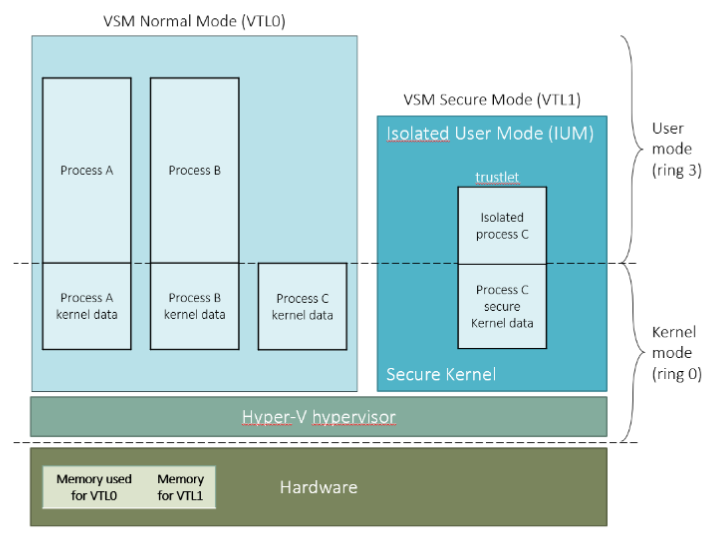

System components at each level operate under specific privilege layers.
Beyond kernel and user mode, exploits virtualization (Hyper-V) to implement virtual trust levels (Win 10 feature):

- here called normal world (VTL 0) and secure world (VTL 1), both with kernel and user mode
- this isolates VTL 0 from VTL 1
- the secure world also has a secure kernel and isolated user mode where trusted processes (trustlets) run
- the hypervisor runs in a special processor mode (VMX/VT-x Root Mode on Intel)

---

#### Figure 13.2 Windows login

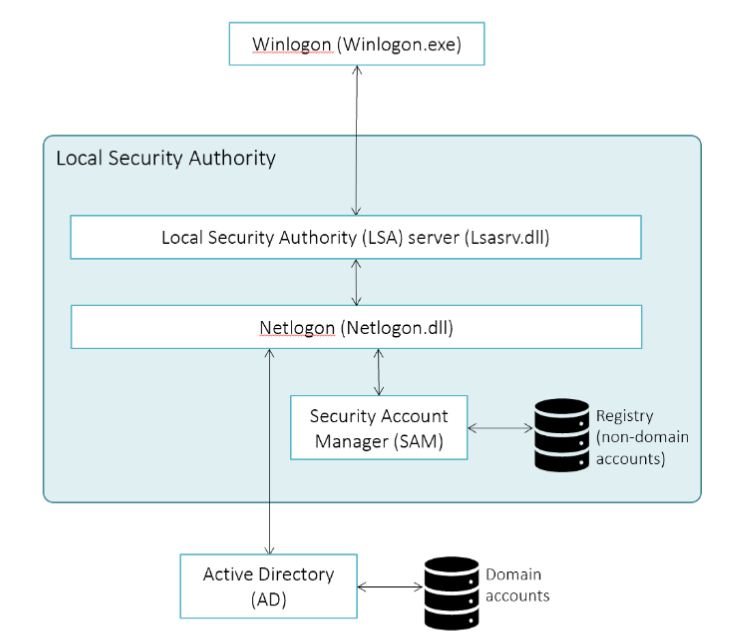

The figure shows the login process in Windows.

When the user logs on correctly, AD provides the authentication token (AKA security token or access token):

- the token includes: SID, groups, privileges
  - groups are also represented with SID
- assigned to every process run by user
- necessary to perform access control when the process opens an object

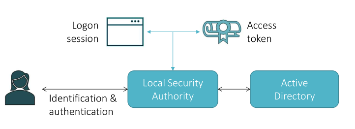

When the user logs on correctly, LSA generates the authentication token as before:

Note: the user must already have a (local) account and an (optional) password

- optional password because in some settings user wants to avoid it (a potential security issue).
- no remote access without password anyway, and admin must have password
- also, the password is actively encouraged at setup
- domain accounts must always have a password

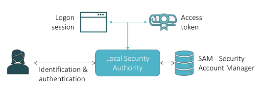

Hence the consequence of the Login is that the user (its processes) obtains an authentication token (AKA security token):

- it represents the "security context" of the user: privileges and permissions that user has.
- it identifies the user (and his processes) in all subsequent interactions with securable access control and thus it is used to implement access control.

---
#### Figure 13.x
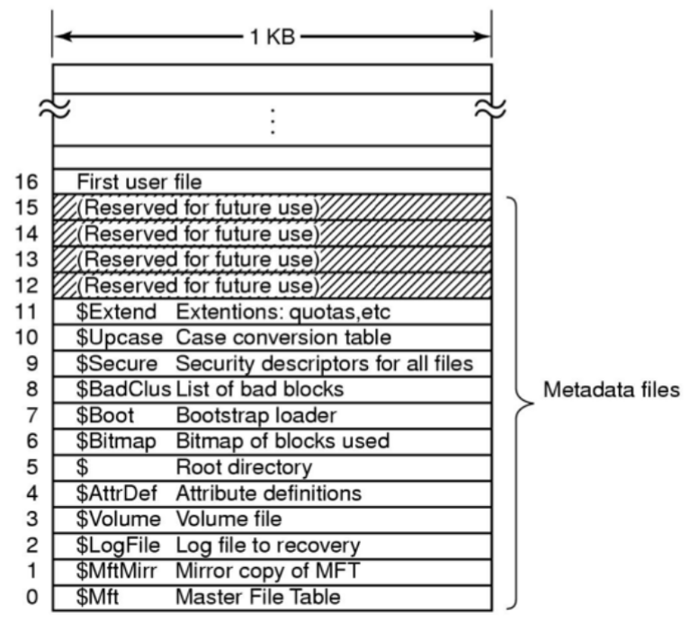

The picture represents the Master File Table (MFT) of the NTFS File System.

From the point of view of the user, NTFS is a hierarchical structure of directories and files, hosted in a volume.

- the volume is a logical disk partition: may correspond to the entire physical disk or only a part of it.
- the actual content of files and directories is stored into disk blocks that are called **clusters** in the Windows nomenclature.
- a cluster is typically a 4 KB (but a FS can be configured differently) and is identified by a logical cluster number.
  - at low-level the portion is an array of clusters, indexed by their logical number
- The entire FS is an object with its own metadata
  - describe the FS configuration (e.g. cluster size, version, etc.)
  - all FS metadata in a regular file in the FS itself

**The Master File Table (MFT)**:
- it's a table with fixed-size entries (1KB each)
- each entry describes a single file (contains file metadata and data)
- is stored into a file (it is itself a file)
- the first two entries of the MFT are the descriptors of the MFT itself
- the location of the first block of the MFT is in the super block at the beginning of the volume

A file:
- is an object that contains pairs (attribute, value)
  - its content is just one of its attributes, along with name, size...
- has a unique 64-bits ID called **file reference**
- described by a Master File Table entry (MFT)
  - that also contains the security descriptor of the file (owner & access control list)
- File data allocated in a set of extents: each extent is a contiguos runs of blocks (similar in EXT-4)

#### Figure 13.y 
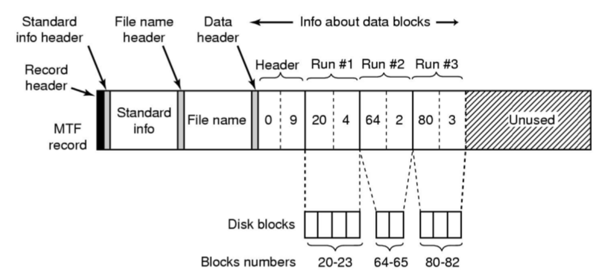

The picture represents a MFT record of a medium-size file. It demonstrates how a file that is too large to fit entirely inside the MFT record (non-resident data) is stored using pointers to external disk blocks.


**Structure of the MFT Record**
The top portion of the image shows a horizzontal bar representing the MFT record (1KB in size), divided into specific sections:
- **Headers**
  - **Record Header**: A small black block at the far left.
  - **Standard Info Header**: Points to the "Standard info" block (containing timestamps, permissions, etc.).
  - **File Name Header**: Points to the "File name" block.
  - **Data Header**: Points to the section containing information about where the actual file is located.
- **Data Runs (Non-Resident Data)**: Because the file data is stored externally, the MFT record stores "Runs" (pairs of numbers) that points to locations on the disk. The diagram displays a sequence of numbers representing these runs:
    - **Run #1**: Contains the values 20 and 4
    - **Run #2**: Contains the values 64 and 2
    - **Run #3**: Contains the values 80 and 3
  - **Unused Space**: the right side of the record is a shared block labeled "unused".
- **Mapping to Disk Blocks**: The bottom portion of the image visually translates these "Runs" into physical "Disk blocks" via dashed lines:
  - Run #1 (20, 4): Represents a data extent starting at logical cluster number 20 with a length of 4 blocks. This maps to blocks 20, 21, 22, and 23.
  - Run #2 (64, 2): Represents a data extent starting at cluster 64 with a length of 2 blocks. This maps to blocks 64 and 65.
  - Run #3 (80, 3): Represents a data extent starting at cluster 80 with a length of 3 blocks. This maps to blocks 80, 81, and 82.

**Key Concept**: The diagram visualizes how NTFS handles fragmentation. Instead of a single contiguous block, this file is split into three separate "extents" or runs scattered across the disk, and the MFT record acts as a map to locate them.

#### Figure 13.3 Explain the concept of "privilege" in Windows and present some privileges that concern the file system

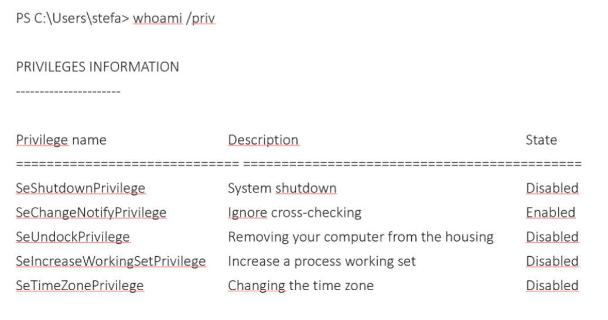

Privileges are systemwide permissions assigned to user accounts

- control access to system resources and system-related tasks whereas access rights & ACL control access to securable objects.
- e.g. backup computer, change system time, ...
  - Note that these two actions are privileged because cannot be granted to anybody
  - Change system time may affect authentication protocols
  - Backup need to bypass all access checks...

Some privileges are deemed "benign"

- E.g. the "bypass traverse checking privilege" that permits to traverse the directories even though the user may not have permissions in the traversed directories.

Some privileges are deemed "dangerous" such as:

- act as part of operating system privilege
  - AKA Trusted Computing Base (TCB) privilege
  - Grants the privilege to run as the most secure part of the operating system (the security code itself)
  - The most dangerous in Windows
  - Granted only to the Local System account (administrators do not have it)
- debug programs privilege
  - Allows to debug any program in Windows
  - Normally not needed by users
  - It implies the ability to run any code in any running processes...
- backup files and directories privilege
  - need to access the entire file system bypassing access controls
  - also to restore files and directories need to bypass access control and it is dangerous

The picture shows the output of command `whoami /priv`.
This command lists the **privileges** present in your current user's security token (`stefa`). Here is what each one means:

1. SeChangeNotifyPrivilege (The only one "Enabled")

   - **Description**: "Ignore cross-checking"
   - **Technical Name**: Bypass Traverse Checking
   - **What it actually does**: This is the most common privilege. In Windows, if you want to access a file like `C:\FolderA\FolderB\file.txt`, technically you should have "Read" permission on FolderA, FolderB, and the file itself.
   - **Why it exists**: This privilege allows Windows to skip checking permissions on the parent folders if you have direct access to the specific file. It is enabled by default for almost everyone to improve system performance (otherwise, Windows would have to check permissions on every single folder every time you open a file).
2. SeShutdownPrivilege
   - **Description**: "System shutdown".
   - **What it does**: It gives you the right to shut down or restart the computer.
   - **Note**: Even though it says Disabled, it is present in the list. This means your user owns the right, but the specific process running at that moment (PowerShell) hasn't "switched it on." When you actually click "Shut Down" in the Start Menu, the system will momentarily enable this privilege to perform the action.
3. SeTimeZonePrivilege
   - **Description**: "Changing the time zone".
   - **What it does**: It allows you to change the computer's time zone (e.g., from EST to GMT).
   - **Important distinction**: This is different from changing the actual System Time (SeSystemTimePrivilege). Changing the system time is much more dangerous (it can break security logs and authentication protocols like Kerberos), so it is usually restricted to Admins. Changing just the "Zone" is considered low-risk.

4. SeUndockPrivilege
   - **Description**: "Removing your computer from the housing".
   - **What it does**: This is largely a legacy feature for laptops with physical "Docking Stations." It allows a user to "eject" the computer from the dock via software.

5. SeIncreaseWorkingSetPrivilege
   - **Description**: "Increase a process working set".
   - **What it does**: It allows an application to request more physical memory (RAM) from the OS than is standard. This is used by performance-heavy applications (like video editors or games) to keep more data in RAM rather than swapping it to the hard drive.

Most of them are **Disabled**.

- In Windows, having a privilege in your "token" doesn't mean it is always active.
- For security and stability, powerful privileges remain "off" (Disabled) until a program explicitly asks the system "Hey, I need to shut down the PC, please enable `SeShutdownPrivilege` for a moment."
- If a privilege were **missing** from this list entirely, the user could never perform that action, even if a program requested it.

**Security Context**: this list likely belongs to a **Standard User** (not an Administrator). An Administratore would have a much longer list, including privileges like `SeDebugPrivilege` (to inject code into other programs) or `SeImpersonatePrivilege` (to impersonate other users).

---

#### Figure 13.4 - explain the structure and purpose of a security descriptor. Discuss some examples of access  rights concerning the file system

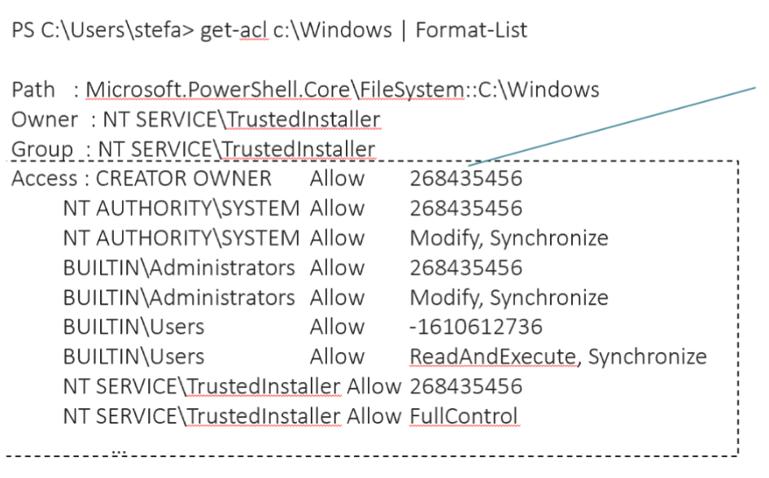

- The Security Desriptor (SD) is a data structure that contains object owner, group, DACL, & SACL (if present)
- each "securable object" has its own SD
  - a securable object is any system resource (file, directory, registry entry, process, thread, pipes, etc...) that need to be protected

Example of an SD:

```
Owner: CORP\Blake
Group: CORP\Clerks
ACE[0]: Allow CORP\Blake Full_Control
ACE[1]: Allow CORP\Paige Full_Control
ACE[2]: Allow Administrators Full_Control
ACE[3]: Allow CORP\Cheryl Read, Write, Delete
```

- This gives full control to users: Blake (who is the owner), Paige and Administrators

  - In newer versions of Windows it is possible to limit full control of the owner, and owner too should be included in the DACL
- There is no implied access, if there is no ACE for a user, then the access to the object by processes of that user is denied
- Processes must request correct type of access

  - if just request "all access" when need less (e.g. read) and when not all is not allowed, access will be denied
- each ACE in the DACL determines access: either allow or deny.
- Windows evaluates each ACE in the AL until access is granted or explicitly denied

  - hence deny ACEs come before allow ACEs
  - order by default if set using GUI
  - ...but the order is up to programmer if set by program
- When user attempts to access a protected object, the OS performs an access check

  - comparing user/group info with ACE's in ACL
  - access granted if all requested operations are granted; else access is denied
- In powershell it is possible to set the DACL and the SACL by means of set-acl.
- It can also use the SDDL syntax to express the SD:

  - is just a textual representation of a SD into a single string
  - can be converted into binary format to be used to set the SD to another object

Windows also supports "conditional ACEs"

- allow application-level access conditions to be evaluated when an object is accessed
- conditions on user/group attributes
  For example, a conditional ACE may incapsulate the rule:
  `(Title==”Manager” && (Division==”Sales” || Division== ”Marketing”))`
  …that expresses the fact that a user is a Manager in Sales or Marketing.
  Conditional ACEs cannot be set by GUI, can only be set by programs using SDDL.

The image shows how Windows manages files permissions using PowerShell.

The image breaks down the output of the command `get-acl`, which stands for **Get Access Control List**.

1. **The Command**

- get-acl c:\Windows | Format-List:
- get-acl asks the system: "Show me the security ticket attached to the folder C:\Windows."
- Format-List tells PowerShell to display the information in a clean, vertical list format instead of a wide table.

2. **Header Information** (Metadata)

- Path: Confirms we are looking at C:\Windows.
- Owner: NT SERVICE\TrustedInstaller.
- Note: This is important. In modern Windows, even "Administrators" do not own the system files; a special account called TrustedInstaller does. This prevents administrators from accidentally deleting critical Windows files.

3. **The Core: ACEs** (Access Control Entries)

The bracket on the left labels the list as ACEs.

- ACL vs. ACE: The whole list is the ACL (Access Control List). A single line within that list is an ACE (Access Control Entry).
- Structure of an ACE: Each line tells you three things:

  - Who: The user or group (e.g., BUILTIN\Administrators).
  - Type: Whether access is Allow or Deny.
  - Right: What they can do (e.g., FullControl, ReadAndExecute).

4. **The "Access Mask"** (The Numbers)

You will notice some rights are written as text (e.g., FullControl) while others are strange numbers (e.g., 268435456 or -1610612736). This is the Access Mask.

- What actually happens: Windows doesn't store words like "Read" or "Write" internally. It stores a 32-bit number (a sequence of 0s and 1s). Each bit represents a specific tiny permission (like "Append Data" or "Read Attributes").
- Why the numbers? When PowerShell sees a combination of bits it recognizes (like all bits set to 1), it translates it to human text like FullControl. When it sees a specific combination it doesn't have a simple name for, it just displays the raw numeric value (the Access Mask).

5. **The Bottom Fields**

- **Audit**: This relates to the SACL (System Access Control List). It defines which actions should be logged. For example, "Log an event every time someone deletes a file in this folder." It is empty in this output.
- **Sddl**: This stands for Security Descriptor Definition Language. It is a cryptic string format used to represent all this information (Owner, Group, ACL, SACL) in a single long text string, often used by developers or for backing up permissions.

#### Figure 13.5 

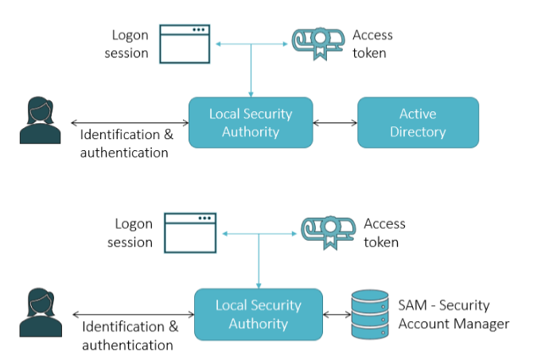

The picture represents respectively login with Active Directory and Security Account Manager (SAM).

**Login with Active Directory**
When the user logs on correctly, AD provides the authentication token (AKA security token or access token):
- the token includes: SID, groups, privileges
  - groups are also represented with SID
- assigned to every process run by user
- necessary to perform access control when the process opens an object

**Login with SAM (workgroup)**
When the user logs on correctly, LSA generates the authentication token as before:

Note: the user must already have a (local) account and an (optional) password
- optional pasword because in some settings user wants to avoid it...
- no remote access without password anyway, and admin must have password
- also, the password is actively encouraged at setup
- domain accounts must always have a password

**Windows Login**
The consequence of the Login is that the user (his processes) obtains an athentication token (AKA security token):
- it represents the "security context" of the user: privileges and permissions that a user has.
- it identifies the user (and his processes) in all subsequent interactions with securable object and thus it is used to implement **access control**.

#### Figure 13.5 Access Token

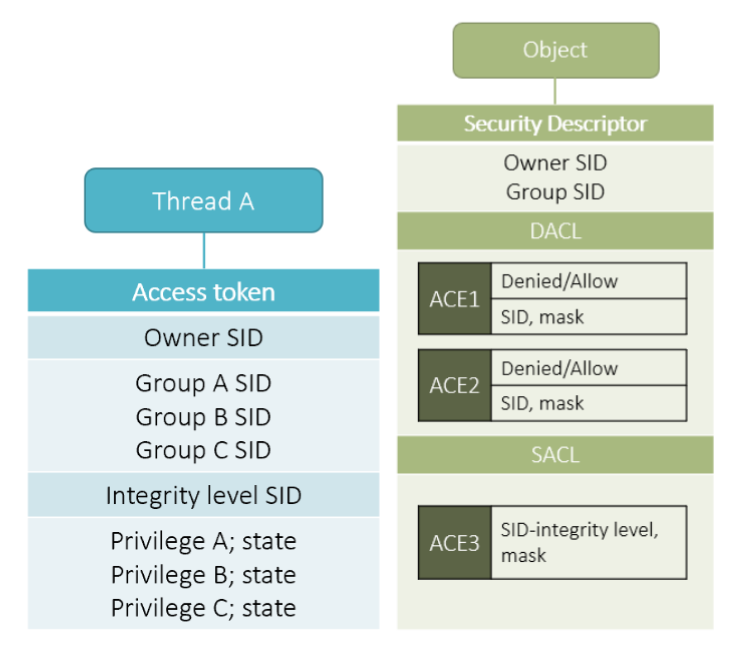

The diagram represents the internal structure of a Windows Access Token and a Object's Security Descriptor.

**Access Token**

If ACLs (Access Control Lists) are the "locks" on files, this Token is the digital ID badge that the user (or program) presents to open those locks.

1. **Thread A & Access Token**: At the top, you see "Thread A" connected to the "Access Token."
  - In Windows, programs run as Processes, which contains Threads (the actual execution units).
  - Every action you perform carries this "Token" with it. It tells the operating system exactly who is trying to perform that action.

2. **Owner SID (Security Identifier)**
   - **What it is**: The SID is a unique numeric code (e.g., `S-1-5-21...`) that identifies the specific user.
   - **What it does**: It identifies who you are. When you create a new file or folder, this SID is stamped onto that file to mark you as the "Owner".

3. **Group SIDs**
   - **What it is**: A list of all the security groups you belong to (e.g., Administrators, Users, HR-Department).
   - **What it does**: This is crucial for permissions. When you try to open a file, Windows checks the file's ACL. If the ACL says "The HR-Department group can enter,"Windows looks inside your Token. If it finds the "HR-Department SID" there, it lets you in.

4. **Integrity Level SID**
   - **What it is**: Defines how "trustworthy" this process is. This is a security feature (Mandatory Integrity Control) designed to sandbox processes.
   - The Levels:

     - Low Integrity: Untrusted processes (e.g., a browser tab running internet content).
     - Medium Integrity: Standard user.
     - High Integrity: Administrator (when you run "Run as Administrator").
     - System Integrity: The OS kernel itself.
   - Golden Rule: A process with Low Integrity cannot write data to a process or object with High Integrity. This prevents malware in your browser from easily infecting your core system.

5. **Privileges & State**
   - **What it is**: This corresponds exactly to the list we saw earlier with `whoami /priv`.
     - **Content** (e.g. `SeShutdownPrivilege`): it lists the specific system rights
     - **State** (e.g. `Disabled` or `Enabled`).
   - **Note**: As mentioned before, powerful privileges are usually kept "Disabled" inside this token untile the exact moment they are needed.

**Security Descriptor**
Windows has two forms of access control list (ACL):
**Discretionary ACL (DACL)**
- grants or denies access to protected resources (objects) such as files, shared, memory, named pipes etc.
**System ACL (SACL)**
- used for auditing, enables the log of attempts to access an object. An entry in SACL:
  - specifies the types of access attempts that generate audit reports in the security log
  - identifies a trustee, a set of access rights, and a set of flags
  - flags: generate audit records when an access attempt fails, when it succeeds, or both
- Also used to enforce mandatory integrity policy

Objects needing protection are assigned a DACL (and possibly a SACL) that includes a list of access control entries (ACEs).

Each ACE includes a SID and an access mask:
- The SID specifies a user or a group
- The access mask can include ability to read, write, create, delete, modify, etc.
- access masks are object-type specific (e.g. service abilities are create, enumerate)


The Security Descriptor (SD) is a data structure that contains object owner, group, DACL, & SACL (if present).

Each "securable object" has its own SD: a securable object is any system resource (file, directory, registry entry, process, thread, pipes, etc...) that need to be protected.

- each ACE in the DACL determines access: either allow or deny
- Windows evaluates each ACE in the ACL until access is granted or explicitly denied
  - hence deny ACEs come before allow ACEs 
  - order by default if set using GUI
  - ...but the order is up to programmer if set by program
- When user attempts to access a protected object, the OS performs an access check
  - comparing user/group info with ACE's in ACL
  - access granted if all requested operations are granted, else access is denies

#### Figure 14.0

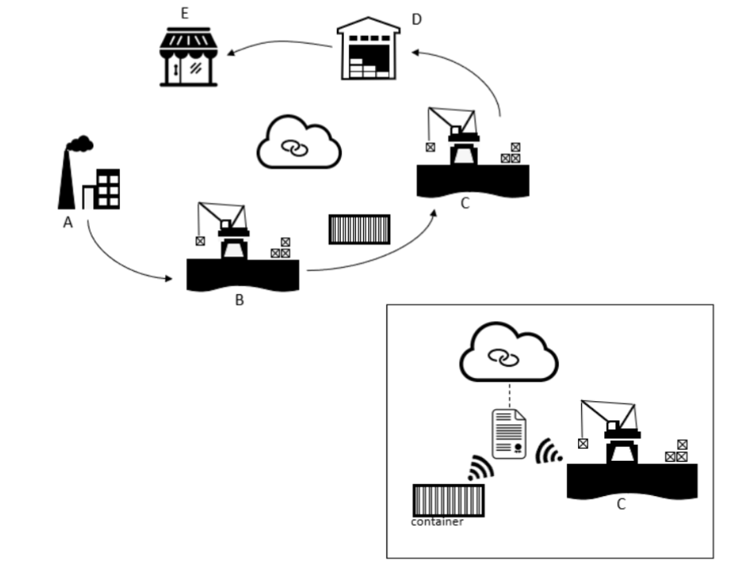

- blockchain is a shared and trusted public ledger for making transactions 
  - everybody can inspect it
  - nobody controls it
  - the transactions within cannot be altered
- the blockchain thus provides a single point of truth: it is shared and tamper-evident
- participants involved in a business can use a blockchain to record the history of business transactions

- Blockchains imply a paradigm shift for IoT
  - From centralized storage to a decentralized one, in a distributed ledger
  - supports the expanding for IoT ecosystem
- Blockchain approach:
  - Reduces maintenance costs (the distributed ledger is public...)
  - Provides trust in data produced
- Different potential scenarios...

**Updates management of IoT devices**
- All IoT devices of a manufacturer operate on the same blockchain
- The manufacturer deploys a smart contract to store the hash of the last firmware update
- Each device shipped with the smart contract address in their blockchain client
- IoT devices can query the contract and find out the new firmware update (and its hash)
- The binary of the firmware could be placed on a P2P
  - so that it can be retrieved by any device also when the manufacturer stops pubblishing it

**marketplace of IoT services**
Blockchains with cryptocurrency to provide a billing layer to implement of a marketplace of services between devices:
  - devices that store a copy of binary codes or storage for sensed data may charge for serving it
  - e.g. Filecoin which allows devices to "rent their disk space"
Every device can have its own account on the blockchain
- it can then expose its resources to other devices (or users) and get compensated for their usage via microtransactions

**traceability in a supply chain**
blockchain as a sgared ledger between the companies in a supply chain
- IoT devices monitor the quality of the goods along the chain at each production stage and during shipping

Smart contracts to certify each intermediate delivery of goods
- each actor in the supply chain can query the ledger to see the (certified) state of the goods.

The image shows this case scenario.

**energy marketplace, precision, agriculture,...**
In the energy sector
- IoT devices can buy and sell energy automatically
- IoT devices with surplus of energy (e.g. with solar panels) may share their energy with other devices

In precision agriculture, with IoT sensors to monitor the state and good health of the crops
- Agreed and visible by all companies in the supply chain
- Can certify the quality of the production


#### Figure 14.1

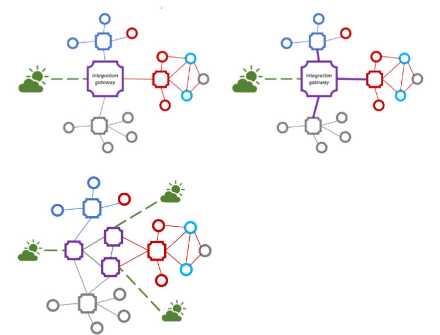

**Interoperability**

- Often, a straight implementation of an IoT solution is not a problem by itself: you can design the solution from the bottom (physical layer) up to the application layer.
- This is what is informally called a **"vertical silos"**.
- Your solution will only work alone:

  - only your devices
  - any change/update requires your intervention
  - other vendors cannot interfere

Business model of vertical silos:
- Entrap your clients, this is often called "vendor lock-in"
- Prevent the use of components from another vendor
- Force high costs to migrate to another vendor
  - full redesign and deployment of a new solution
  - with the risk of entering another silos...
- Example: wristbands for fitness
- In the past interoperability was mostly at hardware level (e.g., mains sockets), now also at software level
- The solution is to introduce **standards**

**Why standards?**

- Require common interests and agreements among different stakeholders
- Usually motivated by a reduction of the costs for development of a technology
- **"coopetition"** among different stakeholders
- Usually happens when technology becomes mature:
  - The big revenues are somewhere else
  - No interest in investing big money in developing the technology
  - without these conditions te standards will most likely fail

**Standards in IoT**

- So far, this happened in wireless communications (that explains the large number of wireless standards)
- Now the problem of interoperability (and thus of standardization) is moving up at middleware/application layers
- Currently many application-level protocols available for IoT:
  - Zigbee, Bluetooth, MQTT, CoAP, lightweight M2M
- But what happens where there are (too) many standards available?
- The interoperability is not only an issue between "vertical silos", but also between different standards
- To deal with several incompatible standards a solution is to introduce application-level gateways
  - do not translate only low-level protocols
  - also map one into the other different application-level behaviors

**Image description**
These diagrams demonstrate how devices from different manufacturers (vendors) using different communication protocols can be connected and managed together using gateways.

1. **Type C Configuration (Top Left and Right)**
   This configuration represents a centralized approach to integration.

- **What it represents**: This is the Type C configuration, characterized by having "different vendors and different protocols".
- **How it works**:

  - The colored nodes (blue and red circles) represent devices from different brands using different languages.
  - These conncet to their specific Service gateways (the blue and red squares).
  - Everything flows into a single, central **Integration gateway** (the purple square).
  - This central gateway acts as a bridge to the cloud/internet (the green cloud).
- **Real-world example* (Type C/II)**: Google Home or Alexa. In this scenario, a single smart hub acts as the integration gateway to let light bulbs, thermostats, and sensors from different brands communicate.

2. **Type D configuration (Bottom Left)**
   This configuration represents a distributed approach to integration

- **What it represents**: This is the type D configuration
- **How it works**:
  - It involves "different vendors, different protocols, and distributed integration gateways".
  - Instead of a single central point of management, there are multiple connected integration gateways (the multiple purple squares linked together).
  - This structure allows for a more distributed architecture compared to the centralized model.

**How many mappings from one procol to another?**

- **Type C configuration (centralized)**: In this configuration, there is a single, central Integration Gateway that manages different vendors and protocols.
  - **The Calculation**: If we assume there are N different protocols and we require full interoperability (meaning every protocol must be able to communicate directly with every other protocol), the central gateway must maintain a translation logic for every possible pair.
  - **The formula**: The number of mappings the gateway must manage is N * (N-1), because each of the N protools must be mapped to the other N-1 protocols.
  - **The Consequence**: The complexity grows quadratically (O(N^2)). This creates a significant bottleneck on the central gateway. Adding a new protocol becomes increasingly expensive because it requires defining mappings to all existing protocols.
- **Type D configuration (distributed)**:
  - In this configuration, the integration gateways are **distributed** across the network.
  - **Mapping Management**: While the total number of translations required for global connectivity might theoretically remain the same, the burden is not placed on a single device.
  - **The advantage**:
    - Each individual distributed gateway is responsible only for the mappings of the devices directly connected to it (or its immediate neighbors), rather than the entire global network.
    - The complexity per node is drastically reduced compared to Type C.
    - This makes the system much more **scalable**: new network segments with new protocols can be added without needing to reconfigure a massive, monolithic central gateway.

**The architectural solution: Two Types of Gateways**
To resolve this chaos, we can use a hierarchy with two levels of "translators" (gateways):

- **Level 1: Service Gateways (the blue, red and gray squares)**:
  - Their task is simple: group end-devices that speak the same language (same protocol).
- **Level 2: Integration Gateways (the purple squares)**:
  - This is where the complex work happens, These are distributed gateways that connect different Service Gateways. Instead of translating directly from "Protocol A" to "Protocol B", they use a specific strategy: they translate everything into an Intermediate Language (a universal format to the system).
- **With the intermediate language**:
  - Each protocol only needs to learn how to translate to "Language X" and from "Language X".
  - The text specifies that the inbound operation (input -> intermediate) and the outbound operation (intermediate -> output) are different tasks (requiring different code).
  - Therefor, for every protocol, you need exactly 2 mappings:
    1. From the protocol to the intermediate language.
    2. From the intermediate language back to the protocol.
  - With 5 protocols, you only need 10 translators (2 x 5).

#### Figure 14.2

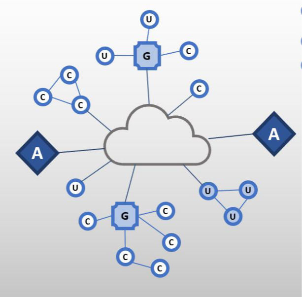

Index:
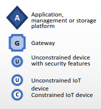

The issue of security in the IoT domain is crucial, as IoT devices often naturally lack security features. This problem stems from the fact that manufacturers prioritize time-to-market and minimizing production costs at the expense of security: performance and battery life are negatively affected by it. The installed operating system is often 'lightweight' and thus lacks the integrated security functionalities found in a full-fledged operating system; furthermore, security patches are rarely released for IoT devices, and even when they are, applying them is difficult.

**Patching vulnerabilities in IoT devices**

- There is a crisis points with regard to the security of embedded systems, including IoT devices.
- The embedded devices are riddled with vulnerabilities and there is no good way to patch them,
- Chip manufacturers have strong incentives to produce their products as quickly as possible
- The device manufacturers focus is the functionality of the device itself
- The end user may have no means of patching the system or, if so, little information about when and how to patch
- The result is that the hundreds of millions of internet-connected devices in the IoT are vulnerable to attacks
- This is certainly a problem with sensors, allowing attackers to insert false data into the network
- It is potentially a graver threat with actuators, where the attacker can affect the operation of machinery and other devices

**IoT Security and Privacy Requirements**

- The IUT-T standard recommendation Y.2066 includes a list of security requirements for the IoT
- These are functional requirements during capturing, storing, transferring, aggregating, and processing the data of things, as well as to the provision of services which involve things
- The requirements are:
  - **Communication security** (secure, trusted, and privacy protected communication capabilities): enforces confidentiality and integrity of data during data transmission or transfer
  - **Data management security** (secure, trusted, and privacy protected data management capabilities): enforces confidentiality and integrity of data when storing or processing data
  - **Services provision security** (secure, trusted, and privacy protected service provision capabilities): deny any unauthorized access to service and fraudulent service provision, protect privacy information related to IoT users
  - **Integration of security policies and techniques**: ability to integrate different security policies and techniques, ensures a consistent security control over the variety of devices and user networks
  - **Mutual authentication and authorization**: mutual authentication and authorization between devices (or device/user) according to predefined security policies before a device (or an IoT user) can access the IoT
  - **Security audit**: any data access or attempt to access IoT applications are required to be fully transparent, traceable and reproducible according to appropriate regulation and laws. Support security audit for data transmission, storage, processing and application access

#### Figure 14.3

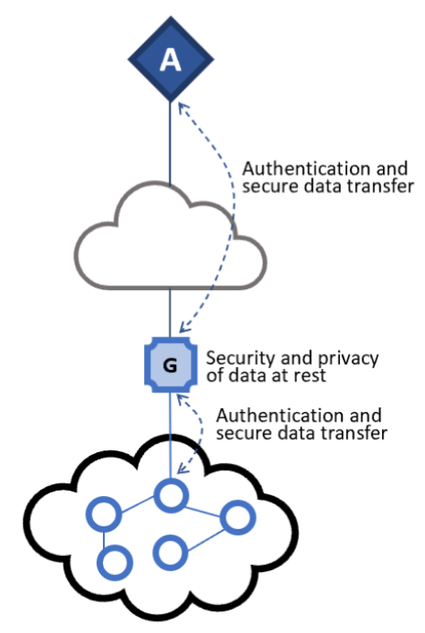

The picture represents the IoT gateway security functions.

- Identification of each access to the connected devices
- Authentication with devices
  - based on application requirements and device capabilities
  - either mutual or one-way authentication
  - one-way authentication is weaker: either the device authenticates itself to the device, but not both
- Mutual authentication with applications
- Security of the data based on security levels
  - data stored in devices and the gateway
  - data transferred between the gateway and devices
  - data transferred between the gateway and applications
- Protect privacy for devices and the gateway
- Self-diagnosis, self-repair and remote maintenance
- Firmware and software update
- Auto configuration or configuration by applications
  - support multiple configuration modes
  - e.g., remote and local configuration, automatic and manual configuration
  - support dynamic configuration based on policies

These requirements may be difficult to achieve if they involve constrained devices

- e.g. if the gateway should support security of data stored in devices. Without encryption capability at the constrained device, this may be impractical to achieve.

These requirements make several references to privacy

- With massive IoT, governments and private enterprises will collect massive amounts of data about individuals:
  - medical information
  - location and movement information
  - application usage
- privacy is an area of growing concern with the widespread IoT
- especially in homes, retail outlets, and vehicles and humans

#### Figure 15.1

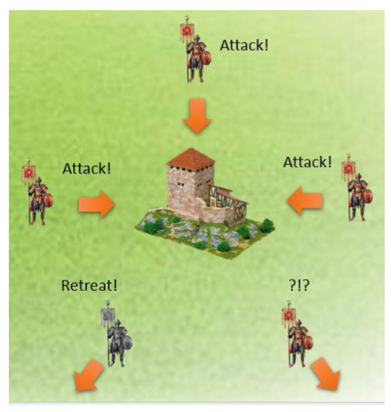

The picture represents the Bizantine Generals Problem also known as the consensus problem.

"several divisions of the Byzantine army are camped outside an enemy city, each division commanded by its own general.

The generals can communicate with one another only by messenger.

After observing the enemy, they must decide upon a common plan of action."

So generals should reach a consensus on the plan. It could be attack or retreat.

If all loyal generals reach a consensus, either attack or retreat, the battle plan succeeds. Else the battle plan will fail. But there may be traitors.

What does a traitor can do to make the plan fail? If all loyal generals reach a consensus, either attack or retreat, the plan succeeds, else the battle will fail.

But there may be traitors.

Traitors can act arbitrarily, and if not all loyal generals take the same decision the army is defeated (like in the picture).

#### Figure 15.1

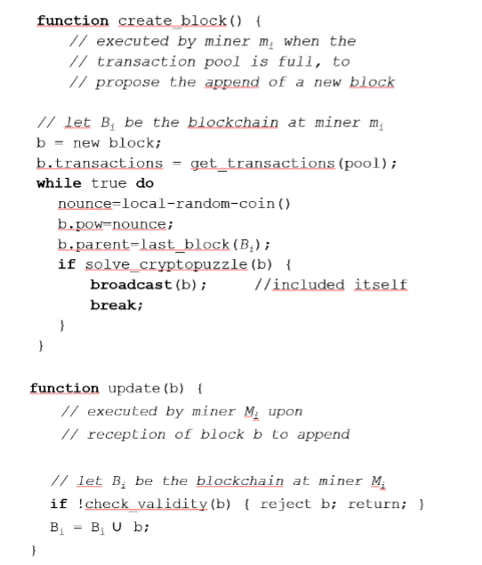

The code in the picture represent resepctively the creation of a new block and the operation to append a received block in consensus algorithm used in the PoW.

- Ethereum (in the past) and Bitcoin are the most used blockchains based on PoW.
- Consensus based on PoW

  - transactions are transfers of digital assets (coins) from a user u_i to a user u_j
  - transactions are sent in broadcast to all miners in best-effort: some miner may not receive a transaction, the broadcast is not reliable
  - if a client broadcasts twice the same transaction this will be considered a new one
  - miners combine transactions into blocks and implement PoW consensus
- A miner M collects all received transactions and checks the validity of each one:

  - the account balances should remain non-negative: amount to be exchanged exists and it is not already spent
  - the signatures of the users making the transactions are valid
- Then it puts the valid transactions into its own **transaction pool**
- When the number of transactions in the pool is sufficient, the miner creates the new block b and sends the block to all other miners in the P2P network to be stored

#### Figure 15.2

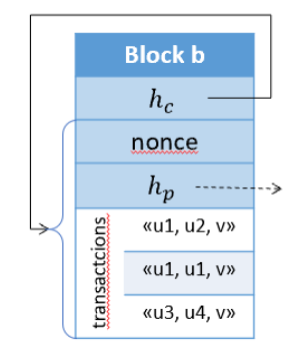

The picture represents the structure of the block b to append in the blockchain.

Formally a Block is a tuple: $b = (nonce, h_c, h_p, T)$

- **nonce** is the proof of work
- $h_c = hash(nonce ||h_p||T)$ it is the current hash of b
- $h_p = h_c^i$, that is, it equals the current hash contained in the last block $b_i$ in the blockchain (hash to the previous block)
- $T$ is a set of transactions

The $nonce$ is computed by M in such a way that $h_c \leq L$ where $L$ is a target value, common to all miners.

Since the hash function is one-way, determining a nonce such that $h_c \leq L$ forces the miner M to make a brute force search.

The complexity of this search depends one the value of L:
the smaller it is the more complex is the work for the miner.

Concluding, block b is valid if:

- all transactions it contains are valid
- $h_p = h_c^i$
- $h_c = hash(nonce||h_p||T) \leq L$

Once added to the blockchain it becomes block $b_{i+1}$

- The value of L is set depending on the computational power of the network of miners.
- It is configured to ensure that new blocks are added to the blockchain regularly, at a given pace
  - it Bitcoin typically one new block every 10 minutes
- Upon reception of block $b$, any other miner checks the validity of all the transactions contained in the block
  - independent check of signatures and amounts of the exchange for each transaction in the block
- if there are invalid transaction the miner may put $M$ in its "black list" and never accept anymore new blocks from $M$
  - this prevent miner from cheating by adding inappropriate data to the blockchain
- if the transactions are valid the block is then appended to the blockchain
  - remember this happens in each miner!

#### Figure 15.2

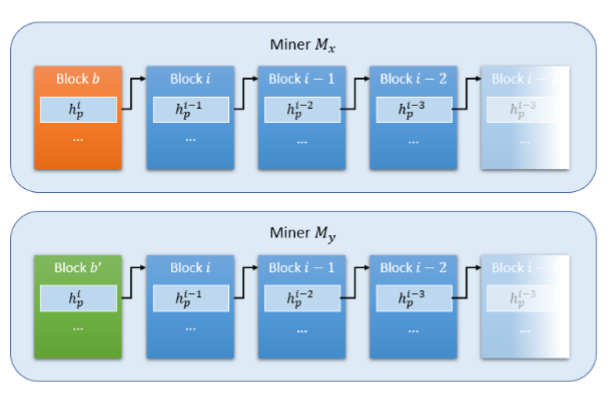

The picture represents forks in the blockchain.
- if two valid blocks (say b and b') are produced at the same time the miners will receive the two blocks (in arbitrary order). Each miner will append the two blocks to its local blockchain and the blockchain would fork into two branches.

- forks are a pathological situation and the PoW mechanism is used to reduce their chance
  - without PoW the forks would be rather frequent
  - ...but PoW cannot avoid forks completely

- forks are the result of disagreements among miners
  - i.e. failure of the consensus protocol
  - they may occur, fortunately not so frequently...

1. In the picture M_x received block b and appends it to its copy of the blockchai.

2. Also M_y receives block b' and appends b' to uts copy of the blockchain.

3. Now M_x receives b' that it is not connected with the last block!

4. Now M_y receives b that is not connected with the last block!

5. The blockchain forks in two branches!


#### Figure 15.3

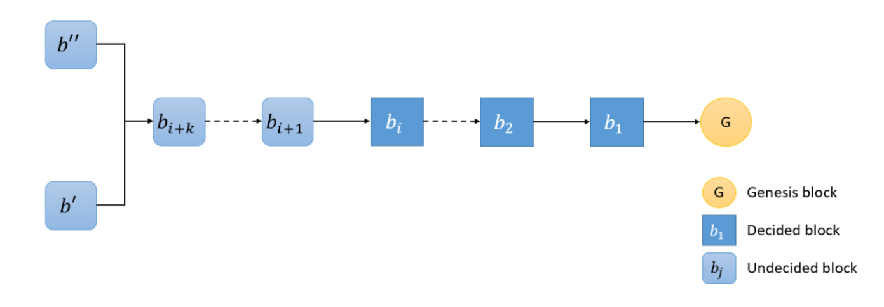

**Forks in the blockchain**
If two valid blocks (say $b$ and $b'$) are produced at the same time the miners will receive the two blocks (in arbitrary order) each miner will append the two blocks to its local blockchain and the blockchain would fork into two branches.

Forks are a pathological situation and the PoW mechanism is used to reduce their chance

- without PoW the forks would be rather frequent
- ...but PoW cannot avoid forks completely

Forks are the result of disagreements among miners

- i.e. failure of the consensus protocol
- they may occur, fortunately not so frequently

Due to forks the blockchain may become populated with several branches.
In addiction, blockchains at different miners may also differ from each other. Some miners may have not received a block (communications are unreliable).
From this point on, a miner willing to produce a new block will append it to the **main branch**.
Main branch selection is necessary to resolve the forks and to define a deterministic state agreed by all miners. Different approaches in Bitcoin and Ethereum.

**Main branch selection in Bitcoin (as in figure)**

- When a fork occurs, Bitcoin selects the **deepest branch** as the main branch.
  - the main branch is found by a pruning procedure on the blockchain executed by each miner
  - each miner will then produce new blocks for the main branch
- The consequence of the selection of the main branch is that the blocks in the other branches are **not committed**
  - hence they are not "valid"
  - the blocks attached to the dead branches will be disregared by compliant miners, as if those blocks were never produced.
  - ...and the blockchain will thus converge again to the same branch
- To be considered committed, a block should have at least $m=5$ other blocks appended to it
  - ...this means that Bitcoin assumes that dead branches are cut before they become longer than 4 blocks

#### Figure 15.4

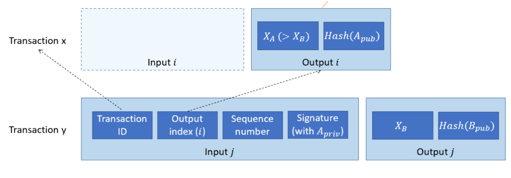

The figure represents the structrure of a Bitcoin transaction.
Both Ethereum and Bitcoin can be viewed as transaction-based machine

- characterized by a global state
- each transaction changes the global state
- transactions should be valid

The figure illustrates the UTXO (Unspent Transaction Output) model, which is the fundamental way Bitcoin handles value transfer. Instead of having a "balance" like a bank account, Bitcoin tracks specific chunks of digital change that move from one transaction to the next.

1. **The Setup (variables)**

- Alice & Bob: the two parties involved. Alice is sending money to Bob.
- $X_A$ and $X_B$: These represent amounts of Bitcoin. $X_A$ is the amount Alice currently has, and $X_B$ is the amount she is sending to Bob.
  - Note: the slide notes $X_A$ > $X_B$, meaning Alice has more than enough funds to cover the payment.
- Keys($A_{pub}$, $A_{priv}$): these are cryptographic keys
  - Public Key (pub): Acts like a mailing address or a lock
  - Private Key (priv): Acts like the password or the physical key to unlock funds

2. **Transaction x (The Source of Funds)**
   This represents a past event where Alice received money.

- **Output $i$**: this is an "Unspent Output". It belongs to Alice
- Inside the box:
  - It holds the value $X_A$
  - it is "locked" with $Hash(A_{pub})$. This means only the person holding Alice's private key can touch this money.

3. **Transaction y (The Transfer)**
   This is the current action where Alice is paying Bob.
   The Input Side (Input $j$): this is where Alice "claims" the money from the previous transaction to spend it.

- **Transaction ID**: Points back to "Transaction x" (the dashed arrow).
- **Output index ($i$)**: Tells the network specifically which UTXO of money from Transaction x she wants to spend.
- **Signature** (with $A_{priv}$): This is the crucial step. Alice signs this input with her **Private Key**. This proves she is the owner of the address $Hash(A_{pub})$ referenced in the previous transaction. She is "unlocking" the funds.

**The Output Side (Output $j$)**: This is where the money goes.

- $X_B$: The amount being sent to Bob.
- $Hash(B_{pub})$: The money is now "locked" to Bob's public key. Now, only Bob can spend this money in a future transaction using his private key $(B_{priv})$.

**Summary**
The diagram visualizes a chain of ownership:

1. **Transaction x** created a UTXO of Bitcoin locked to Alice.
2. **Transaction y** references that specific UTXO, unlocks it using **Alice's signature**, and creates a new UTXO locked to **Bob**.

**Other informations about transactions in Bitcoin**
A transaction

- version: 4 bytes, encodes the version of the blockchain in which the transaction is validated (to let future extensions)
- details of input, output and Locktime
- Each transaction spends the output of a previous transaction.
- Pending outputs, that are not already spent, are called **Unspent Transaction Output (UTXO)**.
- All UTXO referable to a given address (and then a user) are the account of that user, the bitcoins he possesses

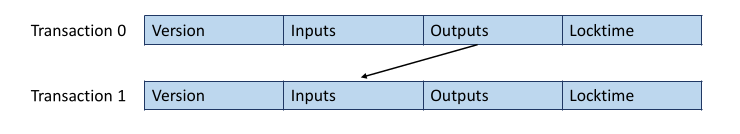

- A user does not own properly cryptocurrency, but he owns the output of the transactions, which is called UTXO.
- With UTXO the currency cannot be spent partially, but only entirely.
- Thus, a user can spend a part of his account by making two transactions:
  1. one, of the amount established, to the merchant
  2. one, of the remaining amount, to himself

Locktime indicates the earliest time a transaction can be added to the block chain.

- it allows signers to create time-locked transactions which will only become valid in the future
- gives the signers a chance to change their minds
- it's not fine grained, and can be set at up to two hours of current time
- Locktime can be disabled
